# ORSH / AIU v1.8: finalized single-file reviewer bundle

Current version labels are unchanged. This is a compilation of canonical text and supporting records, not another manuscript. Original v1.8 readers are preserved in history. See FINALIZATION_NOTES for the limited edits. Figure links work at the extracted package root; binary images and trajectories are in the ZIP.

---

# Source: manuscripts/Frame_Aligned_Records_v0_5.md

# Frame-Aligned Records

## Exact safeguards for locality-record comparisons

**James McGaughran**

MathGov / RippleLogic Research Program

26 September 2026 | Review manuscript v0.5

# Abstract

Which subsystem descriptions make quantum dynamics simple, and which support informative records? We develop three safeguards for comparing them: access-aware equivalence, valid inferential targets, and uncertainty-aware record certification. A centred projection score is bounded and energy-origin invariant. Covariant preparations obey spectral-block restrictions, while conditional typicality constrains state-adaptive selection within a predetermined, quantitatively bounded family. Equal higher-weight operator spans need not define equal access, restricted permutation references can be miscalibrated, and unequal certificate tightness must not become an apparent physical advantage. A source-off pilot illustrates why the estimand matters. Its predeclared six-qubit readability-change mean is negative, -0.015225. A subsequent paired factorial extension instead compares two Hamiltonian orientations at fixed injection and finds positive intervention contrasts, approximately 0.0105 and 0.0126 at six qubits. Reproduction and a finite-family variance-sensitive analysis support those contrasts under the specified sampling law. The two signs are compatible because their counterfactuals differ. Rotating the Hamiltonian is not an intervention on locality alone, and finite propagation bounds do not establish the sign of this readability statistic. The paper supplies reusable comparison safeguards, not a new decoherence mechanism, an identified spacetime metric or a consciousness result.

**Keywords:** quantum mereology; quantum records; conditional typicality; locality; statistical inference; reproducibility.

# 1. Introduction

## 1.1 The question

Decoherence and quantum Darwinism explain how certain observables of a system become stably and redundantly recorded in an environment, given a decomposition of the global Hilbert space into system and environment [Zurek 2003; Ollivier, Poulin and Zurek 2004; Zurek 2009]. The decomposition itself is usually supplied. Work on quantum mereology asks where it comes from: which tensor-product structures (TPS) are singled out by a Hamiltonian, a state, or an operational criterion [Zanardi 2001; Zanardi, Lidar and Lloyd 2004; Cotler, Penington and Ranard 2019; Carroll and Singh 2021; Zanardi, Dallas, Andreadakis and Lloyd 2024]. Two families of criteria have been developed largely in parallel. Locality criteria select structures in which the Hamiltonian is a sum of few-body or graph-local terms. Classicality criteria select structures that host robust pointer states or redundant records [Riedel 2017; Adil et al. 2026].

A natural question joins them: across an ensemble of models, do the candidate structures that are nearly optimal for dynamical locality coincide with those that are nearly optimal for persistent, informative records more often than a declared chance baseline predicts? We call this the locality-record compatibility question. It is implicit in programmes that seek to recover classical, spatially organised descriptions from minimal quantum ingredients, with conditional model-class formulations stated in Section 7. Recent results pull in different directions. Riedel showed that, given the TPS associated with spatial locality, the requirement of redundant local records strongly constrains branch decompositions [Riedel 2017]. Adil et al. found that a fixed Hamiltonian can admit many factorizations with robust pointer states, and that decohering subsystems need not align with the usual notion of locality [Adil et al. 2026]. Whether a Hamiltonian alone determines a TPS is itself disputed [Stoica 2022; Soulas, Franzmann and Di Biagio 2025; Stoica 2026].

## 1.2 Why the question is easy to trivialise

A test of compatibility must score many candidate structures under one physical history and compare the two sets of near-optimal candidates. Three choices can decide the outcome before any physics is done.

The score may be ill-posed. An uncentered numerator divided by the centered Hamiltonian norm is unbounded when its orthogonal projection omits the identity; candidates that differ only by a local unitary or a relabelling may be counted as distinct and inflate overlap.

The preparation may be uninformative. A deterministic, fully covariant Hamiltonian-only preparation is stationary under that same autonomous Hamiltonian. This does not exclude pre-existing records or conditional dynamics hidden by a stationary average. Under conditional Haar assumptions, qualification becomes unlikely in a specified small-fragment regime, but is not impossible (Proposition 3).

The null may be miscalibrated. A uniform pairing of candidate labels mistakes duplicated candidates for independent opportunities, and a recording-friendly design with the preparation, coupling and dynamics aligned can build much of the desired coincidence into its inputs. Alignment alone does not guarantee records for every Hamiltonian or time window.

## 1.3 Contributions

Three failure modes organize the contribution.

1. **Mistaking a convenient description for an equivalent physical access structure.** The centred score and full operational stabilizer make comparisons well posed. The controlled-NOT counterexample shows why equal higher-weight spans alone do not suffice (Sections 2 and 3).
2. **Mistaking an analysis convention for evidence.** Explicit reference assumptions, the exact derangement counterexample, and the distinction between a change from frozen evolution and a paired Hamiltonian-orientation intervention prevent different questions from borrowing each other's verdicts (Sections 5 and 6).
3. **Mistaking a numerical limitation for absent records.** Lower and upper count bounds propagate unresolved certification into inference. Conditional preparation and finite-cover results delimit when a chosen search family can find records (Section 7.3.1; Appendices C to F).

Elementary lemmas and standard concentration tools support these safeguards. The methodological integration and the finite design examples are the contribution claimed here; historical priority for a new physical mechanism or for the underlying mathematics is not claimed. Unrestricted structure recovery and the persistent-count population conjectures remain unexecuted.

# 2. Setting and definitions

## 2.1 System, source and reference structure

Let $\mathcal H_S=(\mathbb C^2)^{\otimes n}$ with $d=2^n$, and let $\mathcal B(\mathcal H_S)$ carry the Hilbert-Schmidt inner product $\langle  A,B\rangle =\mathrm{Tr}(A^\dagger B)$ and norm $\|A\|_2$. A classical binary source $X\in\{0,1\}$ with prior $(p_0,p_1)$ is held in a separate register that is never rotated by a candidate. Equivalently, a source qubit prepared in a $Z$ eigenstate couples through $Z_{\mathrm{src}}\otimes K$.

A **reference structure** $\mathcal R=(S,\{\mathcal A_F\}_F,\mathcal Q)$ comprises a declared local operator span $S$, eligible fragment algebras $\mathcal A_F=\mathcal B(\mathcal H_F)\otimes I_{\bar F}$, and an operational contract $\mathcal Q$. The contract records fragment-size limits, disjointness, source exclusion, allowed measurements, access costs, and any graph or site labels. The symbol $\mathcal B(\mathcal H_F)$ denotes the full matrix algebra; the standalone contract $\mathcal Q$ is metadata, not another algebra. All projections onto operator spans are Hilbert-Schmidt orthogonal.

A candidate represented by a unitary $V_D$ rotates both the local span and the fragment algebras, with the contract transported consistently. The full stabilizer is
$$\mathrm{Stab}(\mathcal R)=\{W\in U(d):\operatorname{Ad}_W(\mathcal R)=\mathcal R\}.$$
Here equality means preservation of the local span, permutation of the eligible fragment algebras, and preservation of every applicable element of the operational contract.
Thus $V$ and $VW$, with $W\in\mathrm{Stab}(\mathcal R)$, define equivalent candidates. Equality of a locality span alone does not suffice. Source registers remain external and are not accessible fragments.

For $n$ equal-dimensional sites (site dimension $q_{\mathrm{site}}=2$ in the qubit models) with every singleton algebra, unrestricted singleton measurements, symmetric costs, unlabelled sites and an unrestricted weight-$k$ span, the stabilizer is exactly the set
$$\{\Pi_\pi(U_1\otimes\cdots\otimes U_n):\pi\in S_n,\ U_j\in U(q_{\mathrm{site}})\}.$$
This set notation avoids treating the product of local unitary groups as an injective subgroup: compensating local phases have a kernel. Graph or operational constraints restrict the allowed elements further. In the unlabelled case these are the usual TPS equivalences; a labelled or cost-restricted access structure has a finer equivalence relation [Andreadakis and Zanardi 2025, Eq. 14 and Appendix A.4].

## 2.2 Convention for evaluating candidates

For any operator $A$ and unitary $V$,
$$\Pi_{VSV^\dagger}(A)=V\,\Pi_S(V^\dagger AV)\,V^\dagger,\qquad(1)$$
because $A\mapsto VAV^\dagger$ is a Hilbert-Schmidt unitary that maps $S$ onto $VSV^\dagger$ and $S^\perp$ onto $(VSV^\dagger)^\perp$. Consequently, scoring the physical operator $A$ against the rotated structure $\mathcal R_D$ is the same as scoring $A_D:=V_D^\dagger AV_D$ against the fixed reference structure. We use the second form throughout:
$$H_D:=V_D^\dagger HV_D,\qquad \rho_D(t):=V_D^\dagger\rho(t)V_D.$$
Every candidate is evaluated on the same physical history. Jointly conjugating the Hamiltonian, the state, the observables and the reference structure by one unitary leaves every score unchanged; it is a recovery check, not a candidate. Changing only the state, or only the Hamiltonian, defines a different physical experiment.

## 2.3 Dynamics

The record-generating dynamics is a source-conditioned family of autonomous Hamiltonians
$$H_x=H_S+K_x,\qquad x\in\{0,1\},$$
where $H_S$ is the internal Hamiltonian and $K_x$ the source coupling (in the historical continuously driven calibration, $K_x=(-1)^xK_{\mathrm C}$). A preparation law $\mathsf P$ is a probability law over $(H_S,K,\rho_x(0))$, and the source-conditioned states are $\rho_x(t)=e^{-iH_xt}\rho_x(0)e^{iH_xt}$. When the initial state does not depend on $x$ we write $\rho(0)$. The symbol $K_{\mathrm C}$ denotes a coupling operator; C in $D_C$, $U_C$ or $H_C$ labels the alternate frame.

## 2.4 Locality score

For Hermitian $H$ let $H_0=H-\mathrm{Tr}(H)I/d$. Let $S_0$ be a declared traceless Hermitian operator space and let $S=\operatorname{span}\{I\}\oplus S_0$. The canonical score is
$$L_S(H)=\frac{\|H_0-\Pi_{S_0}(H_0)\|_2^2}{\|H_0\|_2^2},\qquad H_0\ne0.\qquad(2)$$
All projectors here are Hilbert-Schmidt orthogonal. The legacy uncentered expression is denoted $L^{\mathrm{raw}}_S(H)=\|H-\Pi_S(H)\|_2^2/\|H_0\|_2^2$. For identity-inclusive $S$ these are identical. Lemma 1 states the precise domain of that equivalence; the two forms are not independent measurements.
A scalar Hamiltonian ($H_0=0$) receives UNINFORMATIVE_SCALAR. Numerical near-scalar exclusions use a declared absolute tolerance in stated input units, not one inflated by an arbitrary identity energy shift. A scalar source branch blocks the stated total normalized score unless an alternative aggregation was specified before analysis. Larger $L$ means more weight outside the local span, so **a locality threshold is a ceiling**. For a candidate, $L(D;H):=L_S(H_D)$. Two versions enter the analysis and must be declared in advance:

- **internal locality**, $L^{\mathrm{int}}(D)=L(D;H_S)$;
- **total locality**, $L^{\mathrm{tot}}(D)=\sum_xp_x\,L(D;H_x)$.

Supplement Section S2.6 shows how the choice changes the descriptive verdict in the historical continuously driven calibration.

## 2.5 Records

For fragment $F$, candidate $D$ and time $t$, the conditional fragment states are $\rho^{D}_{F,x}(t)=\mathrm{Tr}_{\bar F}\,\rho_{x,D}(t)$. The optimal probability of error in guessing $x$ from $F$ is the Helstrom error [Helstrom 1969]
$$p_{\mathrm{err}}(F,D,t)=\tfrac12\bigl(1-\|p_0\rho^D_{F,0}(t)-p_1\rho^D_{F,1}(t)\|_1\bigr),\qquad(3)$$
which for equal priors is $\tfrac12-\tfrac14\|\rho^D_{F,0}-\rho^D_{F,1}\|_1$. With unrestricted measurements on $F$, the bound is attained by a projective measurement of the weighted difference. Restricted or costly decoders require their own attainable error; fragment size alone does not certify that physical access is available. The Holevo quantity $\chi(X{:}F)$ is an upper bound on accessible information, not an achieved value [Wilde 2019]; we therefore qualify records by (3). A fragment **qualifies** at tolerance $\varepsilon$ over a window $T_w$ if $p_{\mathrm{err}}(F,D,t)\le\varepsilon$ for all $t\in T_w$. The **record score** $R(D)$ is the largest number of pairwise disjoint qualifying fragments within a declared fragment-size limit. Disjoint fragments may still be correlated; stronger objectivity notions such as spectrum broadcast structure require additional conditions [Horodecki, Korbicz and Horodecki 2015; Le and Olaya-Castro 2019, 2021]. A prior with $\min_xp_x$ near zero makes a small error uninformative, so the source prior is part of the declared design. For a formation claim, declare an initial-error floor on the same fragments: $p_{\mathrm{err}}(F,D,0)\ge\min(p_0,p_1)-\epsilon_0$, and then require persistent final error at most $\varepsilon<\min(p_0,p_1)-\epsilon_0$. Let $R_{\mathrm{new}}(D)$ count only fragments satisfying both conditions. A change in total count alone is insufficient: old records can disappear while different fragments acquire new ones. The presence score $R$ and formation score $R_{\mathrm{new}}$ remain distinct. Pointwise optimal decoding assumes knowledge of readout time and permits its decoder to vary; Appendix D states the stronger fixed-decoder alternative and the continuum certificate.

## 2.6 Near-optimal sets and the association event

With parameters frozen before scoring,
$$\mathcal N_L=\{[D]:L(D)\le\tau_L,\ L(D)\le\min_{D'}L(D')+\epsilon_L\}.$$

$$\mathcal N_R=\{[D]:R(D)\ge\tau_R,\ R(D)\ge\max_{D'}R(D')-\epsilon_R\}.$$
The association event for one sampled model and history is $A=\mathbb 1[\mathcal N_L\cap\mathcal N_R\neq\emptyset]$. Empty sets stay empty; a model with no qualifying records has $A=0$ and remains in every denominator.

## 2.7 Span similarity, access equivalence and numerical clusters

A candidate includes both a locality span and an access structure. Their stabilizers can differ. For equal-rank operator-space projectors define
$$\delta_S(D,E)=1-\frac{\operatorname{Tr}(P_D P_E)}{r}=\frac{\|P_D-P_E\|_{\mathrm{HS}}^2}{2r}.$$
This is a squared projector discrepancy. Its square root is a distance on the rank-$r$ projector space. Neither expression alone identifies the full locality-and-access structure. The construction is related to operator-subspace geometry, but is not automatically the same object or theorem as the tensor-product-structure measures of Andreadakis and Zanardi (2025).

**Exact counterexample 1: proximity is not equivalence.** Rotate $\operatorname{span}\{I,Z\}$ about the $Y$ axis through Bloch angles $0,0.2,0.4$. Consecutive discrepancies equal $0.0197347515$, while the endpoint discrepancy is $0.0758233227$. Thus $\delta<0.03$ is not transitive. Also the squared discrepancy violates the triangle inequality in this example. Exact equivalence is assessed by a declared stabilizer. Approximate groups are called clusters and need a deterministic clustering algorithm, a tie rule and threshold sensitivity; they are never silently substituted for mathematical quotient classes.

**Exact counterexample 2: equal spans need not give equal records.** On two qubits let the allowed span be the complete operator space, so every conjugation leaves it unchanged. Compare the identity and controlled-NOT representatives, and source-conditioned vectors $\left| 00\right\rangle ,\left| 11\right\rangle$. The identity access structure has two perfect single-qubit records. In controlled-NOT coordinates the vectors are $\left| 00\right\rangle ,\left| 10\right\rangle$, giving one. The span discrepancy is zero in both cases. This is an access counterexample, not creation or destruction of information by a passive representation change.

**Access equivalence from an existing theorem.** Define
$$\mathcal W=\operatorname{span}\{I\}+\sum_j\mathcal B_0(\mathcal H_j),\qquad r_1=\sum_j(q_{\mathrm{site},j}^2-1),$$
where site algebras are embedded in the full system and $\mathcal B_0$ denotes their traceless parts. If $P_V$ projects onto $V\mathcal W V^\dagger$, the Andreadakis-Zanardi squared TPS discrepancy is
$$\Phi(V,W)=\frac{\|P_V-P_W\|_{\mathrm{HS}}^2}{2r_1}.$$
Their Eq. 14 proves that $\Phi=0$ precisely for a relative unitary consisting of local unitaries and permutations of equal-dimensional sites. The square root of $\Phi$ is the associated projector distance; $\Phi$ itself is a squared distance and need not satisfy the triangle inequality. The distinction is terminological, not a criticism of their convention. For two-qubit identity versus controlled-NOT, $\delta_1=4/7$ when the identity is included in the rank, while $\Phi=2/3$. SWAP has $\Phi=0$ for unlabelled sites. These normalization differences must not be mixed.

This closes the ordinary unlabelled singleton TPS test. It does not replace the full contract when sites have different access costs, graph roles or restricted decoder sets. A site-permuting unitary can have zero $\Phi$ while violating those labels. In that case retain the tuple of individual fragment-algebra projectors, minimizing only over permitted permutations, together with the locality and access metadata. Small nonzero $\Phi$ is not an exact equivalence relation.

# 3. Structural lemmas for the locality score

**Lemma 1 (boundedness and equivalent conventions).** The centered score (2) lies in $[0,1]$. For an arbitrary orthogonal operator-space projection, $0\le L^{\mathrm{raw}}_S(H)\le1$ for every non-scalar Hermitian $H$ if and only if $I\in S$. In the latter case the raw and centered scores agree and
$$L_S(H)=1-\frac{\|\Pi_S(H_0)\|_2^2}{\|H_0\|_2^2}.\qquad(4)$$

*Proof.* Suppose $I\in S$ and write $H=cI+H_0$. Then $\Pi_S(H)=cI+\Pi_S(H_0)$, so $H-\Pi_S(H)=H_0-\Pi_S(H_0)$. Since $\Pi_S$ is an orthogonal projector, $\|H_0-\Pi_SH_0\|_2^2=\|H_0\|_2^2-\|\Pi_SH_0\|_2^2\in[0,\|H_0\|_2^2]$, which gives (4) and the bound. Conversely, suppose $I\notin S$, so $r:=(1-\Pi_S)I\ne0$. Fix any non-zero traceless Hermitian $G$ and let $H_\varepsilon=I+\varepsilon G$. The numerator of the raw expression is $\|r+\varepsilon(1-\Pi_S)G\|_2^2\to\|r\|_2^2>0$ as $\varepsilon\to0$, while the denominator is $\varepsilon^2\|G\|_2^2\to0$. Hence $L^{\mathrm{raw}}_S(H_\varepsilon)$ is unbounded. $\square$

*Example.* For $n=3$, $S$ the span of weight-one Pauli strings (identity excluded) and $H=I+0.05\,X\otimes X\otimes I$, the numerator is $\|I\|_2^2+\|0.05\,XXI\|_2^2=8.02$ and the denominator is $0.02$, so $L^{\mathrm{raw}}_S(H)=401$. Adding the identity to $S$ gives $L_S(H)=1$, as this $H_0$ lies entirely outside the weight-one span (Supplement run S02).

**Corollary 1.1 (affine invariance).** If $I\in S$ then $L_S(aH+bI)=L_S(H)$ for all real $a\ne0$ and $b$. This is invariance of the score. Rescaling the Hamiltonian while holding clock time fixed generally changes record dynamics. Dynamical equivalence requires the corresponding time rescaling; an energy-origin shift of one autonomous branch only adds its global phase.

**Lemma 2 (candidate-invariant denominator).** For every unitary $V$, $\|(V^\dagger HV)_0\|_2=\|H_0\|_2$. Hence, with $I\in S$, $L(D;H)=1-\|\Pi_S(V_D^\dagger H_0V_D)\|_2^2/\|H_0\|_2^2$, and ranking candidates by $L$ is ranking them by the local weight they capture.

*Proof.* $\mathrm{Tr}(V^\dagger HV)=\mathrm{Tr}\,H$, so $(V^\dagger HV)_0=V^\dagger H_0V$, and the Hilbert-Schmidt norm is unitarily invariant. $\square$

**Lemma 3 (class functions).** If $W\in\mathrm{Stab}(\mathcal R)$ then $L(VW;H)=L(V;H)$ for every $H$, and $R$ computed with the fragment family of $\mathcal R$ satisfies $R(VW)=R(V)$.

*Proof.* Conjugation by $W$ is a Hilbert-Schmidt unitary that maps $S$ onto itself and hence $S^\perp$ onto itself, so it commutes with $\Pi_S$. Therefore $\|\Pi_S(W^\dagger AW)\|_2=\|W^\dagger\Pi_S(A)W\|_2=\|\Pi_S(A)\|_2$ with $A=V^\dagger H_0V$, and Lemma 2 fixes the denominator. For records, the full stabilizer must additionally preserve fragment sizes, disjointness, source exclusions and declared decoder/access budgets. Under these conditions $W$ maps each fragment algebra onto an eligible fragment algebra of the same size, so eligible fragments correspond bijectively and paired reduced states are related by a common local unitary. The permitted decoder is transported with that correspondence. Attainable Helstrom errors, qualification decisions and the maximal disjoint count are therefore preserved; the reduced matrices need not be literally identical. $\square$

Numerically, for random $8\times8$ Hamiltonians the change in $L$ under a product of single-qubit unitaries, a cyclic qubit permutation, and their product is at most $6\times10^{-17}$, while a generic unitary changes $L$ by $0.144$ in the sampled instance (Supplement run S02).

**Consequence for counting.** Candidate families must be reduced to classes before $\mathcal N_L$, $\mathcal N_R$ or any chance baseline is formed. Otherwise a family containing $m$ stabilizer-equivalent copies of one structure offers $m$ spurious opportunities for overlap. Section 5.3 quantifies the effect on the null.

## 3.1 Rank and fitting budget

For an isotropic unit direction in the real traceless-Hermitian space of dimension $m=d^2-1$, an independently fixed rank-$r$ orthogonal projector gives
$$\mathbb E[L]=1-r/m,\qquad \operatorname{Var}(L)=\frac{2r(m-r)}{m^2(m+2)}.$$
The mean follows from the isotropic second moment; the variance follows from the beta distribution of a projected spherical direction. A Haar-conjugated fixed traceless Hamiltonian has the same mean by adjoint irreducibility, but need not have that spherical variance. Fitting a projector to the same Hamiltonian changes the selection problem. Rank, admissible graphs and search effort must therefore be controlled or reported. A larger operator span is not evidence of a more meaningful recovered geometry merely because it leaves a smaller residual.

# 4. Preparation constraints

## 4.1 Proposition 1: covariance and stationarity

Let $F$ be a deterministic rule assigning a density operator to a Hamiltonian on $\mathcal H_S$, and write $U_t=e^{-iHt}$.

**Proposition 1.**

(a) $F$ is covariant under the flow of $H$, that is $F(U_tHU_t^\dagger)=U_tF(H)U_t^\dagger$ for all $t$, if and only if $[F(H),H]=0$, which is the statement that $F(H)$ is stationary under $U_t$.

(b) If $F$ is covariant under all unitaries, $F(UHU^\dagger)=UF(H)U^\dagger$, then $F(H)=\sum_\lambda f_\lambda P_\lambda$, where $H=\sum_\lambda\lambda P_\lambda$ is the spectral decomposition. In particular $F(H)$ is stationary and is uniform on each degenerate eigenspace.

(c) A rule that selects a pure state inside a degenerate eigenspace can be stationary without being covariant under all unitaries.

*Proof.* (a) Since $U_tHU_t^\dagger=H$, flow covariance reads $F(H)=U_tF(H)U_t^\dagger$ for all $t$. Differentiating at $t=0$ gives $[H,F(H)]=0$. Conversely, if $F(H)$ commutes with $H$ it commutes with every $U_t$. (b) For any unitary $U$ with $[U,H]=0$, covariance gives $F(H)=F(UHU^\dagger)=UF(H)U^\dagger$. So $F(H)$ lies in the commutant of the commutant of $\{H\}$. The commutant of $\{H\}$ is $\bigoplus_\lambda\mathcal B(E_\lambda)$ for the eigenspaces $E_\lambda$; its commutant is $\mathrm{span}\{P_\lambda\}$. (c) Take $H=\mathrm{diag}(0,0,1,2)$ and $\rho=\left| g\right\rangle \left\langle  g\right|$ with $\left| g\right\rangle =(\left| 0\right\rangle +\left| 1\right\rangle )/\sqrt2$. Then $[\rho,H]=0$, but the unitary $U=\mathrm{diag}(1,-1,1,1)$ commutes with $H$ and changes $\rho$ by $1.0$ in the maximum entry norm, so $\rho\ne F(UHU^\dagger)$ for any all-unitary-covariant rule. $\square$

Part (a) shows that flow covariance adds nothing beyond stationarity. The strong content of all-unitary covariance is (b): the state is scalar inside each degenerate eigenspace. Its coefficients may depend on the complete spectrum; no universal Gibbs form or temperature is forced. Thermal states $e^{-\beta H}/Z$ and normalised ground-space projectors are the familiar examples. An "own-Hamiltonian ground state" in a degenerate ground space is covariant only if it is the normalised projector onto the whole ground space.

**Remarks.**

1. *Formation versus presence.* Proposition 1 excludes the formation of new equal-time records under autonomous evolution by the same Hamiltonian. It does not exclude their presence: pointer-basis records that commute with $H$ are stationary and persistent.
2. *Conditional states are what matter.* Records concern the source-conditioned states $\rho_x(t)$, not their average. A stationary average can hide conditional dynamics. With $H=Z$ and $\rho_0(0)=(I+X)/2$, $\rho_1(0)=(I-X)/2$, the average is $I/2$ at all times. The information a fixed $\sigma_x$ measurement carries about $x$ is $1.0,\ 0.399,\ 0,\ 0.399,\ 1.0$ bits at $t=0,\pi/8,\pi/4,3\pi/8,\pi/2$ (Supplement run S02).
3. *Stochastic rules.* If a covariant rule is randomised, covariance of the average does not imply stationarity of each draw.

## 4.2 Proposition 2: entropy matching does not match resources

**Proposition 2.** A unitary change of preparation, $\rho\mapsto W\rho W^\dagger$, preserves the spectrum and von Neumann entropy of $\rho$. It need not preserve (i) the energy distribution relative to a fixed Hamiltonian or (ii) the entanglement across a fixed bipartition.

*Counterexamples.* (i) Let $H=Z$, $\beta=1$, $\rho=e^{-Z}/\mathrm{Tr}\,e^{-Z}$ and $W$ the Hadamard gate. Then $S(\rho)=S(W\rho W^\dagger)=0.5270653410$ bits (von Neumann), while $\mathrm{Tr}(H\rho)=-\tanh1=-0.7615941560$ and $\mathrm{Tr}(HW\rho W^\dagger)=0$. The Rényi-2 entropy of both states is $0.3400520132$ bits, so the symbol $S_2$ should not be used for the von Neumann value. (ii) On the fixed bipartition A/B of two qubits, $U=(\mathrm{Had}\otimes I)\,\mathrm{CNOT}$ maps $(\left| 00\right\rangle +\left| 11\right\rangle )/\sqrt2$ to $\left| 00\right\rangle$: both states are globally pure, but $S(\rho_A)$ falls from one bit to zero (Supplement run S01). $\square$

Restricting to unitaries that commute with $H$ does not repair this as a control: for $\rho=f(H)$ every such unitary leaves $\rho$ unchanged. A preparation-only rotation is therefore not, without further proof, an intervention that alters only the locality-record relation.

## 4.3 Proposition 3: conditional typicality bounds record qualification

We bound qualification probabilities for small fragments in frames independent of the realised states. The conclusion is probabilistic and conditional, not a prohibition on every record.

**Assumption U (frame-free preparation).** For each $x$, the source-conditioned system state at the time considered is pure, $\left| \psi_x\right\rangle \in\mathcal H_S$, and its law is invariant under $\left| \psi\right\rangle \mapsto U\left| \psi\right\rangle$ for every unitary $U$ on $\mathcal H_S$, up to global phase. No assumption is made about the joint law of $\left| \psi_0\right\rangle$ and $\left| \psi_1\right\rangle$.

For the autonomous source-conditioned unitary dynamics declared in Section 2.3, Assumption U holds at every fixed $t$ whenever $\left| \psi(0)\right\rangle$ is Haar distributed independently of $(H_S,K)$ and $\left| \psi_x(t)\right\rangle =e^{-iH_xt}\left| \psi(0)\right\rangle$. The Haar law is invariant under the fixed unitary $e^{-iH_xt}$, including when conditioning on $(H_S,K)$. It also holds when a product or otherwise ready state is prepared in a frame $W$ drawn from the Haar measure independently of the dynamics, since $W\left| 0\cdots0\right\rangle$ is then Haar distributed.

**Proposition 3.** Under Assumption U, let $V$ be fixed independently of the realised states, or fixed after conditioning on design information $Z$ for which each conditional marginal law remains Haar. For example, $V$ may depend on the Hamiltonian if the initial state is conditionally independent Haar given that Hamiltonian. Let $F$ be any fragment with $\dim\mathcal H_F=d_F$ and complement dimension $d_R=d/d_F$, and let $\rho^x_F=\mathrm{Tr}_{\bar F}(V^\dagger\left| \psi_x\right\rangle \left\langle \psi_x\right| V)$. With equal priors:

(i) $\mathbb E\,\mathrm{Tr}(\rho^x_F)^2=\dfrac{d_F+d_R}{d+1}$;

(ii) $\mathbb E\,\|\rho^x_F-I/d_F\|_1\le b:=\sqrt{\dfrac{d_F^2-1}{d_Fd_R+1}}<\sqrt{d_F/d_R}$;

(iii) $\mathbb E\bigl[\tfrac12-p_{\mathrm{err}}\bigr]\le\tfrac12b$;

(iv) for $0\le\varepsilon<\tfrac12$, $\ \Pr(p_{\mathrm{err}}\le\varepsilon)\le b/(1-2\varepsilon)$;

(v) for $M$ (candidate class, fragment) pairs fixed in advance with the same fragment dimensions, the probability that any qualifies at a single time is at most $\min\{1,Mb/(1-2\varepsilon)\}$. For unequal dimensions replace $Mb$ by the sum of their individual $b$ bounds.

*Proof.* The unitary group acts transitively on unit vectors modulo phase, and the invariant probability measure on this homogeneous space is unique, so each $\left| \psi_x\right\rangle$ is Haar distributed. So is $V^\dagger\left| \psi_x\right\rangle$, because $V$ is fixed. For a Haar vector, $\mathbb E\,(\left| \psi\right\rangle \left\langle \psi\right| )^{\otimes2}=(I+\mathbb F)/(d(d+1))$, where $\mathbb F$ is the swap of the two copies; this is the normalised projector onto the symmetric subspace. Writing $\mathrm{Tr}\rho_F^2=\mathrm{Tr}[(\mathbb F_F\otimes I_{RR'})(\left| \psi\right\rangle \left\langle \psi\right| )^{\otimes2}]$ and using $\mathrm{Tr}(\mathbb F_F\otimes I_{RR'})=d_Fd_R^2$ and $\mathrm{Tr}(\mathbb F_F\mathbb F_F\otimes\mathbb F_R)=d_F^2d_R$ gives
$$\mathbb E\,\mathrm{Tr}\rho_F^2=\frac{d_Fd_R^2+d_F^2d_R}{d(d+1)}=\frac{d_F+d_R}{d+1},$$
which is (i) [Page 1993]. Next, $\|\rho_F-I/d_F\|_2^2=\mathrm{Tr}\rho_F^2-1/d_F$, whose expectation is $(d_F^2-1)/(d_F(d+1))$. By Cauchy-Schwarz $\|A\|_1\le\sqrt{d_F}\,\|A\|_2$, and by Jensen $\mathbb E\|A\|_1\le\sqrt{d_F\,\mathbb E\|A\|_2^2}=b$; since $d_F^2-1<d_F^2$ and $d_Fd_R+1>d_Fd_R$, $b<\sqrt{d_F/d_R}$. This is (ii). For (iii), the triangle inequality gives $\|\rho^0_F-\rho^1_F\|_1\le a_0+a_1$ with $a_x=\|\rho^x_F-I/d_F\|_1$, so $\tfrac12-p_{\mathrm{err}}=\tfrac14\|\rho^0_F-\rho^1_F\|_1\le\tfrac14(a_0+a_1)$. Only the marginal laws enter. For (iv), $\tfrac12-p_{\mathrm{err}}\ge0$, so Markov's inequality gives $\Pr(\tfrac12-p_{\mathrm{err}}\ge\tfrac12-\varepsilon)\le\tfrac12b/(\tfrac12-\varepsilon)$. Part (v) is the union bound. $\square$

For single-qubit fragments ($d_F=2$, $d_R=2^{n-1}$), $b=\sqrt{3/(2^n+1)}$ decays as $2^{-n/2}$. Sharper, exponential tail bounds follow from concentration of measure [Popescu, Short and Winter 2006; Hayden, Leung and Winter 2006]; Markov's inequality is used here for transparency. Two limits of the statement matter. It concerns candidates fixed before the state is seen, so a data-dependent search over a continuum of frames is not covered by (v). It is proved for pure conditional states only.

**Corollary 1 (scoped contrapositive).** If a qualification probability exceeds the applicable bound, at least one premise of the conditional typicality statement fails. Only after independence, source priors, access and dynamics have been independently checked may that failure be attributed specifically to the preparation law. Full-space Haar invariance is an explicit statistical assumption, not a definition of physical formlessness. Energy-shell typicality and dissipative reset models have different assumptions.

For a fixed fragment and fixed error threshold, the bound becomes small as the complement dimension grows. A finite or suitably slow-growing fixed candidate family can inherit that suppression. It does not cover unrestricted adaptive search, and its union bound can be vacuous when the candidate budget grows too quickly. A single-time state-adaptive counterexample is immediate: let $U$ be Haar, take the conditional vectors $U\left| 000\right\rangle$ and $U\left| 111\right\rangle$, and choose the candidate $V=U$ after seeing them. Both marginal vectors are Haar, yet all three candidate fragments are perfect records. The missing premise is candidate independence, not an error in the typicality calculation.

A generic model need not have a unique preparation or coupling frame. The three-frame language is a useful experimental parameterisation when such frames are actually supplied. Frame misalignment can also be relational: a joint ensemble can be globally covariant while a coupling and its preparation are aligned conditionally within every draw. Marginal invariance alone must not be confused with conditional independence.

**Numerical check (Supplement run S03).** For Haar states, the Monte Carlo purity matches (i) to within sampling error at every size tested ($n=3$ to $10$, fragments of one and two qubits, 4,000 samples each). The mean trace-norm deviation lies below the bound in (ii): for one-qubit fragments it is $0.552$, $0.282$, $0.141$ and $0.0497$ at $n=3,5,7,10$, against $b=0.577$, $0.302$, $0.152$ and $0.0541$. Table 1 applies the same local record-making dynamics to a ready product state and to a Haar initial state.

**Table 1. Ready versus frame-free preparation under identical local dynamics.** Dynamics $H_x=H_S\pm\sum_jX_j$, where $H_S$ is a random nearest-neighbour 2-local chain of Frobenius norm $0.3$, at $t=\pi/4$ with $\varepsilon=0.1$. Fragments are single qubits in the reference frame.

| $n$ | Models | Ready: mean fragment fraction qualifying | Haar: mean fraction of fragments qualifying | Frame-free $\mathbb E[\frac12-p_{\mathrm{err}}]$ | Bound $\frac12\sqrt{d_F/d_R}$ |
|---|---|---|---|---|---|
| 3 | 400 | 1.000 | 0.033 | 0.211 | 0.354 |
| 5 | 400 | 1.000 | 0.000 | 0.110 | 0.177 |
| 7 | 200 | 1.000 | 0.000 | 0.054 | 0.088 |
| 9 | 100 | 1.000 | 0.000 | 0.028 | 0.044 |

The last column retains the historical loose bound; Proposition 3 supplies the tighter $b/2$. In these sampled models the ready state makes every tested single-qubit fragment qualify at the one declared time, whereas Haar initialisation gives rare qualifying fragments. The rates in Table 1 are means of per-model fragment fractions, not the proportion of models with any record. At three qubits the nonzero Haar rate itself refutes a literal no-record reading. A mean advantage of 0.211 is nonzero even where few fragments meet the strict error threshold.

# 5. The association estimand and its null

## 5.1 Estimand and sampling unit

For a frozen implementation $\Theta$ with model law $\nu$, let $A_\Theta(M)$ be the association event of Section 2.6 for model-and-history $M$ and $q_\Theta(M)$ the chance probability of that event under a declared baseline. The estimand is
$$d_\Theta=\mathbb E_\nu[A_\Theta(M)]-\mathbb E_\nu[q_\Theta(M)].\qquad(5)$$
The independent sampling unit is a sampled model together with its preparation history. Fragments, times and candidates within one model are not independent units.

## 5.2 The hypergeometric baseline

**Lemma 4.** Let $\mathcal N_L$ be a fixed subset of size $a$ of $N$ candidate classes, and let $\mathcal N_R$ be a uniformly random subset of size $b$. Then
$$q(N,a,b):=\Pr(\mathcal N_L\cap\mathcal N_R\ne\emptyset)=1-\binom{N-a}{b}\Big/\binom Nb,$$
with $q=1$ if $a+b>N$ and $q=0$ if $a=0$ or $b=0$.

*Proof.* There are $\binom{N-a}{b}$ subsets of size $b$ that avoid $\mathcal N_L$ out of $\binom Nb$ equally likely subsets. If $a+b>N$ every subset meets $\mathcal N_L$. $\square$

For $N=8$, $a=2$, $b=3$, $q=0.6428571429$, confirmed by enumerating all 56 subsets (Supplement run S01). Under the null that $\mathcal N_R$ is a uniformly random subset of its size given $\mathcal N_L$, $\mathbb E[A-q]=0$. Conditional uniformity of fixed-size subsets is a sufficient symmetry assumption for this formula; generic labels do not establish it. Particular nonexchangeable laws can coincidentally give the same overlap probability, so this is not an unrestricted if-and-only-if characterisation. The next subsection shows two ways in which exchangeability fails.

## 5.3 Two calibration failures

**Duplicate inflation (conservative).** Suppose the $N$ labels fall into $c$ stabilizer classes of equal size $m=N/c$, and the near-optimal sets are unions of whole classes, containing $k_a$ and $k_b$ classes. The correct baseline pairs classes, $q(c,k_a,k_b)$. The uniform-label formula $q(N,k_am,k_bm)$ is larger. Table 2 gives exact values, each with a Monte Carlo check of the class-level value from 200,000 draws (Supplement run S04). In this equal-sized, whole-class construction, the label formula gives a baseline that is too high, so the specified comparison loses power and can hide real enrichment. Other weighting or candidate-generation laws need a separate calibration argument.

**Table 2. Uniform-label versus class-level chance overlap.**

| Labels $N$ | Classes $c$ | Near sets (classes) | $q$ uniform labels | $q$ classes, exact | $q$ classes, Monte Carlo | Ratio |
|---|---|---|---|---|---|---|
| 100 | 10 | 1, 1 | 0.6695 | 0.1000 | 0.0989 | 6.70 |
| 100 | 10 | 2, 2 | 0.9934 | 0.3778 | 0.3765 | 2.63 |
| 100 | 20 | 1, 3 | 0.5643 | 0.1500 | 0.1504 | 3.76 |
| 60 | 6 | 1, 2 | 0.9888 | 0.3333 | 0.3316 | 2.97 |

**Shared frames (anti-conservative).** In a recording-friendly shared-frame calibration, one candidate can be special by construction: it is both the most local and the only one hosting qualifying records. Exchangeability fails in the opposite direction. The baseline is small while the event is certain. For the two weak-internal-coupling shared-frame cells in Supplement Table S4, this gives $A=1.00$ against $q=0.05$ in every sampled model. It is not a guarantee for the stronger-coupling cell or every shared-frame model.

**Adaptive choices.** Tolerances $\epsilon_L,\epsilon_R$, thresholds $\tau_L,\tau_R$ and the margin $\Delta$ chosen after scores are seen invalidate both the baseline and the interval below. They must be frozen in $\Theta$.

## 5.4 Interval and decision rule

With $n$ independent units, $Y_i=A_i-q_i\in[-1,\,1-1/N]$. Using the a priori range of width 2, Hoeffding's inequality [Hoeffding 1963] gives the two-sided $1-\alpha$ half-width
$$h=\sqrt{2\ln(2/\alpha)/n},$$
and the interval $[\bar Y-h,\ \min(\bar Y+h,1-1/N)]$. At $\alpha=0.05$ the half-width is $0.200$, $0.100$ and $0.050$ for $n=185$, $738$ and $2952$. With a margin $\Delta>0$ fixed in $\Theta$ and interval $[L_\alpha,U_\alpha]$: the result supports enrichment if $L_\alpha\ge\Delta$, counts against it if $U_\alpha<\Delta$, and is inconclusive otherwise. If $q_i$ is itself estimated by simulation, its Monte Carlo error must be added. Numerical error in eigen-decompositions and matrix exponentials is recorded separately.

## 5.5 Historical alternative: score-profile correlation

The binary event $A$ discards most of the information in the two score profiles. A previously proposed secondary analysis was, within each model, the Spearman correlation $r_s$ between $-L(D)$ and $R(D)$ across candidate classes. A within-model permutation of $R$ across classes gives its null; this is valid only under class exchangeability, with the p-value computed as $(b+1)/(m+1)$ for $b$ exceedances in $m$ random permutations [Phipson and Smyth 2010]. Model-level correlations are aggregated by their mean, with a model-level bootstrap interval whose sampling conditions are checked. A sign-flip test additionally requires the relevant sign symmetry or randomisation; independence and a zero mean alone do not supply it. Undefined rank correlations under constant scores are reported, not assigned zero without a rule. That this statistic has more power than (5) is a hypothesis that has not been tested.

## 5.6 Feasibility, complete permutation groups and registration

Let $e$ indicate that both absolute-qualified sets exist. Since $0\le A\le e$ and $q=0$ on empty-set cases,
$$-q\le A-q\le e-q,\qquad d_\Theta\le\mathbb E[e-q].$$
This is a design ceiling, not a power calculation. For the $8,2,3$ example, even perfect overlap yields at most $5/14$ per eligible unit. An impossible margin must not be used to manufacture a negative result. No-record units remain in the unconditional population.

**Permutation safeguard.** A plus-one formula does not validate an arbitrary collection of rearrangements. In the usual exact permutation argument, transformations form a group under which the conditional null distribution is invariant. Full enumeration uses the fraction of group transformations at least as extreme as the observation, including ties. A Monte Carlo version must use the corresponding valid group sampling scheme [Hemerik and Goeman 2018]. Derangements, which forbid self-pairing, generally do not form such a group.

**Exact counterexample 3.** Let both marginal lists be $(0,1,3,7)$ and let a null observation be a uniformly random pairing among all 24 permutations. Use the sum of squared matched differences as the lower-tail statistic. For each observation compare it only to the nine relative derangements plus the identity. The resulting rank fraction rejects 6 of the 24 equally likely null observations at a nominal 0.10 cutoff: actual size 0.25. The complete 24-permutation reference rejects 2 of 24, or $1/12$. This counterexample does not make every derangement-based estimator invalid; it defeats the claimed automatic p-value validity. Its full enumeration is supplied.

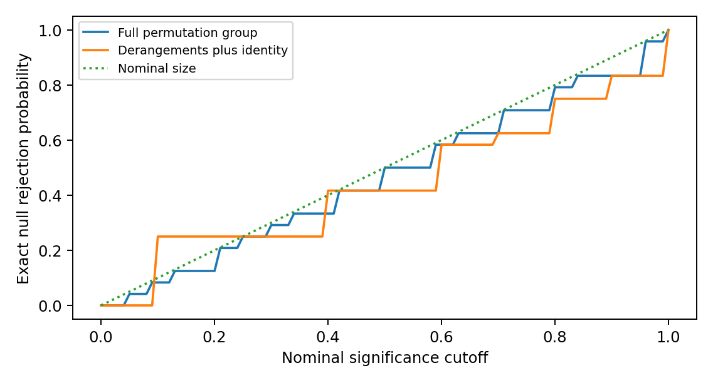

**Figure 1. A restricted rearrangement rule can break calibration. The curves enumerate all 24 null pairings, not simulated physical worlds. The dotted line is the nominal upper size bound.**

**Registration safeguard.** Suppose all model optima equal one fixed frame $D_0$. Matched and mismatched distances are identically zero, so a pairing effect is zero and its p-value is one. This is a recovery control, not an association-positive control. If instead both optima follow a randomly varying supplied orientation, mismatching can give a positive effect without revealing any new dynamical law. Cross-model coordinates need a common operational meaning. Re-expressing each model in its independently supplied frame can remove an apparent effect that only tracked that input.

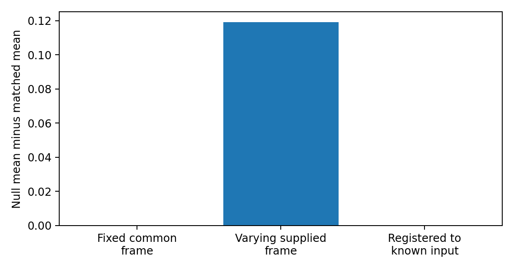

**Figure 2. Three exact registration controls. Fixed common frames give zero contrast; differing supplied common orientations give a contrast; registering to those known inputs removes it. This diagnoses the estimand, not an emergent law.**

# 6. Supplied-structure studies and distinct counterfactuals

## 6.1 Continuously driven calibration

A historical three-qubit study used 20 supplied candidates and a time-averaged singleton-count outcome. Its source coupling and observation window were changed after an initial low-record run, so fresh-seed repeats remain exploratory. Shared preparation, coupling and locality inputs facilitated an apparent overlap enrichment of 0.95 in selected cells. When preparation and coupling moved together, records preferentially remained readable in that supplied frame. These are design-sensitive illustrations, not tests of persistent redundancy or a justified chance-overlap null. Supplement Section S2 preserves the full model, development history, tables and interpretations.

## 6.2 Source-off pilot: change relative to no evolution

An injection pulse encoded a binary source while internal dynamics were paused. Both source branches then evolved under the same internal Hamiltonian, with the source fully removed. There were 96 independent Hamiltonian/circuit units at each of four and six qubits and two paired injection conditions per unit. The graph, access structures and two comparison frames were supplied. The primary contrast was half the change in the mean singleton trace-distance gap between the native frame L and alternate frame C, averaged over 50 declared positive-time readouts, relative to matched frozen evolution.

The six-qubit rotated-injection mean was -0.015225, with 28 positive and 68 negative units. The approximate bootstrap 95% interval was [-0.021070, -0.009646]; the predeclared range-only interval was [-0.292446, 0.261996]. The observed effect is negative and the bootstrap supports a negative population mean under its sampling approximation, while the conservative range-only bound does not establish its sign at this sample size. The post hoc sign test gives $p=5.4592\times10^{-5}$ under independent equiprobable nonzero signs; Holm correction across four disclosed conditions gives $p=1.6377\times10^{-4}$. This is a directional-balance test, not a zero-mean test [Holm 1979]. A negative change narrowed an existing L advantage; it did not make C absolutely superior.

No singleton met the strict new-record criterion throughout an original half-unit window. Some initially uninformative native-frame sites nevertheless became briefly strongly readable. Global distinguishability was conserved and transport controls succeeded. The zero persistent count is conditional on the initial-information floor, singleton access, error threshold and short windows, not absence of information transport.

A separately written review-stage implementation used the declared law with fresh streams, inferring the open-chain convention, circuit-layer order and tensor-factor ordering from the protocol. Those conventions are documented in the accompanying results log. Its 60,000-unit six-qubit rotated sample has mean -0.014125 and a range-only 95% interval [-0.025213, -0.003036]. Re-execution reproduced the supplied output. This strengthens the negative mean for that specific target; it does not identify the mechanism responsible for the change. The reimplementation, historical pilot and subsequent controls are separate runs, not one enlarged original sample.

## 6.3 Factorial extension: rotating dynamics at fixed injection

The original study held the Hamiltonian native to L. A subsequent exploratory extension supplied the missing alternative intervention, $H_C=U_C H_L U_C^\dagger$, retaining the same spectrum, unit-specific inputs and readout frames. It crossed injection in $a\in\{L,C\}$ with evolution under $b\in\{L,C\}$. For each unit define the post-time-average readability gap $g_b^a$ and its common initial value $g_0^a$. Then

$$z_{ab}=\tfrac12(g_b^a-g_0^a),\qquad e_a=z_{aL}-z_{aC}=\tfrac12(g_L^a-g_C^a).$$

The original rotated-pilot target is $\mathbb E[z_{CL}]$. The new intervention target is $\mathbb E[e_C]$. The initial gap cancels only in the latter. A negative first quantity and a positive second quantity are fully compatible, not a reversal of one result.

**Table 3. Six-qubit factorial extension, 20,000 paired units**

| Injection | Dynamics native to L | Dynamics native to C | Paired difference L minus C |
| --- | --- | --- | --- |
| L | 0.014004 | 0.003491 | 0.010514 |
| C | -0.014028 | -0.026663 | 0.012635 |

The supplied four-, six- and eight-qubit runs were re-executed. All six mean intervention contrasts are positive. With six disclosed targets and two-sided family coverage at least 95%, the empirical-Bernstein calculation in Supplement Section S4 gives intervals [0.008604, 0.012423] and [0.010692, 0.014579] for the six-qubit L- and C-injection contrasts. Both four-qubit intervals also exclude zero; the eight-qubit intervals with only 1,000 units do not. Normal-approximation intervals are reported separately and are narrower. The analysis is post hoc, assumes independent units from the specified law, and does not certify floating-point error [Maurer and Pontil 2009].

The range is $e_a\in[-1,1]$, not the loose difference-of-two-ranges interval [-2,2], because the initial gap cancels. This permits the sharper, explicitly derived bound. Its use is a precision calculation for this finite family, not a retrospective preregistration or a guarantee for every analysis selected after review.

## 6.4 Interpretation and limits

The added factor demonstrates a positive relative effect of the specified Hamiltonian rotation intervention at fixed injection in this family. The old result was a change relative to no evolution; it was not an isolated estimate of a locality mechanism. Neither result is discarded. The independently generated third-frame comparator lies between L and C in the supplied means, but its designation as neutral is a design description, not a theorem that it breaks only one causal link.

Isospectral conjugation does not change only locality: relative to a fixed prepared state it can change energy distributions, correlations with input structure and which observables are simple. Both native and shallow-circuit-rotated Hamiltonians also have controlled finite-range structure relative to related descriptions. Lieb-Robinson bounds constrain commutator propagation under explicit interaction assumptions [Lieb and Robinson 1972]; they do not prove the sign of a difference of time-averaged singleton trace norms. Calling the observed contrast the light-cone effect would therefore be a mechanistic inference requiring further discrimination.

No tensor-product structure is reconstructed by these computations, and the factorial outcome is not strict or redundant record formation. The remaining physical task is to identify unknown structure from several interventions and predict held-out responses without giving the algorithm its target. The methodological lesson is precise: a baseline-subtracted change, a paired Hamiltonian intervention and a structure-identification claim require different evidence.

# 7. Conjectures and prospective comparisons

> **Distinct targets.** LRA-count compares two declared reference frames, not two independently recovered global optima. It is neither LRA-int nor LRA-tot. The executed source-off pilot instead measures a baseline-subtracted readability change, not persistent record counts. No result is transferred between these targets by renaming it.

## 7.1 Two distinct model-class hypotheses

An implementation $\Theta$ must fix a model-history law $\nu$, source and preparation resources, candidates or search algorithms, record rule, locality rule, valid reference distribution and effect margin. Let $\mathsf K$ denote that declared population, not a class selected after observing which models make records. For a candidate-overlap design, define $d_{\Theta,\mathrm{int}}=\mathbb E[A_{\mathrm{int}}-q_{\mathrm{int}}]$ and analogously for the branchwise total score.

**LRA-int($\Theta$).** $d_{\Theta,\mathrm{int}}\ge\Delta_{\mathrm{int}}>0$.

**LRA-tot($\Theta$).** $d_{\Theta,\mathrm{tot}}\ge\Delta_{\mathrm{tot}}>0$.

Their exact negations are the corresponding strict inequalities below the stated margins. A confidence interval crossing a margin is inconclusive; non-significance is not equivalence. These are conditional model-class hypotheses, not derived theorems of physics. If a frame-distance estimand is chosen instead, it is a different operational hypothesis and receives a separate identifier and margin. One must not switch between the two after seeing results.

The source family $H_x=H_S+(-1)^xK_{\mathrm C}$ distinguishes internal locality from branchwise total locality. The latter averages separately normalised branch residuals. It is not necessarily the same as a single residual of the joint source-system Hamiltonian: that extension needs its own source-access convention and normalisation. A coupling-dominated example can make LRA-tot descriptively favourable almost by construction. Intermediate $\kappa=\|H_S\|_{\mathrm{HS}}/\|K_{\mathrm C}\|_{\mathrm{HS}}$ and independent frame variation are therefore useful stress regimes, not guarantees of physical novelty.

## 7.1.1 Source injection and subsequent redistribution are different questions

For a common initial state $\rho(0)$ and $H_x=H_S+K_x$,
$$\left.\frac{d}{dt}(\rho_0-\rho_1)\right|_0=-i[K_0-K_1,\rho(0)].$$
The common internal generator cancels at first order. This identifies the source of the initial branch difference, not a theorem that one access frame wins at later times. Energy eigenstates selected as pointer states in a regime of weak system-environment interaction in which the system self-Hamiltonian dominates [Paz and Zurek 1999] are also not automatically redundant records of the particular external source bit used here.

A source-off design separates the roles. After a stated injection pulse, set $K_x=0$ and evolve both branches under the same $H_S$. Their global trace distance is conserved by that common unitary, while reduced distinguishability can increase, decrease or redistribute. Switching off the source does not remove the prepared imprint. Compare changes against a matched frozen-history control, disclose the supplied injection and readout structures, and distinguish transfer, local accessibility, redundant records and identification of an unknown TPS. The source-off pilot studies this different target, not a relabelling of LRA-count. Its factorial extension additionally varies the Hamiltonian orientation while retaining the specified injection.

Small closed systems can have time-sensitive record windows, but closed dynamics do not preclude persistence: orthogonal stationary product records under a diagonal Hamiltonian remain readable. Conversely, dissipation with one common attractive fixed state can erase the branch distinction. Large size or openness alone is neither a necessary nor a sufficient record guarantee. Environmental many-body interactions can suppress redundancy under the assumptions of Riedel, Zurek and Zwolak (2012). The decoder, retention target and observation window must be specified in each model.

## 7.2 What an independent search would mean

The locality algorithm may see $H$ and declared admissibility data, but not record scores. The record algorithm may see conditional states, source and access rules, but not locality scores. Each uses a prospectively fixed optimisation budget and independent random starts. Informational separation of algorithms does not remove shared physical inputs, nor does it prove that either output is a global optimum.

Use multi-start sets rather than pretend there is one unique best frame. Apply an absolute record floor to the original persistent-record target even when a smooth surrogate drives optimisation. A failed search is SEARCH_UNRESOLVED, while a verified absence of qualifying records is NO_RECORD. They have different interpretations and neither supplies a fabricated optimal record frame. Training on some times or histories requires held-out evaluation, and any state-adaptive search lies outside Proposition 3's fixed-frame union bound.

## 7.3 Primary prospective target: within-model record contrast

The prospective LRA-count design compares declared frames within each model rather than re-pairing frames across models. It is retained as an unexecuted target, not the primary outcome of the source-off pilot. This is a change of estimand, not a confirmation or falsification of LRA-int or LRA-tot. Let $E$ denote an input-only eligibility condition, such as separation of the reference frames by a stated $\Phi$ threshold. For eligible units use
$$Z_i=\frac{R_{\mathrm{new}}(D_{L,\mathrm{ref}}(i))-R_{\mathrm{new}}(D_{C,\mathrm{ref}}(i))}{m_{\max}},\qquad \theta_{LC}=\mathbb E[Z_i\mid E=1].$$
The common predeclared cap $m_{\max}$ bounds the admissible disjoint-fragment count. In a singleton study it equals the system-site count. It must not be changed after seeing the records. A reference frame is supplied by the model construction or computed from inputs without record scores. It is not called a unique global optimum unless that is established. In particular the native internal-locality frame need not minimize the total Hamiltonian score. Nonunique references require a predeclared selector, a near-optimal-set sensitivity analysis, or an explicitly supplied-frame interpretation.

The count difference asks how much qualified information distribution differs; the sign contrast $\mathbb E[\operatorname{sgn}(R_L-R_C)\mid E=1]$ asks how often one frame wins. Both are legitimate but different questions. This unexecuted proposal selects normalized count difference and retains win/loss/tie frequencies as secondary diagnostics. Neither is a causal effect merely because it is called frame attribution.

No-record units remain in the primary denominator with $Z_i=0$ when absence is established. Define a companion formation indicator using existence of newly qualifying records in the declared union of reference-frame fragment sets. Report its rate on both the complete generated population and the input-eligible population. A formation-conditional contrast is explicitly secondary. When that formation event $B$ contains every unit with $Z_i\ne0$,
$$\mathbb E[Z\mid E=1]=\Pr(B\mid E=1)\,\mathbb E[Z\mid E=1,B=1].$$
Dropping zero-record units therefore changes the magnitude and scientific target. Reference frames remain evaluable even when no record optimum exists. Search failure and unresolved numerical certification are not assigned zero.

Each within-unit comparison is invariant under a consistent common conjugation of its history and access descriptions. This removes cross-model registration and permutation assumptions, but not the need for independent sampling, justified model relevance, resource accounting, fixed thresholds, or honest treatment of uncertainty. A model prepared and coupled in its own reference frame can still favour that frame by design. Separation thresholds and failure of a sufficient perturbation certificate do not prove that a cell is informative.

For a frozen implementation, LRA-count($\Theta$) is $\theta_{LC}\ge\Delta>0$, with negation $\theta_{LC}<\Delta$. The sampled class, eligibility law, primary cell, cap, margin and formation diagnostic must be specified before the held-out run. A fully specified negative result counts against this model-class contrast, not every relational ontology. Cross-model pairing remains only a conditional alternative with the explicit contract in the supplement; its counterexamples in Section 5.6 remain valid.

## 7.3.1 Certification uncertainty must not become a frame advantage

A local reference may have a smaller continuity constant than a scrambled reference. On the same coarse grid, more fragments can then be certified in the local frame even if their true persistent-record counts coincide. That is a property of the certification procedure, not necessarily of the physics. For example, true constant error $0.099$ is below a $0.1$ threshold in both frames. A spacing $0.01$ and valid constants $0.1$ and $1$ give upper certificates $0.0995$ and $0.104$. The second is unresolved, not a demonstrated absence of a record.

Maintain lower and upper count bounds $R^{\mathrm{lo}}\le R_{\mathrm{new}}\le R^{\mathrm{hi}}$. Certified fragments provide a lower bound. Every fragment not proved to fail remains eligible for the upper bound; disjoint packing is solved consistently for each bound. Then
$$Z_i^{\mathrm{lo}}=(R_L^{\mathrm{lo}} -R_C^{\mathrm{hi}})/m_{\max},\qquad Z_i^{\mathrm{hi}}=(R_L^{\mathrm{hi}}-R_C^{\mathrm{lo}})/m_{\max}.$$
For $N$ independent eligible model-history units, deterministic valid enclosures and an endpoint-inclusive fixed analysis,
$$\left[\overline{Z^{\mathrm{lo}}}-h,\overline{Z^{\mathrm{hi}}}+h\right]\cap[-1,1],\qquad h=\sqrt{2\log(2/\alpha)/N},$$
covers $\theta_{LC}$ with probability at least $1-\alpha$. This follows from Hoeffding applied to the unobserved true $Z_i\in[-1,1]$ and the inequalities between sample means. No independence of the fragment-level certificates is required. If numerical bounds have a failure probability, add that failure budget explicitly. With no valid classification, use the full possible interval, not deletion of the unit. Larger samples reduce sampling error but cannot remove persistent identification width. A bootstrap alone does not fix that width.

## 7.4 Controls and staged progression

| Control or stage | Correct expected interpretation | Status in this release |
|---|---|---|
| Fixed common frame | Recover the frame, but pairing contrast is zero | Exact counterexample/calibration executed |
| Varying supplied common orientation | Raw pairing contrast can be positive; disclose and condition on the supplied orientation | Exact projector-span calibration executed |
| Known-input registration | Input-only association can disappear | Exact calibration executed |
| Complete permutation group | Conditional size control under its stated null | Exact four-label enumeration executed |
| Derangements-only reference | Not automatically calibrated | Exact anti-conservative counterexample executed |
| Independent conditional Haar preparation | Small fixed fragments rarely qualify in the stated regime | Source simulations reproduced; bounds retained |
| Persistent versus sampled records | Require a continuum certificate or an explicitly discrete target | Certificate and decoder controls executed, Appendix D |
| Unrestricted independent optimisation | Needs access constraints, convergence study and costed search budget | NOT EXECUTED |
| Physically informative LRA model ensemble | Needs independently motivated model class and valid inference | NOT EXECUTED |

The supplied source-off protocol records the executed feasibility pilot. Unrestricted structure search and a prospectively registered, held-out identification study remain unexecuted. The supplied factorial extension is an executed exploratory intervention study, not that identification stage. No larger study is activated by the existence of this protocol: it first needs an informative target, a justified sampling law and an acceptable certification budget. Any subsequent search requires a separate sensitivity and unresolved-rate assessment.

## 7.5 Physical correspondence remains a separate claim

An effective graph or a few-body Hamiltonian is not a derived spacetime metric. Existing reconstruction work makes additional assumptions explicit [Cao, Carroll and Michalakis 2017]. A fundamental extension needs a primitive-input ledger and an independent target: geometry, causal propagation, dimensionality, or observation distributions evaluated on data not used to choose the frame. Even successful LRA evidence would support its specified models. It would not automatically establish monism, spatial infinity, plenitude or a conscious ground.

# 8. Relation to prior work

**Subsystems from operational or dynamical criteria.**

- *Virtual subsystems and generalised TPS.* Zanardi's virtual subsystems and their extension define subsystems through operationally accessible observable algebras [Zanardi 2001; Zanardi, Lidar and Lloyd 2004].
- *Minimal scrambling.* Zanardi, Dallas, Andreadakis and Lloyd define generalised TPS as dual pairs of an operator subalgebra and its commutant, and select them by minimal short-time information scrambling. The long-time extension uses the long-time average of the algebraic out-of-time-order correlator [Zanardi et al. 2024; Andreadakis, Dallas and Zanardi 2023]. Either criterion could replace or complement $L$ as a dynamical score. The same audit questions apply, but its class invariance, admissible structure, search distribution and reference calibration must be re-established; the theorems do not transfer unchanged by renaming the score. Andreadakis and Zanardi also define a distance between a tensor-product structure and its image under a unitary channel [Andreadakis and Zanardi 2025]; Section 2.7 distinguishes our span diagnostic from a full access-structure comparison.
- *Locality from the spectrum.* Cotler, Penington and Ranard study when a Hamiltonian's spectrum determines a local TPS [Cotler, Penington and Ranard 2019]. Stoica argues that preferred structures built only from the Hamiltonian and state are either not unique or not compatible with observation [Stoica 2022]. Soulas, Franzmann and Di Biagio re-examine both results and argue that the first has been widely misread and the second holds only in a weaker version [Soulas, Franzmann and Di Biagio 2025], a reading Stoica disputes [Stoica 2026]. Loizeau and Sels show that the number of subsystems can be inferred from finite-size corrections to the Gaussian density of states in local models [Loizeau and Sels 2025].
- *Scope of this paper.* Nothing here depends on how that dispute is resolved. Our candidate structures are declared, and our claims are conditional on the declared reference structure.

**Records, objectivity and classicality.**

- *Decoherence and quantum Darwinism.* Decoherence and einselection identify states robust under a given interaction, and quantum Darwinism studies the redundant proliferation of information about them [Zurek 2003; Ollivier, Poulin and Zurek 2004; Zurek 2009].
- *Preparation dependence.* Zwolak, Quan and Zurek (2010) analyse information acquisition in mixed or misaligned environments under specified decohering interactions. This is direct prior art for readiness dependence, not a new mechanism discovered here. Kumar (2023), an undergraduate thesis, reports loss of a quantum-Darwinism redundancy plateau when environmental subsystem divisions are scrambled. Its mutual-information criterion differs from the present persistent Helstrom formation rule. Ollivier (2022) studies imperfect records and POVMs without singling out a preferred system-environment dichotomy. His construction still assumes microscopic sites and a natural tensor-product structure (Sections 1 and 2); it is not a derivation of arbitrary subsystem structure from no input factorisation. The present Helstrom-persistence test asks a different operational question.
- *Genericity.* Brandão, Piani and Horodecki proved that the objectivity of observables is generic in quantum dynamics, while the objectivity of outcomes is model-dependent [Brandão, Piani and Horodecki 2015].
- *Stronger objectivity notions.* Spectrum broadcast structures formalise stronger objectivity [Horodecki, Korbicz and Horodecki 2015]. Their claimed equivalence with strong quantum Darwinism was later qualified in a reply to a published comment [Le and Olaya-Castro 2019, 2021].
- *Riedel.* Given the TPS of spatial locality, redundant local records constrain branch decompositions strongly [Riedel 2017]. Our question is the converse direction: whether record structure selects that TPS.
- *Adil et al.* A fixed Hamiltonian admits many factorizations with robust pointer states, and these need not align with the usual notion of locality [Adil et al. 2026]. Their pointer-state criterion is not identical to persistent, redundantly decodable source records. Supplement Table S6 is a separate small illustration of frame sensitivity, not a replication of their stronger or differently defined claims.

**Typicality.** Proposition 3 is a direct consequence of subsystem-typicality estimates [Page 1993; Popescu, Short and Winter 2006; Goldstein et al. 2006; Hayden, Leung and Winter 2006]. We claim no new typicality result. The contribution is its scoped use as a design constraint on record tests. Conditional Haar typicality suppresses selected small-fragment outcomes; it neither identifies the true preparation of the universe nor forbids adaptive encoding.

**Contribution and priority.** Section 1.3 states the single contribution list. The underlying projection, commutant, concentration and perturbation tools are standard. Their role here is to prevent three specific mistakes: equating span and access, transferring a verdict between counterfactuals, and treating an unresolved certificate as absent information. The factorial illustration is an outcome of a supplied finite model, not a new theorem that locality always determines record structure. External assessment of novelty and usefulness remains necessary.

# 9. Limitations, falsifiers and competing interpretations

**Limitations.**

- Finite dimension, qubit factors, pure conditional states in Proposition 3, a binary source, autonomous Hamiltonians and declared reference structures.
- Proposition 3(v) does not cover candidates chosen after inspecting the state.
- The historical continuously driven toy has three qubits and development-stage tuning. The original source-off pilot has four and six qubits; the later review extensions include eight. All use closed dynamics, supplied frames and restricted observation windows. Mean readability is not redundant-record formation.
- The prospective unrestricted search design is not executed. Several exact statistical, access and persistence components are checked, but component success is not an ensemble result.
- The locality residual measures operator weight relative to a declared span; it is not by itself a propagation velocity or a recovered spacetime geometry.

**What would change the claims.**

- An error in any proof withdraws the corresponding statement. Numerical agreement supports implementation checks but cannot repair a false general proof.
- For the prospective LRA-count target, an uncertainty-valid interval wholly below its predeclared margin counts against that contrast in its declared eligible population. A structurally built-in positive result does not provide the claimed discrimination. The older LRA-int and LRA-tot overlap hypotheses require their own justified reference null and cannot inherit the count-contrast verdict. Held-out model families and larger systems test generalisation, not the correctness of an already exhibited counterexample.
- Different post hoc interventions do not change the original predeclared estimand. More units sharpen sampling precision but do not identify an otherwise unspecified physical mechanism.

**Competing interpretations.**

- *Einselection.* Any positive LRA-tot result may be the familiar statement that pointer observables are selected by the interaction Hamiltonian [Zurek 2003]. An LRA-tot result has further content only where the locality frame of the total Hamiltonian is not the frame of any single designed term.
- *Algebraic criteria.* Criteria that do not privilege locality, such as minimal scrambling, may select the same frames for different reasons. They should be run as comparators.

# 10. Data, code and reproducibility

The accompanying Supplementary Information provides the complete run catalogue, parameters, random-stream rules, software environment, pre-execution records and commands. The circulation package contains immutable pilot inputs, per-unit outcomes, raw trajectories, numerical-control scripts and the secondary analyses reported here. Historical exploratory outputs retain their original definitions. Same-code replay and separate numerical implementations are distinguished from external replication; floating-point agreement is not a rigorous interval enclosure. No public persistent deposit or external scientific replication is claimed. All four size/arm pilot summaries, including adverse outcomes, are reported in the accompanying results log.

# 11. Declarations

The author is responsible for the claims and their final approval. Claude, ChatGPT and a Genspark-mediated review assisted analysis, source retrieval, code, drafting and editing; none is an author, and this assistance is not external peer review. No human-participant data were collected. Funding, competing interests and the final author/correspondence metadata remain subject to author confirmation before submission. The philosophical common-ground inquiry is a separate work; no quantum-information result here is evidence that a conscious or infinite substrate exists.

# References

- Adil, A., Rudolph, M. S., Arrasmith, A., Holmes, Z., Albrecht, A., and Sornborger, A. (2026). Search for classical subsystems in quantum worlds. Physical Review D 113, 103535 (2026). https://doi.org/10.1103/vj4x-96fk. Preprint arXiv:2403.10895.
- Andreadakis, F., and Zanardi, P. (2025). Tensor product structure geometry under unitary channels. Quantum 9, 1668. https://doi.org/10.22331/q-2025-03-25-1668
- Andreadakis, F., Dallas, E., and Zanardi, P. (2023). Long-time quantum information scrambling and emergent mereology. arXiv:2312.13386.
- Brandão, F. G. S. L., Piani, M., and Horodecki, P. (2015). Generic emergence of classical features in quantum Darwinism. Nature Communications 6, 7908. https://doi.org/10.1038/ncomms8908
- Cao, C., Carroll, S. M., and Michalakis, S. (2017). Space from Hilbert space: Recovering geometry from bulk entanglement. Physical Review D 95, 024031. https://doi.org/10.1103/PhysRevD.95.024031
- Carroll, S. M., and Singh, A. (2021). Quantum mereology: Factorizing Hilbert space into subsystems with quasiclassical dynamics. Physical Review A 103, 022213. https://doi.org/10.1103/PhysRevA.103.022213
- Cotler, J. S., Penington, G. R., and Ranard, D. H. (2019). Locality from the spectrum. Communications in Mathematical Physics 368, 1267-1296. https://doi.org/10.1007/s00220-019-03376-w
- Goldstein, S., Lebowitz, J. L., Tumulka, R., and Zanghì, N. (2006). Canonical typicality. Physical Review Letters 96, 050403.
- Hayden, P., Leung, D. W., and Winter, A. (2006). Aspects of generic entanglement. Communications in Mathematical Physics 265, 95-117.
- Helstrom, C. W. (1969). Quantum detection and estimation theory. Journal of Statistical Physics 1, 231-252. https://doi.org/10.1007/BF01007479
- Hemerik, J., and Goeman, J. (2018). Exact testing with random permutations. TEST 27, 811-825. https://doi.org/10.1007/s11749-017-0571-1 ; author manuscript https://arxiv.org/abs/1411.7565
- Hoeffding, W. (1963). Probability inequalities for sums of bounded random variables. Journal of the American Statistical Association 58(301), 13-30. https://doi.org/10.1080/01621459.1963.10500830
- Holm, S. (1979). A simple sequentially rejective multiple test procedure. Scandinavian Journal of Statistics 6(2), 65-70. https://www.jstor.org/stable/4615733
- Horodecki, R., Korbicz, J. K., and Horodecki, P. (2015). Quantum origins of objectivity. Physical Review A 91, 032122.
- Kumar, M. (2023). Quantum Darwinism and Preferred Choice of Subsystems. Pitzer Senior Theses, 187. https://scholarship.claremont.edu/pitzer_theses/187/
- Le, T. P., and Olaya-Castro, A. (2019). Strong quantum Darwinism and strong independence are equivalent to spectrum broadcast structure. Physical Review Letters 122, 010403. https://doi.org/10.1103/PhysRevLett.122.010403
- Le, T. P., and Olaya-Castro, A. (2021). Reply to Comment on "Strong quantum Darwinism and strong independence are equivalent to spectrum broadcast structure". arXiv:2101.10756.
- Lieb, E. H., and Robinson, D. W. (1972). The finite group velocity of quantum spin systems. Communications in Mathematical Physics 28, 251-257. https://doi.org/10.1007/BF01645779
- Loizeau, N., and Sels, D. (2025). Quantum mereology and subsystems from the spectrum. Foundations of Physics 55, 3. https://doi.org/10.1007/s10701-024-00813-2
- Maurer, A., and Pontil, M. (2009). Empirical Bernstein Bounds and Sample Variance Penalization. Proceedings of COLT 2009. arXiv:0907.3740. https://arxiv.org/abs/0907.3740
- Ollivier, H. (2022). Emergence of Objectivity for Quantum Many-Body Systems. Entropy 24(2), 277. https://doi.org/10.3390/e24020277 ; https://arxiv.org/html/2202.06832v1
- Ollivier, H., Poulin, D., and Zurek, W. H. (2004). Objective properties from subjective quantum states: Environment as a witness. Physical Review Letters 93, 220401.
- Page, D. N. (1993). Average entropy of a subsystem. Physical Review Letters 71, 1291. arXiv:gr-qc/9305007
- Paz, J. P., and Zurek, W. H. (1999). Quantum limit of decoherence: Environment induced superselection of energy eigenstates. Physical Review Letters 82, 5181-5185. https://doi.org/10.1103/PhysRevLett.82.5181
- Phipson, B., and Smyth, G. K. (2010). Permutation p-values should never be zero: Calculating exact p-values when permutations are randomly drawn. Statistical Applications in Genetics and Molecular Biology 9(1), Article 39. https://doi.org/10.2202/1544-6115.1585
- Popescu, S., Short, A. J., and Winter, A. (2006). Entanglement and the foundations of statistical mechanics. Nature Physics 2, 754-758. https://doi.org/10.1038/nphys444 The longer author preprint, *The foundations of statistical mechanics from entanglement: Individual states vs. averages*, arXiv:quant-ph/0511225v3, supplies the explicit concentration Lemma 3 and Eqs. 20 to 22 used in Appendix F. These are related accounts, not independent evidence.
- Riedel, C. J. (2017). Classical branch structure from spatial redundancy in a many-body wave function. Physical Review Letters 118, 120402. arXiv:1608.05377
- Riedel, C. J., Zurek, W. H., and Zwolak, M. (2012). The rise and fall of redundancy in decoherence and quantum Darwinism. New Journal of Physics 14, 083010. https://arxiv.org/abs/1205.3197
- Soulas, A., Franzmann, G., and Di Biagio, A. (2025). On the emergence of preferred structures in quantum theory. arXiv:2512.07468.
- Stoica, O. C. (2022). 3D-space and the preferred basis cannot uniquely emerge from the quantum structure. arXiv:2102.08620. Advances in Theoretical and Mathematical Physics 26(10), 3895-3962. https://doi.org/10.4310/ATMP.2022.v26.n10.a12
- Stoica, O. C. (2026). Comment on "On the emergence of preferred structures in quantum theory" by Soulas, Franzmann, and Di Biagio. arXiv:2603.07674.
- Wilde, M. M. (2019). From classical to quantum Shannon theory. arXiv:1106.1445, version 8.
- Zanardi, P. (2001). Virtual quantum subsystems. Physical Review Letters 87, 077901. https://doi.org/10.1103/PhysRevLett.87.077901
- Zanardi, P., Dallas, E., Andreadakis, F., and Lloyd, S. (2024). Operational quantum mereology and minimal scrambling. Quantum 8, 1406. https://doi.org/10.22331/q-2024-07-11-1406
- Zanardi, P., Lidar, D. A., and Lloyd, S. (2004). Quantum tensor product structures are observable induced. Physical Review Letters 92, 060402. https://doi.org/10.1103/PhysRevLett.92.060402
- Zurek, W. H. (2003). Decoherence, einselection, and the quantum origins of the classical. Reviews of Modern Physics 75, 715-775. https://doi.org/10.1103/RevModPhys.75.715
- Zurek, W. H. (2009). Quantum Darwinism. Nature Physics 5, 181-188. https://doi.org/10.1038/nphys1202
- Zwolak, M., Quan, H. T., and Zurek, W. H. (2010). Quantum Darwinism in non-ideal environments. Physical Review A 81, 062110. https://arxiv.org/abs/0911.4307

# Appendix A. Numerical provenance

Supplement Section S1 maps every displayed numerical result to its original script, output key and sample definition. The historical 2,000-draw twirl sample and the separate 1,200-draw calibration target the same exact expectation but are not one enlarged sample. The source-off data, post hoc sign analysis and transport-window diagnostic have distinct run records. Version and file-path details are kept there so that they do not substitute for the scientific argument.

# Appendix B. Scope of results

The score, covariance, conditional typicality, continuity and finite-cover statements are mathematical results under their explicit premises. Numerical agreement is corroboration of an implementation, not a proof of the universal statements. The finite-cover result is a concentration-and-net corollary; historical priority is not asserted.

The continuously driven simulations are exploratory and time-averaged. The source-off experiment is a separately specified finite readability pilot. Neither tests the original model-class overlap conjectures or recovers an unknown metric. The proposed persistent count comparison remains a different prospective study. Full-space Haar assumptions are not an empirical preparation model for the universe.

# Appendix C. Mixed conditional typicality

**Proposition 4.** Conditional on design information $Z=z$ that fixes the candidate frame, let each branch have a unitarily invariant density-operator marginal in dimension $d=d_Fd_R$. Write $\mathbb E_z[\cdot]=\mathbb E[\cdot\mid Z=z]$ and $P_x(z)=\mathbb E_z\operatorname{Tr}\rho_x^2$. Then
$$\mathbb E_z\|\rho_{F,x}-I/d_F\|_{\mathrm{HS}}^2=\frac{(d_F^2-1)(dP_x(z)-1)}{d_F(d^2-1)},$$
$$b_x(z)=\sqrt{\frac{(d_F^2-1)(dP_x(z)-1)}{d^2-1}},\qquad \mathbb E_z[1/2-p_{\mathrm{err}}]\le\frac{b_0(z)+b_1(z)}4.$$
For equal priors and $\varepsilon<1/2$,
$$\Pr(p_{\mathrm{err}}\le\varepsilon\mid Z=z)\le\min\left\{1,\frac{b_0(z)+b_1(z)}{2(1-2\varepsilon)}\right\}.$$
**Proof.** Conditional twirling gives $\mathbb E_z[\rho_x\otimes\rho_x]=\alpha_z I+\beta_z\mathbb F$, where $\alpha_z=(d-P_x(z))/[d(d^2-1)]$ and $\beta_z=(dP_x(z)-1)/[d(d^2-1)]$. Contract with the fragment swap, subtract $1/d_F$, and use the Schatten-norm comparison and Jensen. The triangle and Markov steps are those of Proposition 3; they do not require branch independence. An unconditional result follows by averaging the conditional bounds. Replacing $P_x(z)$ by an unconditional purity after selecting a frame need not be valid. $\square$

The pure-state case is $P_x=1$ and reduces to Proposition 3; the maximally mixed case $P_x=1/d$ gives zero advantage. A four-dimensional calibration with spectrum $(0.55,0.25,0.15,0.05)$ has global purity $0.39$, exact mean centered fragment Hilbert-Schmidt norm squared $0.056$, and trace-norm bound $0.3346640106$. The historical sample of 2,000 random eigenbases gave $0.0557464152$ for that squared norm, with Monte Carlo standard error $0.0007264476$. Separately, the 1,200-draw calibration gave $0.05550839355$, with standard error $0.00093479233$. Both target the same exact value $0.056$; the samples and provenance are not interchangeable. This is a check of an explicit finite twirl formula, not a new empirical law or a claim of historical priority.

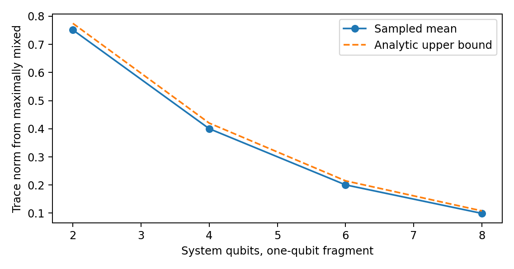

**Figure 3. Fixed-fragment typicality calibration. The conditional measure and fragment size are supplied. The bound is not a probability distribution for the universe.**

# Appendix D. Persistent accessibility and a continuum certificate

Pointwise optimal decoding allows a different measurement at each known time. That is weaker than requiring one fixed decoder when the readout time is unknown. Consider orthogonal Pauli-X eigenstates as source-conditioned states evolving under $H=Z$. They remain perfectly distinguishable at each known time. At times $0$ and $\pi/2$ their labels swap. Averaging over those two unknown times makes both conditional states $I/2$, so every fixed time-blind decoder has error $1/2$. A persistence definition must therefore declare whether time, a reference clock and decoder changes are available.

**Proposition 5: grid-to-window certificate.** For autonomous finite-dimensional conditional generators $H_x$, define the shift-invariant spectral radius $\omega_x=\min_{c\in\mathbb R}\|H_x-cI\|_{\mathrm{op}}$. For equal priors and a fixed candidate fragment,
$$| p_{\mathrm{err}}^{\mathrm{opt}}(t)-p_{\mathrm{err}}^{\mathrm{opt}}(s)| \le K| t-s| ,\qquad K=(\omega_0+\omega_1)/2.$$

**Proof.** $\|\dot\rho_x\|_1=\|[H_x-cI,\rho_x]\|_1\le2\omega_x$. Integrating gives a trace-norm Lipschitz bound, preserved by the partial trace on Hermitian differences. Apply the reverse triangle inequality to the equal-prior Helstrom expression and sum the two branch bounds. The same bound applies to the error of any single fixed binary effect, using that a trace-zero Hermitian difference has maximal effect expectation equal to half its trace norm. $\square$

Write $p_{\mathrm{err}}^{\mathrm{opt}}$ for the pointwise optimal error. On a closed finite window, an endpoint-inclusive grid with largest gap $h$ and certified grid-error allowance $\eta_{\mathrm{num}}$ gives
$$\max_{t\in T_w}p_{\mathrm{err}}^{\mathrm{opt}}(t)\le\max_j\widehat p_{\mathrm{err}}^{\mathrm{opt}}(t_j)+Kh/2+\eta_{\mathrm{num}}.$$
The numerical error budget must be proved or bounded; ordinary floating-point agreement alone is not a rigorous interval enclosure. Where an analytic solution is available it can validate the entire window directly.

For $H_0=X$, $H_1=-X$, common initial $\left| 0\right\rangle$ and $T_w=[0.70,0.87]$, the analytic error is $(1-\sin2t)/2$. Thirty-five equally spaced points give maximum grid error $0.0072751350$, $K=1$ and $h=0.005$, hence a whole-window upper certificate $0.0097751350$ before a numerical allowance. The analytic formula also shows one fixed $Y$ decoder suffices throughout this window. This calibration is distinct from certifying the original three-qubit exploratory table, whose time-averaged outcome is retained as historical data.

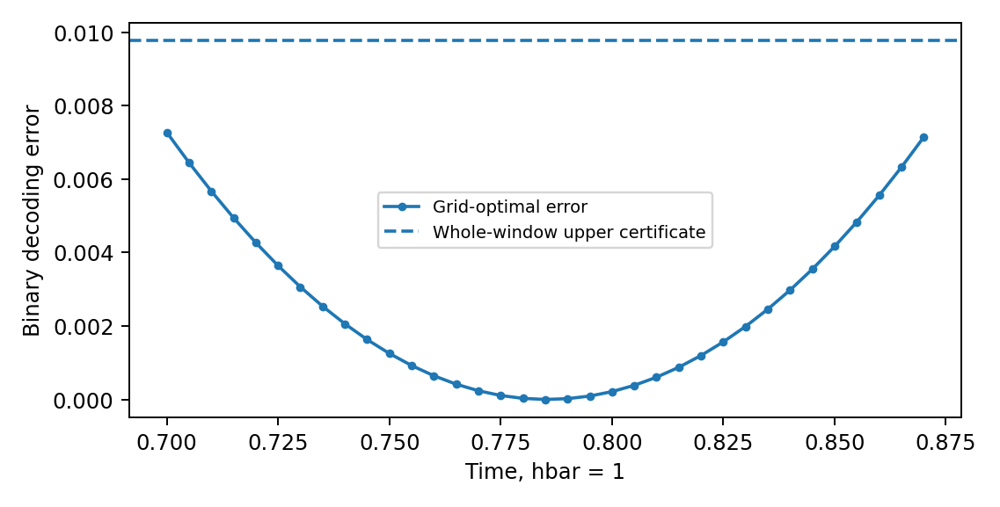

**Figure 4. Sampled accessibility is strengthened by an explicit continuity bound. This one-qubit conditional calculation certifies its stated window; it does not certify a different model or an unrestricted frame search.**


## D.1 Localised certificate without arbitrary term grouping

**Proposition 5a.** In the coordinates of a fixed candidate, define the normalized conditional expectation onto complement-only operators and the touching part by
$$\mathcal E_{\bar F}(H_x)=\frac{I_F}{d_F}\otimes\operatorname{Tr}_F H_x,\qquad H_{x,\mathrm{touch}\, F}=H_x-\mathcal E_{\bar F}(H_x).$$
The tensor placement follows the chosen $F\mid\bar F$ ordering. Put
$$\omega_{x,F}=\inf_{c\in\mathbb R}\|H_{x,\mathrm{touch}\, F}-cI\|_{\mathrm{op}},\qquad K_F=(\omega_{0,F}+\omega_{1,F})/2.$$
The Lipschitz and grid bounds of Proposition 5 remain valid with $K_F$. They also remain valid using $K_{\mathrm{best}}=\tfrac12\sum_x\min(\omega_x,\omega_{x,F})$.

**Proof.** Complement-only commutators vanish after the partial trace, including on entangled states. Consequently $\dot\rho_{F,x}=-i\operatorname{Tr}_{\bar F}[H_{x,\mathrm{touch}\, F}-cI,\rho_x]$. The Hermitian operator $-i[H,\rho]$ obeys trace-norm contraction under partial trace, and $\|[A,\rho]\|_1\le2\|A\|_{\mathrm{op}}$. Integrate and apply the Helstrom reverse-triangle argument. Both the global and touching bounds hold per branch, so their minima can be used. $\square$

An explicit supported-term decomposition gives another valid bound, as follows directly from termwise support. The conditional-expectation form removes arbitrary grouping and cancels all complement-only Pauli components. For fixed-size fragments in bounded-degree models with uniformly bounded incident interactions in the scored frame, the touching bound stays bounded as system size grows. It need not do so for arbitrary nonlocal candidate frames, growing fragments, unbounded couplings or dense graphs. It is not guaranteed smaller than the global bound, hence the minimum above. A tighter derivative bound does not remove decoder or roundoff obligations.

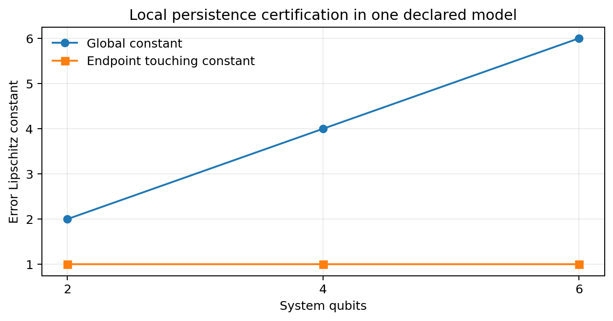

**Figure 5. Local certification in a specified model. The new calculation uses $H_S=0.05\sum_j Z_jZ_{j+1}$ and $K_x=(-1)^x\sum_j X_j$ for 2, 4 and 6 qubits. The endpoint touching constant is $\sqrt{1.0025}$ at each size. The conditional expectation removes complement-only terms; the illustration does not prove size independence in every candidate frame.**

# Appendix E. Perturbation robustness is not a frame-ranking theorem

**Proposition 6.** For $H_x=H_S+K_x$ and the same initial conditional states, access and priors, let $p^0_{\mathrm{err}}(F,t)$ be the optimal error under $K_x$ alone. In finite dimension,
$$|p_{\mathrm{err}}(F,t)-p^0_{\mathrm{err}}(F,t)|\le \left|t\right|\,\omega(H_S),\qquad\omega(H_S)=\inf_c\|H_S-cI\|_{\mathrm{op}}.$$
**Proof.** Subtracting $cI$ changes only a propagator phase. Duhamel's formula bounds the operator-norm propagator difference by $\left|t\right|\|H_S-cI\|$. The corresponding state difference is at most twice that value in trace norm. Reduce to the fragment and apply the weighted Helstrom reverse-triangle inequality. The factor one half cancels the factor two, and the priors sum to one. Minimize over $c$. $\square$

Thus the condition $p^0_{\mathrm{err}}(F,t)+\left|t\right|\omega(H_S)\le\varepsilon$ at every $t\in T_w$ is a sufficient preservation certificate for that fragment. It proves neither that this frame minimizes locality nor that it maximizes redundant records, nor that a near-optimal overlap event must occur. Other frames and the full generator's score still matter. Failure of the sufficient condition does not prove competition: $H_S=100I\otimes Z$ can have a huge norm while leaving the first qubit's records under $K_x=(-1)^xX\otimes I$ unchanged. This exact spectator example is included in the new checks.

Use certified cells as clearly labelled recording controls. Do not remove every norm-dominated cell or call every uncertified cell an informative test by default. A historical 9,000-case numerical check tests the perturbation inequality, not a stronger frame-ranking conclusion; its provenance is retained in the supplement.

# Appendix F. Adaptive selection within a predetermined family

**Proposition 7 (conditional search-family bound).** Condition on design information $Z=z$. Let both pure branch states have Haar marginals in $\mathbb C^d$, without requiring joint independence. Fix a nonempty compact unitary family $\mathcal V_z$ before the realized branch states, and let $N_z(r)$ be the size of an operator-norm $r$-net whose centres lie in that family. Let $0\le\varepsilon<1/2$, $r>0$, and $J\ge1$ declared fragment patterns all have dimension $d_F\ge2$, with $d=d_Fd_R$. Put
$$b=\sqrt{\frac{d_F^2-1}{d+1}},\qquad a_r=1-2\varepsilon-2r-b>0.$$
For equal priors at one specified time,
$$\Pr\left(\exists V\in\mathcal V_z,F:\ p_{\mathrm{err}}(F,V)\le\varepsilon\mid Z=z\right)\le\min\left\{1,4J N_z(r)\exp\left[-\frac{d a_r^2}{18\pi^3}\right]\right\}.$$
An algorithm may choose its output adaptively from $\mathcal V_z$; the family itself may not be expanded in response to the realized states without accounting for that expansion. With unequal fragment dimensions use the largest $b$ or sum the individual bounds.

**Proof.** For normalized vectors, $f(\psi)=\|\operatorname{Tr}_{\bar F}\left|\psi\right\rangle\left\langle\psi\right|-I/d_F\|_1$ is at most 2-Lipschitz on the unit sphere. Proposition 3 gives $\mathbb E_z f\le b$. The explicit version of Levy concentration in Popescu, Short and Winter (2006), Lemma 3 and Eqs. 20 to 22, gives $\Pr(f\ge b+a)\le2\exp[-d a^2/(18\pi^3)]$ for $a>0$. This constant uses real sphere dimension $2d-1$ and the Lipschitz bound two.

For fixed conditional states, $|p_{\mathrm{err}}(F,V)-p_{\mathrm{err}}(F,W)|\le\|V-W\|_{\mathrm{op}}$: each branch density matrix changes by at most $2\|V-W\|_{\mathrm{op}}$ in trace norm, and the two branches enter with coefficient one quarter. Therefore a qualifying $V$ implies a net centre $W$ with error at most $\varepsilon+r$. At that centre the triangle bound requires at least one branch deviation $f_x\ge1-2\varepsilon-2r=b+a_r$. Union over two branches, $J$ fragments and $N_z(r)$ centres gives the result. Only marginal Haar concentration is used. $\square$

**Circuit corollary.** For a fixed ordered product of $P$ gates $e^{-i\theta_j A_j}$, with fixed Hermitian generators $\|A_j\|_{\mathrm{op}}\le1$ and $\theta_j\in[-\Theta,\Theta]$, telescoping bounds unitary distance by $\sum_j|\theta_j-\theta'_j|$. A coordinate grid of maximum spacing $2r/P$ gives
$$N_z(r)\le(2+2\Theta P/r)^P.$$
A finite choice of $B$ circuit architectures multiplies the cover by at most $B$. Parameter count alone gives no such bound: parameter ranges, map regularity and allowed architectures matter. This corollary specifies those assumptions rather than using dimension as a substitute for metric entropy.

For $d=2^n$, fixed fragment dimension and fixed positive $a_r$, a polynomial log-cover budget is eventually dominated by the $2^n$ concentration term. The resulting asymptotic suppression has form $\exp[-\Omega(2^n)]$. This is not a claim of a useful small-$n$ numerical bound: in the plotted example it remains vacuous over many small system sizes. For the exact Figure 6 settings, the capped bound is one through $n=18$ and first becomes nontrivial at $n=19$, with base-ten logarithm approximately $-56.85$. Even the displayed concentration method without a search cover, for one fixed frame and one singleton with $r=0$, is capped at one through $n=10$. Proposition 3 gives the sharper elementary single-fragment bound approximately $0.525$ at $n=4$ and $0.269$ at $n=6$. These are conditional fixed-frame probabilities, not bounds on all fragments, all times or the non-Haar preparations used in the source-off pilot. Failure to obtain a useful finite-size bound is not a counterexample to the theorem.

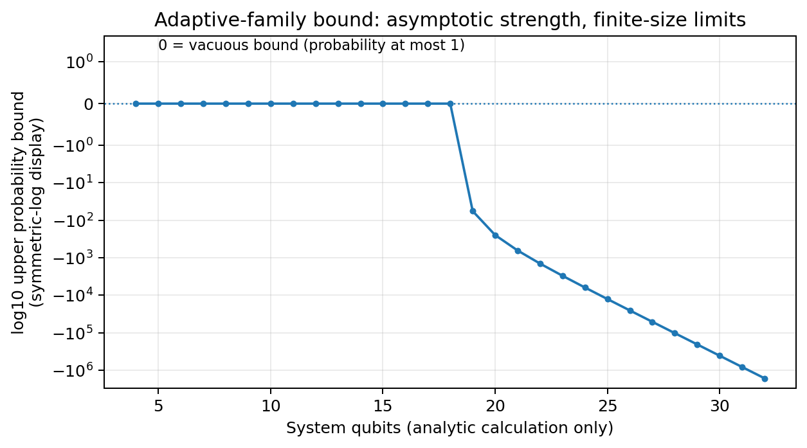

**Figure 6. A theorem can be correct while its finite-size bound is uninformative. The plot uses singleton fragments, $J=n$, $P=2n$, $\Theta=\pi$, $r=0.05$ and $\varepsilon=0.1$. It displays the base-ten logarithm of the capped bound, with zero meaning probability at most one. The curve is a calculated envelope, not observed record frequencies.**

The proposition addresses a uniform-selection question under an explicit covering contract. It is a derived concentration-and-net corollary, not a claim of historical novelty. It does not cover physical energy-shell states, arbitrary nonlinear preparation, a state-chosen family, or every time in a window. Persistent qualification implies qualification at any fixed time in that window, so the same upper bound constrains that event; an existence-at-any-time event needs its own time covering argument. It does not prove emergence of locality or a result about consciousness.

---

# Source: supplement/Frame_Aligned_Records_Supplement_v1_2.md

# Frame-Aligned Records: Supplementary Information

## Calculations, study definitions and reproducibility

**Supplementary Information v1.2 | 26 September 2026**

**James McGaughran**

**Scope.** This supplement supports the methods paper. Scientific calculations and model definitions come first; dated lineage is in the final provenance section. A reported historical run, a fresh same-code replay and a separate numerical implementation have different evidential meanings.

**Version crosswalk.** Portfolio v1.8 identifies the distribution; *Frame-Aligned Records* v0.5, this supplement v1.2, the results log v1.2, protocol reader edition v1.3 and *Absolute Infinite Union* v1.4 identify its components. CAL-1.6 and similar identifiers name fixed calculation suites, not alternative current manuscripts. A historical label means a preserved prior state, even when its date is only one day earlier. The authoritative executed specification remains protocol v1.2 and its original pre-execution receipt; later reader edits do not modify that record. Finalization retains these version labels and records changes through source hashes and a dated change record.

## S1. Numerical provenance for the methods paper

The source run labels S01 to S06 refer to the preserved six-script calibration suite under `historical/supporting_lineage/v1_6_code/legacy_v1_5/legacy_claude_v0_2_0/`. The original display values and sampling histories are retained, not all rerun during this editorial release. The newer calibration and pilot paths are listed explicitly below.

| Statement | Value(s) | Script and output key |
|---|---|---|
| Lemma 1 counterexample | $L=401$ | S02 `L1_counterexample_published_expression_without_identity` |
| Lemma 3 invariance; generic change | $\le6\times10^{-17}$; $0.144$ | S02 `L3_*` |
| Proposition 1(c) | $1.0$ | S02 `P1_commuting_unitary_changes_pure_ground_state_by` |
| Proposition 1, Remark 2 | $1.0, 0.399, 0, 0.399, 1.0$ bits | S02 `P1_stationary_average_conceals_conditional_dynamics` |
| Proposition 2 | $0.5270653410$; $0.3400520132$; $-0.7615941560$; $0$; $1\to0$ bits | S01 `P2_*` |
| Lemma 4 example | $0.6428571429$ (formula and enumeration) | S01 `hypergeometric_*` |
| Proposition 3 checks, Table 1 | as tabulated | S03 `A_haar_fragments`, `B_dynamics` |
| Table 2 | as tabulated | S04 `duplicate_inflation` |
| Hoeffding half-widths | $0.200$, $0.100$, $0.050$ | S01 `hoeffding_half_width` |
| Supplement Tables S4 to S6 | as tabulated | S05 `e1`, `e2`, `e3`, `e4` in the exploratory output |
| Supplement Section S2.5 | as stated | S05 replication output |
| Legacy S06 span checks | $0$; $7\times10^{-16}$; $0.4166$ versus $0.4170$ | S06 |
| Mixed twirl, historical v1.5 | 2,000 draws; mean $0.0557464152$; SE $0.0007264476$ | Archived W03 v1.1, Section 6; not the CAL-1.6 sample |
| Mixed twirl, CAL-1.6 | 1,200 draws; mean $0.05550839355$; SE $0.00093479233$; exact $0.056$ | `historical/supporting_lineage/v1_6_data/results.json`, `mixed_summary`; full draws in `mixed_draws.csv` |
| Proposition 5a endpoint constant | $\sqrt{1.0025}=1.0012492197$ at $n=2,4,6$ | `historical/supporting_lineage/v1_6_data/localized_constants.csv` |
| Proposition 6 spectator | error difference approximately $8.44\times10^{-15}$ against a loose bound $78.53981634$ | `historical/supporting_lineage/v1_6_data/results.json`, `spectator` |
| Unequal certificate example | $0.0995$ and $0.104$, same true error $0.099$ | Section 7.3.1, direct arithmetic; not two physical observations |
| Proposition 7, Figure 6 | capped bound $1$ through $n=18$; log10 bound approximately $-56.85$ at $n=19$ | `data/prop7_thresholds.csv`; direct envelope, not state simulation |
| Source-off feasibility pilot | 192 independent units in two size strata; separate outcome definitions | `data/pilot_run/results.json`, `per_unit.json`; results log, not an LRA test |
| Post hoc sign analysis | primary raw $p=5.4592\times10^{-5}$; four-row Holm $p=1.6377\times10^{-4}$ | `data/review_additions/sign_tests.csv`; `code/analyze_review_additions.py` |
| Range-only precision budget | 32,791 units for half-width 0.015, not a power claim | `data/review_additions/review_analysis.json`, `precision` |
| Initial eligibility and transient access | 5 and 10 eligible site/unit pairs in native arms briefly exceed 0.8 | `data/review_additions/initial_floor_diagnostics.csv` |
| Source encoding in clean transport control | phase code $d=|f|$; vacuum/excitation code $d=|f|^2$ | `data/review_additions/transport_encodings.csv`; separate full-space checks |


**Additional run crosswalk**

| Target | Source and data | Boundary |
| --- | --- | --- |
| Factorial four/six/eight-qubit means | `data/reviewer_replay/factorial_results.json`; `factorial_n*.npz` | Same-code reproduction of an exploratory review extension |
| Larger source-off sample | `data/reviewer_replay/reimpl_id1_results.json` | Fresh-stream reimplementation, not the original sample |
| Third-frame means | `data/reviewer_replay/factorial_neutral.json` | Post hoc comparator, no guaranteed neutrality |
| Paired range and finite-family intervals | `data/factorial_analysis/analysis.json`; `code/analyze_factorial.py` | Derived secondary sampling bounds |
| Alternative numerical method | `verification/factorial_independent_checks.json` | Selected trajectories, not a second full population study |

## S2. Historical continuously driven simulation

The material below retains the complete exploratory model and outcomes for reproducibility. It is not another experiment or a retrospective confirmation of the newer source-off target. References to original Sections 2 to 5 concern the methods framework; references to Section 6.x are mapped to S2.x below. Its reported causal interpretations are descriptive and family-specific, not general theorems.

### S2.0 Status

**Status: EXPLORATORY.** This section reports computed results for one small model class. The configuration was changed after the first results were inspected (Section S2.2), so they are not a confirmatory test of the prospectively stated population conjectures. They can nevertheless supply counterexamples to a universal claim and guide later design; exploratory does not mean scientifically worthless. They are included because they show concretely how the design choices of Sections 2 and 5 decide outcomes. The frozen configuration was then re-run with fresh seeds (Section S2.5).

The notation below uses $K_{\mathrm C}$ for the source-coupling operator, reserving C for an alternate frame label. Preserved scripts and original outputs still use their original variable C; this is a notation change only.

### S2.1 Model

- **System and source.** $n=3$ system qubits and a binary source with equal priors; $H_x=H_S+(-1)^xK_{\mathrm C}$.
- **Internal Hamiltonian.** $H_S$ is a random nearest-neighbour 2-local chain: Gaussian coefficients on all two-body Pauli products on adjacent pairs, plus one-body terms at half weight. It is normalised to Frobenius norm $\lambda$.
- **Coupling and time window.** The source coupling is the star operator $K_{\mathrm C}=\sum_{j=1}^3X_j$, of Frobenius norm $\sqrt{24}\approx4.90$. Times are $t\in\{0.6,0.7,0.8,0.9,1.0\}$.
- **Candidates.** There are $N=20$ candidates: the identity (the frame in which $H_S$ and $K_{\mathrm C}$ are local), a preparation frame $W$, and 18 Haar-random unitaries.
- **Locality.** $L$ is the internal score $L^{\mathrm{int}}$ on the span of Pauli strings of weight at most 2, identity included.
- **Records (simplified).** The record score is the time-averaged number of single qubits whose Helstrom error is at most $0.1$. This is a simplification of the disjoint, persistent redundancy of Section 2.5.
- **Near-optimal sets.** $\mathcal N_L$ requires $L\le\min L+0.02$ and $L\le0.6$; $\mathcal N_R$ requires $R=\max R$ and $R\ge0.5$.
- **Arms.** In the *shared-frame* arm the initial state is $\left| 000\right\rangle$. In the *decoupled-preparation* arm it is $W\left| 000\right\rangle$ with $W$ Haar-random, so by Section 4.3 it is Haar distributed. The coupling stays in the identity frame in both arms.

### S2.2 Development history

The first configuration used a single-qubit coupling $X\otimes I\otimes I$, $\lambda=4$ and nine times in $[0.3,1.5]$. Records qualified in 1% of shared-frame models and in none of the decoupled models ($A=0.010$ and $0.000$). The coupling was then changed to the star operator, the time window was narrowed, and a grid over $\lambda$ was added. All results below use the changed configuration, which was frozen on 25 September 2026.

### S2.3 Shared versus decoupled preparation

**Table S4. Association results by arm (200 models per cell; Hoeffding 95% intervals clipped at $1-1/N=0.95$).**

| $\lambda$ | Arm | Records qualify | $\bar A$ | $\bar q$ | $\hat d$ | 95% interval |
|---|---|---|---|---|---|---|
| 0.3 | shared | 1.000 | 1.000 | 0.050 | 0.950 | [0.758, 0.950] |
| 0.3 | decoupled | 0.095 | 0.050 | 0.005 | 0.045 | [-0.147, 0.237] |
| 1.0 | shared | 1.000 | 1.000 | 0.050 | 0.950 | [0.758, 0.950] |
| 1.0 | decoupled | 0.060 | 0.025 | 0.003 | 0.022 | [-0.170, 0.214] |
| 4.0 | shared | 0.320 | 0.255 | 0.016 | 0.239 | [0.047, 0.431] |
| 4.0 | decoupled | 0.030 | 0.005 | 0.002 | 0.004 | [-0.189, 0.196] |

In the shared arm, the most local candidate hosts the records in every model at $\lambda\le1$, and the descriptive estimate is $0.95$ in these sampled cases. This agreement is facilitated by the shared inputs, not proved for every model by a coupling bound. At $\lambda=4$ the internal dynamics is comparable in norm to the coupling, and records qualify in only 32% of models. In the decoupled arm, records qualify rarely. In the reported cases they preferentially sit in the identity frame, where the coupling remains local. This association is consistent with the supplied interaction structure, not an isolated causal estimate.

### S2.4 Moving the preparation frame and the coupling frame

**Table S5. Preparation frame rotated by $W=e^{-i\theta G}$ away from the dynamics frame** ($G$ a random Hermitian of unit spectral norm; $\lambda=0.3$; 100 models per row). The columns give the fraction of models in which records qualify anywhere, and in which the record-optimal set contains the dynamics frame, the preparation frame, or neither.

| $\theta$ | Records anywhere | In dynamics frame | In preparation frame | Elsewhere |
|---|---|---|---|---|
| 0.0 | 1.00 | 1.00 | 1.00 | 0.00 |
| 0.1 | 1.00 | 1.00 | 1.00 | 0.00 |
| 0.2 | 1.00 | 1.00 | 0.97 | 0.00 |
| 0.4 | 1.00 | 1.00 | 0.44 | 0.00 |
| 0.8 | 0.86 | 0.82 | 0.06 | 0.00 |
| 1.6 | 0.13 | 0.10 | 0.00 | 0.03 |

At $\theta=0$ the "preparation frame" candidate equals the identity, a duplicated class of exactly the kind Lemma 3 requires to be merged. As the ready resource is rotated away, records do not follow it. They stay in the frame of the coupling and then disappear, in this specific exploratory family. Finite-angle exponentials of normalised random Hermitians are not Haar draws, and no Haar limit for this parameterisation has been established.

**Table S6. Coupling and ready resource moved together** ($K_{\mathrm C}\mapsto U_cK_{\mathrm C}U_c^\dagger$, initial state $U_c\left| 000\right\rangle$, $U_c=e^{-i\varphi G}$; 60 models per row). The internal-locality minimum was at the identity in every model.

| $\lambda$ | $\varphi$ | Records anywhere | In internal-locality frame | In coupling frame | Elsewhere |
|---|---|---|---|---|---|
| 0.3 | 0.4 | 1.000 | 0.583 | 1.000 | 0.000 |
| 0.3 | 0.8 | 1.000 | 0.017 | 1.000 | 0.000 |
| 1.0 | 0.4 | 1.000 | 0.333 | 0.917 | 0.000 |
| 1.0 | 0.8 | 1.000 | 0.033 | 1.000 | 0.000 |
| 4.0 | 0.4 | 0.317 | 0.133 | 0.183 | 0.067 |
| 4.0 | 0.8 | 0.200 | 0.033 | 0.100 | 0.067 |

The total record-generating Hamiltonian $H_x$ was more local, by $L$ averaged over $x$, in the coupling frame than in the internal-locality frame in 100%, 100% and 95% of models at $\lambda=0.3$, $1.0$ and $4.0$ ($\varphi=0.8$, 60 models each).

### S2.5 Fresh-seed repeats of the frozen exploratory configuration

With the configuration frozen, the main contrasts were re-run with seeds not used during development.

- **Seeds 20260926 and 20260927, $\lambda=0.3$, 200 models per arm.** The shared arm again gave $\bar A=1.000$, $\bar q=0.050$ and $\hat d=0.950$. The decoupled arm gave $\hat d=0.072$ $[-0.120,0.264]$ and $0.040$ $[-0.153,0.232]$.
- **Three-frame design, $\lambda=0.3$, $\varphi=0.8$, 100 models per seed.** Records qualified in every model. They lay in the coupling frame in every model and in the internal-locality frame in 0% and 1% of models.
- **Total Hamiltonian.** $H_x$ was more local in the coupling frame in 100% of models for both seeds.
- **Larger model-sample decoupled run, still three qubits.** One further run was declared before execution (seed 20260928, 2,952 models, chosen for a Hoeffding half-width of $0.05$). It gave records in 10.7% of models, $\bar A=0.0515$, $\bar q=0.0055$ and $\hat d=0.046$ $[-0.004,0.096]$.

### S2.6 What the calculation shows, and what it does not

1. **Shared frames produce enrichment by construction.** The estimate $\hat d=0.95$ reflects the design, not a regularity of the model class.
2. **Records track the frame in which the ready resource and the source coupling are aligned.** A ready resource rotated away from the coupling produces few records, and they do not follow the resource (Table S5).
3. **The verdict depends on which Hamiltonian defines locality.** When the coupling and the resource move together, records move with them, away from the internal-locality frame, and into the frame in which the total Hamiltonian is most local (Table S6 and Section S2.5). Its descriptive pattern differs for internal versus branchwise total locality. Neither reading is a calibrated verdict on LRA-int or LRA-tot, because the exploratory time-averaged record outcome and label reference are not the prospective persistent-record test.
4. **The "decoupled" arm is only partly decoupled.** Its coupling remains local in the dynamics frame. Its small descriptive enrichment ($\hat d=0.046$) is compatible with influence from the shared coupling frame, but the toy does not isolate that cause; and its interval, $U=0.096$, lies just below a margin of $\Delta=0.1$. This is not evidence about any conjecture.

The calculation has three qubits, 20 candidates, Haar candidates not demonstrated to form an exhaustive set of equivalence classes, a simplified record score and thresholds chosen during development. The coupling has a larger declared norm than the internal Hamiltonian at $\lambda\le1$; that norm comparison alone is not a record-persistence guarantee. Its role is to show that the questions in Section 7 need to be posed with frames declared separately.


## S3. Post hoc sign tests and window diagnostics

The four-row directional analysis uses the immutable per-unit contrast data and verifies them against the full trajectories. Its null is Pr(z>0 given z is nonzero)=1/2 for independent signs; it is not a zero-mean null. No ties were observed. Exact binomial p-values and a four-row Holm adjustment are reported in the results log. The Holm family was chosen during review, not in the pre-execution plan. Dependence between the paired arms is not treated as extra sample size.

The script also reports initial-eligibility and transient-access counts by frame, and compares both source encodings in an ideal exchange-chain transport control. The phase-superposition pilot code has singleton distinguishability |f|, while the vacuum-versus-excitation control has |f| squared. These are not interchangeable time-window diagnostics. The original study's thresholds, windows and data remain unchanged.

```text
OPENBLAS_NUM_THREADS=1 OMP_NUM_THREADS=1 python code/analyze_review_additions.py --root . --out /path/to/fresh_review_analysis
```

The code refuses a nonempty output folder. It writes `review_analysis.json`, `sign_tests.csv`, `transport_window_checks.csv`, `transport_encodings.csv` and `initial_floor_diagnostics.csv`. The last file counts site/unit pairs, not independent observations. Mathematical derivations, same-code replay, separate-method checks and external replication remain distinct.

### S3.1 Initial eligibility and transient strong access

| Qubits | Arm | Frame | Eligible / total site-unit pairs | Ever reaches d >= 0.8 |
| --- | --- | --- | --- | --- |
| 4 | native | L | 288 / 384 | 5 |
| 4 | native | C | 192 / 384 | 0 |
| 4 | rotated | L | 96 / 384 | 0 |
| 4 | rotated | C | 288 / 384 | 0 |
| 6 | native | L | 480 / 576 | 10 |
| 6 | native | C | 384 / 576 | 0 |
| 6 | rotated | L | 288 / 576 | 0 |
| 6 | rotated | C | 480 / 576 | 0 |

A site-unit pair is not an independent model. These are post hoc diagnostic counts from existing trajectories. A transient threshold crossing does not establish full-window persistence or redundant copying. The strict persistent-record result remains zero under the original definition.

## S4. Factorial extension and paired uncertainty

### S4.1 Design and replay

The review extension crosses injection L/C with Hamiltonian orientation L/C, with $H_C=U_C H_L U_C^\dagger$. Every unit supplies all four outcomes. The time grid is 0.05 through 2.5 plus the switch-off readout; the common injection code and two-layer circuit follow the original source-off conventions. The main paper and results log define z and $e_a$. We retain supplied inputs in `feedback/current/` without editing their scripts or their predictions.

`code/replay_reviewer.py` runs the supplied functions with their original seeds and sample sizes and retains per-unit observables, rather than only aggregate summaries. It replays the 41,000 factorial units, the 60,000-unit reimplementation and its smaller checks, and the 6,000-unit third-frame comparison. Each arm in a unit remains paired. The statement that two routines were written independently refers to source implementation, not statistical independence of their authors' reasoning or external peer review.

### S4.2 Range and finite-family bound

At fixed injection, the initial gap cancels in the difference between dynamics arms:

$$e_a=\tfrac12\bigl(g_L^a-g_C^a\bigr)\in[-1,1].$$

Let $s_a^2$ be the unbiased sample variance of e in N iid units. Theorem 4 of Maurer and Pontil (2009) applies to variables in [0,1]. Rescale by $Y=(e+1)/2$, use both tails, and allocate total error $\alpha$ over K specified targets. A simultaneous interval for each mean is its sample mean plus/minus

$$r_N=\sqrt{\frac{2s_a^2\log(4K/\alpha)}N}+\frac{14\log(4K/\alpha)}{3(N-1)}.$$

**Derivation.** The theorem's one-tail bound is $\sqrt{2V_N\log(2/\delta)/N}+7\log(2/\delta)/(3(N-1))$. Set $\delta=\alpha/(2K)$, note $V_N(Y)=s_a^2/4$, multiply by two to return to e, and union over the 2K events. No independence between targets is required. The iid assumption is within each model-unit sample; paired arms are used to form one e. The variance identity $V_N=N^{-1}(N-1)^{-1}\sum_{i<j}(Y_i-Y_j)^2$ equals the usual unbiased variance. Numerical rounding is not covered by the sampling theorem.

For K=6 and alpha=0.05, all four intervals at N=20,000 exclude zero. The two eight-qubit intervals at N=1,000 do not. Full normal, Hoeffding and Bernstein intervals are in `data/factorial_analysis/factorial_intervals.csv`. The method was chosen during review; this is not an external preregistration or a claim that arbitrary post hoc selections retain coverage.

### S4.3 Important interpretation checks

The original negative change relative to frozen dynamics and the positive Hamiltonian-intervention contrast concern different counterfactuals. Neither invalidates the other. Isospectrality preserves the energy eigenvalues, not the initial energy distribution or all resources relative to the fixed input. The third-frame comparator is an additional sampled intervention, not a certified link-only control. A Lieb-Robinson bound is not a sign theorem for e. Regression on an initial gap must account for the gap's explicit minus-one-half contribution to z.

**Reproduction commands, from the extracted release root**

```text
OPENBLAS_NUM_THREADS=1 OMP_NUM_THREADS=1 python code/replay_reviewer.py --root . --out /path/to/fresh_reviewer_replay --task all
python code/analyze_factorial.py --root . --out /path/to/fresh_factorial_analysis
OPENBLAS_NUM_THREADS=1 python code/validate_factorial.py --root . --out /path/to/fresh_factorial_checks.json
```

The analysis reads the delivered `data/reviewer_replay` by default. To analyse a replay, use a separate copy with the fresh replay at that relative location. Do not overwrite the delivered evidence. The README records exact environment and tool versions; portability to an arbitrary numerical environment is not assumed. All original scripts can also be run directly in a copied input folder, with the single-thread setting stated by their author.

## S5. Historical execution and provenance

The following subsections preserve the earlier account, with their historical dates and sample sizes. These are not fresh counts of independent physical experiments.

### S5.1 Scope

This is supporting material for *Frame-Aligned Records*, review manuscript v0.5, not an independent research paper. It records new executions, supplied-script reproduction, prior reported results and what was not done. The original LRA population study remains unexecuted. A separately defined source-off feasibility pilot, P01-ID1, has now run; see the dedicated results log and protocol. It is not silently relabelled as the original study. No participant data, cosmological likelihood fit or unrestricted subsystem search was analysed. The mathematical propositions are assessed through their proofs; numerical checks are finite safeguards, not universal demonstrations.

**Table S1. Execution levels must remain separate**

| Layer | Work done in v1.6 | Limit |
| --- | --- | --- |
| Supplied post-v1.5 Claude audit | Executed both numerical scripts in a fresh directory and compared their two JSON outputs | Same-code replay, not a new external implementation |
| New CAL-1.6 suite | 174 assertions, including random-case checks and exact small examples | Related assertions, not 174 independent experiments |
| Separate CAL-1.6 checker | 46 checks using independent small formulas and enumeration; does not import the main script | Same-project second implementation, not external scientific replication |
| Prior v1.5 results | Preserved unchanged with source files and historical reports | Its large historical assertion counts are not fresh v1.6 executions |
| Proposed LRA-count experiment | Specification and uncertainty handling revised | Not run, registered or scientifically confirmed |

### S5.2 Replay of the supplied audit

The exact delivered audit scripts are retained under `historical/supporting_lineage/v1_6_code/supplied_claude_audit/`. Both ran successfully from an initially empty output directory. `v15_independent_checks.py` took about 43 seconds and `coupling_dominance.py` about 2 seconds in this environment. Runtime is descriptive, not a portable performance promise. Captured output and environment differences are recorded in `historical/supporting_lineage/v1_6_verification/claude_replay/`.

Recursive comparisons of dictionaries, lists and numerical leaves found agreement with both supplied JSON outputs using relative tolerance $10^{-8}$ and absolute tolerance $10^{-10}$. Key sets and list lengths must agree; timing and unrelated files are not used to infer numerical correctness. The comparison report is `historical/supporting_lineage/v1_6_verification/claude_replay_comparison.json`.

The replay includes the supplied exact four-label counterexample, mixed twirl, gauge invariances, local-persistence example, symbolic examples and the reported permutation Monte Carlo. For 30 units, the displayed derangement rejection estimate is approximately 0.060 at a nominal 0.05 threshold; that is a finite Monte Carlo estimate with sampling uncertainty, not an exact universal size. The exact four-label example separately establishes a failure of the proposed general validity claim.

The 9,000 perturbation checks all satisfy their bound within the script tolerance. Those are fragment-time checks across related models, not 9,000 independent experiments. They confirm the stated implementation of the inequality, not a theorem that coupling-frame records must maximize a locality-record score.

### S5.3 New suite and effective configuration

The new executable source is `historical/supporting_lineage/v1_6_code/checks_v0_3_0.py`. It accepts one complete JSON configuration, rejects missing or unused keys, checks numerical ranges, refuses a nonempty output directory, and writes the effective configuration and its canonical-JSON hash with every run. The version is CAL-1.6; the code version is 0.3.0. This is calibration code, not the future LRA experiment implementation.

**Table S2. Complete new calibration configuration**

| Field | Value | Use |
| --- | --- | --- |
| version | CAL-1.6 | Validate scope |
| seed | 20260926 | NumPy default RNG stream |
| random_cases | 32 | Each random matrix/invariance/perturbation check family |
| mixed_draws | 1200 | Fixed-spectrum twirl Monte Carlo |
| word_length | 5 | Symbolic support enumeration |
| chain_length | 30000 | Finite golden-mean example |
| bound_epsilon | 0.1 | Adaptive-family probability envelope |
| net_radius | 0.05 | Operator-norm cover radius |
| angle_limit | pi | Declared circuit parameter interval |
| max_bound_qubits | 32 | Envelope evaluation through 32 qubits; no 32-qubit state simulation |

The canonical effective-configuration SHA-256 is `f5f8d1633e36e402922eefb5fe8a24640b890fa028e0985856a753f779cabc2b`. Numerical environment: Python 3.13.5, NumPy 2.3.5 and SciPy 1.17.0. The supplied Claude audit originally reports Python 3.11.15, NumPy 2.4.4 and SciPy 1.17.1, so agreement is assessed with tolerances, not assumed from version identity. The code's environment report supplies the actual current values rather than promising installation compatibility with every platform.

**Table S3. Data files and their unit of observation**

| File in historical/supporting_lineage/v1_6_data/ | Contents | Interpretation |
| --- | --- | --- |
| per_case_checks.csv | 32 cases, gauge and stabilizer residuals, local bound and sampled slope | Numerical checks of deterministic inequalities |
| perturbation_checks.csv | 32 differences and perturbation bounds | New small finite checks, distinct from the replayed 9,000 checks |
| localized_constants.csv | Global and endpoint touching constants for 2, 4, 6 qubits | One explicitly specified bounded-strength model |
| mixed_draws.csv | 1,200 squared Hilbert-Schmidt deviations | Individual draws, not only an aggregate |
| symbolic_support.csv | All 32 binary length-five words and their model probabilities | Exact support and finite-sample occurrence are distinct columns |
| adaptive_cover_bound.csv | Log probability envelopes for n=4 through 32 | Evaluation of a theorem bound, not physical observations |
| results.json | Assertions, selected summaries, environment and code hash | Failures cannot be hidden by counting only passed examples |

The old constant-window example retains its analytic certificate 0.0097751350, before adding a numerical error budget. The new endpoint chain has $K_F=\sqrt{1.0025}$ for every plotted size. The supplied random-chain example is a different construction, not a failed attempt to reproduce this value.

### S5.4 Independent small verification and reproduction instructions

The second checker does not import the main checker. It reconstructs exact permutation ranks, contracts the twirl in a different form, evaluates endpoint spectra analytically, and checks the circuit-cover arithmetic. Its 46 checks are another implementation path within the same session, not a second research team.

From the extracted release root, use initially absent output directories:

```text
python historical/supporting_lineage/v1_6_code/checks_v0_3_0.py --config historical/supporting_lineage/v1_6_code/config.json --output /path/to/fresh_calibration
python historical/supporting_lineage/v1_6_code/second_checks_v0_3_0.py --results /path/to/fresh_calibration
python historical/supporting_lineage/v1_6_code/plot_results.py --data /path/to/fresh_calibration --output /path/to/fresh_figures
```

The legacy scripts are preserved for provenance and old calibration replay. They are not silently relabelled as corrected production software. In particular, the earlier hard-coded defaults and aggregate-only outputs remain historical limitations. New matrix cases and mixed draws have individual rows; a future model-search implementation must additionally log every input frame, rejection, tie, search failure and certificate interval.

For raw floating-point checks, a small residual is not a verified interval enclosure. The many-body continuum certificate requires a defensible numerical allowance or interval method. Without one, report numerical evidence and a certificate conditional on the allowance, not rigorous machine certification.

### S5.5 Conditional pairing retained only as an alternative

The v1.6 primary prospective target compares normalized counts within an input-eligible model. It uses no cross-model pairing. The previous pairing method remains meaningful only under its own contract: specify the independent unit, frame registration, conditioning variables, admissible group action, why the null is invariant, tie handling and missing-output treatment. A complete permutation group cannot create exchangeability in a physical population that lacks it.

Fixed common frames can make matched and mismatched distances identical. Randomly varying shared orientations can produce an apparent pairing signal inherited from supplied structure. These are valid diagnostic examples, not reasons to ban every permutation test. Where the null cannot be justified, the appropriate status is NO_IDENTIFIED_PAIRING_NULL. The original conditional wording is preserved in `editorial/retained_pairing_contract.md`.

### S5.6 Delivery and scientific readiness

The present supplement is complete for inspection at its declared finite scope. The full release contains the exact new code and data plus the supplied audit and baseline archive. A short manuscript-only review necessarily cannot certify those absent files, and no claim in the text turns that limitation into disconfirmation. Source parity, render inspection, archive integrity and scientific correctness are separate checks, recorded in the release verification report.

The new uniform-cover theorem is a conditional mathematical corollary of known concentration and covering arguments. Its novelty and physical relevance remain open. The broad AIU inquiry neither inherits empirical confirmation from it nor is refuted by a poor finite-size bound.


### S5.7 Maintenance patch and separate source-off execution

Appendix C of the methods paper retains the archived v1.5 2,000-draw twirl result (mean 0.0557464152; standard error 0.0007264476). CAL-1.6 used 1,200 draws instead (mean 0.05550839355; standard error 0.00093479233), with exact target 0.056. These are two calibration samples, not a conflict or one enlarged study. The historical data paths identify them separately.

P01-ID1 is a new finite computational pilot with 96 independent model units at each of four and six sites. Each unit supplies two paired injection arms and paired evolution-on/frozen controls. Its primary outcome is a baseline-subtracted checkpoint-average local-readability contrast, not persistent redundancy, the older LRA-count target, or a recovered TPS. Full trajectories, model coefficients, random-stream identifiers, configuration and code hashes are in `data/pilot_run/`; the specification and local pre-execution receipt are in `pilot/`. The specialist review was not sent and no external validation is claimed.

The main solver diagonalizes each internal Hamiltonian. `code/validate_injection_pilot.py` independently checks selected trajectories with exponential action and a full-density-matrix partial trace. It also checks exact transport, source-free global distinguishability, zero evolution, passive conjugation and closed stationary records. Its finite-precision agreement is not a rigorous roundoff enclosure. Persistence classifications are conditional on the explicitly empirical numerical guard; failed certificates are not absent records.

Reproduction of the new pilot from an empty directory:

```text
OPENBLAS_NUM_THREADS=1 OMP_NUM_THREADS=1 python code/run_injection_pilot.py --config pilot/config.json --out /path/to/fresh_run
python code/validate_injection_pilot.py --root /path/to/extracted_patch
```

The validator reads the delivered `data/pilot_run` by default. To validate a replay, place that replay at the same relative path in a separate extracted copy. Do not overwrite the delivered evidence. The code and effective configuration specify all model parameters; no unused fields are silently accepted.


## References

Maurer, A., and Pontil, M. (2009). Empirical Bernstein Bounds and Sample Variance Penalization. COLT 2009. https://arxiv.org/abs/0907.3740

---

# Source: pilot/Post_Injection_Results_v1_2.md

# Post-injection pilot: executed results

## Local readability, directional evidence and finite-window limitations

**Study ID: P01-ID1 | Results log v1.2 | 26 September 2026**

This is a results log, not another journal manuscript. It records one specified computational pilot, its independent-method checks and its limits. The primary model family and outcome were recorded before execution. The sign tests, precision calculation and additional window/eligibility diagnostics below were added after the outcome was known; they are explicitly secondary reanalyses, not changes to the original study. No external preregistration, human specialist review, participant experiment or cosmological observation is claimed.

## 1. Main result

The source was switched off after injection. The predeclared change relative to matched frozen evolution was negative. A later factorial extension asks a different question by comparing two Hamiltonian orientations at fixed injection; its paired contrast is positive. Neither number replaces the other. At six qubits with rotated injection, the mean normalized change was **-0.015225**, with 68 negative and 28 positive unit-level contrasts. None of the 96 primary units produced a new singleton record satisfying the strict initial-information floor and error threshold throughout any declared half-unit window, in either frame.

The full source bit was not erased: the two global conditional states remained orthogonal under their shared unitary. Local access, transfer, redundancy and global information are different outcomes. There is no inference here that AIU or a general locality-record law is false.

## 2. Exactly what ran

There are **192 independent model/circuit units**, 96 at four qubits and 96 at six qubits. Each unit has two paired injection arms, giving **384 arm evaluations**, not 384 independent samples. Each arm is evaluated in two frames over 101 checkpoints. The primary statistic uses 50 positive-time checkpoints fixed before execution. The paired off-evolution control is analytic identity evolution, not a separately random sample.

The internal model is a random anisotropic nearest-neighbour Pauli chain with independent fields. It differs from an earlier review proposal that varied the amplitude of one fixed Hamiltonian shape. The alternate frame is an independent depth-two adjacent-pair Haar circuit. The graph and allowable readout algebras are supplied. Randomized coefficients do not make this a representative sample of all physical systems.

The executable simulation uses full finite-dimensional state vectors, not a quantum device. Runtime of the main numerical solve in this environment was approximately 2.08 seconds; that excludes writing, derivation, source checking and verification and is not a portable performance guarantee.

## 3. Primary and sensitivity results

**Table 1. Baseline-subtracted local-readability contrast**

| Qubits | Injection arm | Mean z | Approximate bootstrap 95% interval | Positive / negative / tie |
| --- | --- | --- | --- | --- |
| 4 | native | 0.015125 | [0.008577, 0.022237] | 61 / 35 / 0 |
| 4 | rotated | -0.028761 | [-0.035284, -0.022440] | 18 / 78 / 0 |
| 6 | native | 0.011674 | [0.007238, 0.016167] | 65 / 31 / 0 |
| 6 | rotated | -0.015225 | [-0.021070, -0.009646] | 28 / 68 / 0 |

Only the six-qubit rotated arm is primary. The native-injection arm compares its native frame against the paired alternate frame, which is not its own physical injection frame. Do not pool the four rows as independent confirmations.

For the primary row, the distribution-free Hoeffding 95% interval is **[-0.292446, 0.261996]**. It crosses zero. The much narrower bootstrap interval is approximate and informative about this finite empirical distribution; it is not a distribution-free guarantee or a confirmation of a universal negative sign. This original sample does not support a positive value of its own target. It cannot isolate the effect of changing the dynamics-locality frame, which it held fixed.

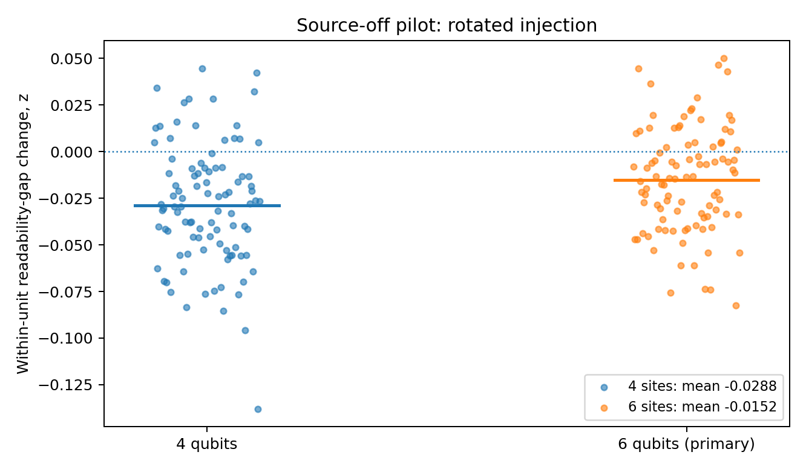

**Figure 1. Each point is one independent model unit. Zero is no change in the readability gap relative to the no-evolution baseline. This is not a probability of AIU or a test of the older LRA-count margin.**

### 3.1 A negative change does not mean C has better absolute readout

For the six-qubit rotated arm, mean singleton trace distance at switch-off was approximately **0.208408 in L** and **0.166667 in C**. The corresponding post-time averages were **0.197702 in L** and **0.186411 in C**. Thus L's initial gap of **0.041742** narrowed to **0.011292**. Half that gap change is the negative primary result. Claiming that records migrated to C would overstate this statistic.

A scrambled representation can spread partial distinguishing information over multiple sites; sums of singleton distances are not additive global information. The primary mean therefore measures accessibility, not independent bits, redundant strong records or a unique preferred subsystem structure.

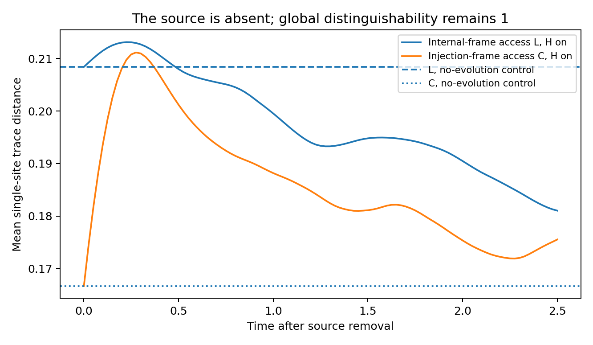

**Figure 2. Six-qubit rotated injection, means across 96 units. The pulse ends at t=0; the source is absent thereafter. Horizontal baselines are the matched frozen states. Weak local readability can change even when no new fragment meets the strict record criterion.**

### 3.2 Post hoc directional analysis

Let $p_{\mathrm{pos}}$ be the probability of a positive nonzero unit contrast. The exact sign test evaluates $H_0:p_{\mathrm{pos}}=1/2$ with independent signs. It does not assume symmetry of the full contrast distribution, but independence alone is not the null. It is not a test of zero mean. Ties use the original $10^{-12}$ reporting tolerance; none occur, and the smallest absolute contrast across these data is greater than $2.5\times10^{-4}$.

**Table 2. Post hoc two-sided binomial sign tests**

| Qubits / arm | Positive / negative | Unadjusted p | Holm-adjusted p, four-row family |
| --- | --- | --- | --- |
| 4 / native | 61 / 35 | 0.0103459 | 0.0103459 |
| 4 / rotated | 18 / 78 | 4.44694e-10 | 1.77877e-9 |
| 6 / native | 65 / 31 | 0.000674719 | 0.00134944 |
| 6 / rotated | 28 / 68 | 0.0000545915 | 0.000163775 |

The adjustment covers these four tests and does not require independence between the paired arms. It does not account for unrestricted post hoc exploration outside this stated family. Within the explicit sampling law, the rotated-arm signs provide strong secondary evidence against directional balance. This neither makes the mean a distribution-free finding nor overturns the formal distinction between the executed readability target and the older LRA hypotheses. The predeclared bootstrap interval already provided approximate evidence about the mean; it was not an empty or wholly inconclusive result.

### 3.3 Precision limitation, not a retrospective power claim

At 96 units, the chosen range-only Hoeffding half-width is 0.277221. Solving $\sqrt{2\log(40)/N}\le0.015$ gives $N\ge32791$. This is a sufficient worst-case sample count for that confidence-interval precision, not a minimum sample size required by every valid method and not a power calculation. The width is much larger than the observed effect. The pre-execution plan should have stated this limitation, and the original plan is preserved without retrospective amendment. Future studies should distinguish a justified precision budget, an alternative-specific power analysis and computational feasibility. This calculation is not a recommendation to run 32,791 units.

## 4. Strict new-record criterion

The criterion required initial error at least 0.4999 and subsequent error at most 0.1 throughout [0.5,1.0], [1.0,1.5], [1.5,2.0] or [2.0,2.5]. At both sizes and in both arms, every possible upper count for a new singleton record was zero in every window. Here that was not an unequal-certificate problem: the initial-information floor or a failing checkpoint already ruled out the strict condition numerically. The raw data retain all cases.

This says nothing about larger fragments, looser tolerances, other windows, different preparation laws or other Hamiltonians. Those would be different analyses. They were not added after observing this outcome. The numerical guard remains empirical rather than a formally certified roundoff enclosure.

### 4.1 What the zero count excludes, and what it does not

A review-stage diagnostic of the original stored trajectories separates transient access from full-window persistence. In the native arm, 5 initially eligible site/unit pairs at four qubits and 10 at six qubits briefly reached trace distance at least 0.8 at a positive-time checkpoint. None satisfied a complete declared window. These are site/unit pairs, not independent samples or counts of distinct systems; they are not new strong persistent records. Thus the data themselves do not support the general statement that internal dynamics cannot create local source accessibility. In the rotated arm, none of the initially eligible singletons reached this strict checkpoint threshold within the recorded horizon.

Initial eligibility also differs between frames because partial source information can already be distributed at switch-off. At six qubits with rotated injection, 288 of 576 site/unit pairs are initially eligible in L, compared with 480 in C. The definition deliberately asks about newly informative fragments, so this difference is part of the target, not a reason to remove inconvenient units. The companion mean-readability statistic has a different denominator and remains unchanged. The full diagnostic table is supplied in the supplement and data.

## 5. Transport worked in the analytical controls

For the vacuum-versus-excitation encoding, the two-site exchange control gives recipient distinguishability $\sin^2 t$. At $t=\pi/2$, the source bit has transferred from the addressed site to its neighbour. Four- and six-site exchange chains matched an independently evaluated one-excitation hopping model. The sampled end-site distinguishability reached approximately 0.972655 at time 2.80 for four sites and 0.911536 at time 3.95 for six sites. These are sampled control values, not globally optimized arrival times or claims of new transport physics.

For a vacuum-versus-single-excitation code, let $p_j(t)$ be the excitation probability. Then $d_j(t)=p_j(t)$ and $\sum_j p_j(t)=1$. Error at most 0.1 requires $p_j\ge0.8$, so at most one singleton can qualify at one time. This control demonstrates transport without high redundant copying. It exposes why a redundancy measure is not automatically a transport or geometry-recovery measure.

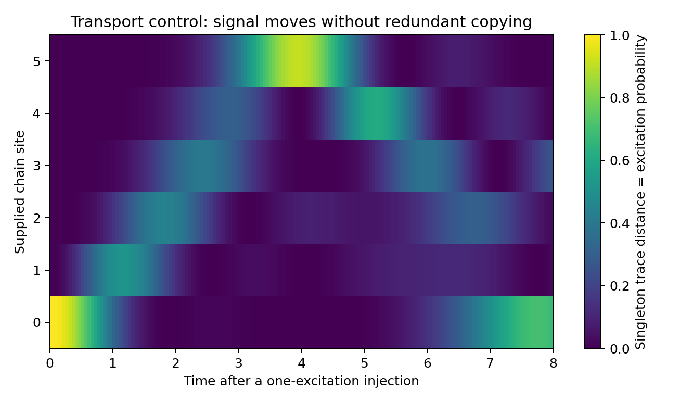

**Figure 3. Full-state calculation, independently matched to the one-excitation reduction. Propagation is present although conservation limits simultaneous strong singleton records. The chain and its coordinates are supplied.**

### 5.1 Transport-window and source-encoding diagnostic

The original windows end at 2.5. In the uniform exchange-chain control using a vacuum-versus-excitation code, end-site distinguishability is $|f(t)|^2$. On the reviewer's 0.05 grid, it exceeds 0.8 during 2.4 to 3.2 at four sites and 3.6 to 4.3 at six sites. No complete declared half-unit window lies inside either interval. This is a valid warning that the windows cannot assess late far-end strong transfer in that control.

The actual pilot uses opposite-phase superpositions of vacuum and a single addressed excitation, not that control's source code. For the ideal number-conserving exchange chain with the pilot code, direct partial trace instead gives end-site distinguishability $|f(t)|$. Its qualification threshold corresponds to excitation probability 0.64, not 0.8. Both curves and their exact declared-window checks are supplied. No complete original window passes at the far end for either encoding, but the two threshold times must not be interchanged.

These controls do not establish that all zero counts in random anisotropic chains were built in: those chains, their code, distances and eligible fragments differ, and some near-site transient strong signals were observed. The defensible conclusion is narrower: the strict result is conditional on a restrictive floor, threshold and short windows and cannot stand for absence of transport. No late-window rerun or changed primary endpoint is included in this release.

## 6. Verification

A separate implementation does not import the main solver. It propagates selected n=4 and n=6 units using exponential action and reduces full density matrices rather than the main state-tensor shortcut. The largest compared trace-distance discrepancy was **9.104e-15**. The largest main-run norm error was **3.320e-14** and the largest branch overlap magnitude **2.371e-14**.

The **36 checks passed**, with **0 failures**. These checks include selected-trajectory agreement, zero evolution, identical branches, passive conjugation, two-site transfer, one-excitation conservation, closed stationary records and amplitude-damping erasure. They are not 36 independent physical experiments. Numerical agreement is not a formal floating-point proof.

A closed diagonal Hamiltonian preserves orthogonal product records because their density matrices commute with H. Conversely, an ordinary amplitude-damping channel reduces the distinguishability of zero-versus-one states as $e^{-t}$. These elementary controls correct the overstatement that persistence always requires a large or dissipative environment. What matters is the stated retention mechanism and observable, not openness alone.

## 7. Decision after the pilot

**Keep the original result and the new counterfactual separate.** The source-off pilot measures a change from frozen evolution with the dynamics always native to L. Its negative mean is reproducible but is not an isolated causal estimate of locality. The factorial extension varies that dynamics frame at fixed injection and produces a positive paired intervention contrast. It adds missing information rather than changing the original question after the answer was seen.

This is not recovered locality: the frames, Hamiltonian family and readout rules are all supplied. A named Lieb-Robinson mechanism has not been identified merely by obtaining a positive scalar contrast. An actual identification study would require multiple injections, a reconstruction method not given its target and held-out prediction. An open-system retention study separately needs a justified reservoir and erasure controls. Neither extension is silently announced as completed here.

## 8. Reproduction and provenance

`pilot/PRE_EXECUTION_PLAN.md`, `pilot/config.json` and `pilot/PRE_EXECUTION_RECEIPT.json` retain the pre-outcome specification and local hashes. `data/pilot_run/model_inputs.json` contains coefficients and random-stream identifiers. `trajectories_n4.npz` and `trajectories_n6.npz` contain raw per-site readability and small validation examples. `per_unit.json` retains the count bounds and all individual outcomes. `code/run_injection_pilot.py` refuses a nonempty output directory. The reviewer bundle includes the text, configuration and code but omits binary trajectories to remain small.

No email was sent and no external review occurred. The specialist brief accompanies *Frame-Aligned Records* and its supplement for a later, separately authorized circulation.

## 9. Review-stage reimplementation and factorial intervention

### 9.1 Same target, fresh reimplementation

An independently written implementation supplied during review uses the protocol's model law, 50 positive-time readouts, a two-layer adjacent-pair Haar circuit and fresh seeds. Its author had to infer the open-chain convention, the order $U_C=L_2L_1$, and the leftmost addressed site. Those inferred conventions were compared with the original code, not certified by initial eligibility counts alone. Matching a small diagnostic does not logically prove complete implementation identity.

All supplied numerical summaries were re-executed with their stated seeds. The six-qubit 60,000-unit rotated run gives mean -0.01412453 and a range-only 95% interval [-0.02521338, -0.00303568]. This is a new sample from the explicit law, not a retrospective increase of the original 96-unit sample. Its prediction file was supplied with a matching hash; a local hash establishes integrity, not an externally certified time of creation.

### 9.2 The added factor and its estimand

For each paired unit, injection in L or C is crossed with dynamics $H_L=H$ or $H_C=U_C H U_C^\dagger$. Readout remains in the same L and C algebras. Let $g_b^a$ be the post-time mean readability gap and $g_0^a$ its common initial gap at injection $a$. Then

$$z_{ab}=\tfrac12(g_b^a-g_0^a),\qquad e_a=z_{aL}-z_{aC}=\tfrac12(g_L^a-g_C^a).$$

The baseline cancels in $e_a$, so $-1\le e_a\le1$. The factorial contrast is not the old $z_{CL}$, and a positive $e_C$ need not make either $z_{CL}$ or $z_{CC}$ positive. At six qubits the four means are:

| Injection | Dynamics L | Dynamics C | Difference |
| --- | --- | --- | --- |
| L | 0.01400416 | 0.00349055 | 0.01051361 |
| C | -0.01402828 | -0.02666340 | 0.01263512 |

The values were reproduced, not merely transcribed. The factorial code originally retained aggregate JSON only. This replay additionally retains per-unit z and before/after readability in NPZ arrays, with the original seeds and input-generation code unchanged. It does not retain every factorial state trajectory.

### 9.3 Finite-family sampling uncertainty

The six disclosed contrasts cover two injection conditions at each of four, six and eight qubits. The four- and six-qubit runs contain 20,000 independent model units per size; the eight-qubit run contains 1,000. Four arms within one unit are paired, not four independent observations. A simultaneous empirical-Bernstein bound uses the paired sample variance, rescaling from [-1,1] and allocating error over both tails and six targets [Maurer and Pontil 2009, Theorem 4].

| Qubits | Injection | Mean e | Simultaneous 95% Bernstein interval |
| --- | --- | --- | --- |
| 4 | L | 0.005752 | [0.003528, 0.007976] |
| 4 | C | 0.011074 | [0.008801, 0.013347] |
| 6 | L | 0.010514 | [0.008604, 0.012423] |
| 6 | C | 0.012635 | [0.010692, 0.014579] |
| 8 | L | 0.010363 | [-0.020023, 0.040748] |
| 8 | C | 0.012137 | [-0.018361, 0.042634] |

This finite-sample result assumes iid units under the declared law and faithful numerical evaluation. It makes no normal-distribution assumption, but it does not account for unlimited undisclosed model selection. The variance-sensitive analysis was specified during this review, after the supplied summaries were known. It is a disclosed secondary analysis, not a newly preregistered confirmatory study. The older normal-approximation intervals and wider simultaneous Hoeffding intervals are all retained in the CSV, not selected according to which exclude zero.

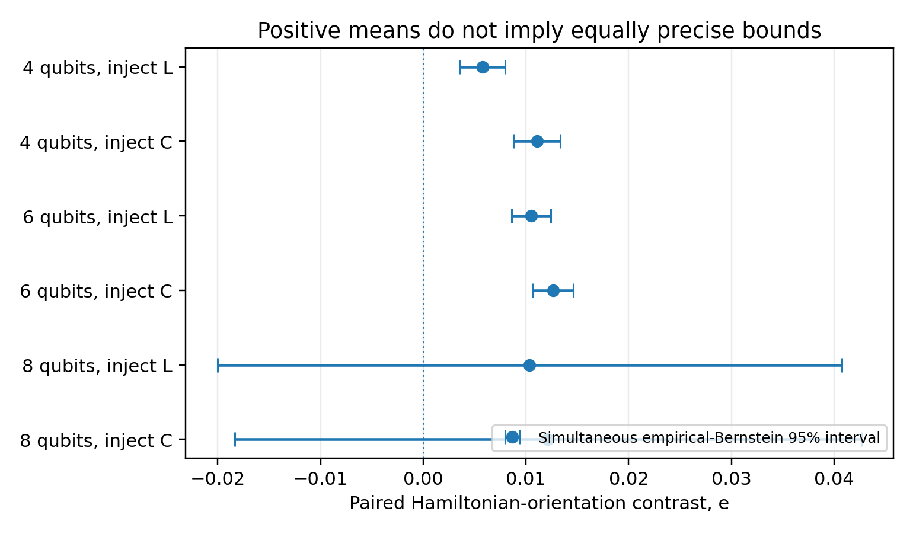

**Figure 4. Different uncertainty methods answer the same six factorial targets. Normal intervals are approximations; the displayed Bernstein intervals use the stated finite-sample assumptions and six-target coverage. These are not confidence intervals for AIU or emergent spacetime.**

### 9.4 What the extension identifies

The intervention changes the whole Hamiltonian's orientation relative to fixed preparation and access. Its spectrum is unchanged, but the prepared energy distribution and detailed state-dynamics relations need not be. Thus the contrast supports a specified model intervention, not a pure effect of locality with all other relevant properties held constant. A third independent circuit frame W has intermediate supplied mean outcomes; there is no theorem that it must be neutral or intermediate.

The small nonzero interaction between injection and dynamics also means that a unique additive attribution to an injection mechanism and a locality mechanism is not supplied. A regression of z on its initial gap contains an algebraic minus-one-half term by definition. Such regression is descriptive unless additional assumptions identify the mechanism; an intercept at zero gap is not by itself proof of frame selection.

Lieb-Robinson bounds constrain propagation for appropriately local interactions. They do not imply the observed sign of the average-readability intervention. Both Hamiltonians are related by a fixed-depth local circuit, which enlarges native support only by a bounded amount. Distinguishing this explanation from other finite-family effects requires an independently chosen response or intervention test.

### 9.5 Reproduction boundary

The original pre-execution plan, configuration, code and receipt remain immutable. Supplied review predictions, including the failed near-zero factorial prediction, are preserved. Re-execution is not external scientific replication and does not verify the claimed chronological creation of those review predictions. Selected factorial trajectories were checked with exponential action and full-density-matrix partial traces rather than the source's spectral/Bloch implementation; the separate check report records its actual scope.

New commands and numerical assumptions are in the Supplementary Information. The archive includes the original source-off trajectories, new factorial unit summaries, all three supplied review scripts, reference outputs and fresh replay outputs. No outside correspondence, peer review or publication was performed.

## 10. Secondary-analysis sources

The exact binomial calculation follows directly from independent equiprobable signs under the null. See Penn State STAT 415, Section 20.1, *The Sign Test for a Median*, for the median interpretation and its distinction from a mean test. The original contrast data, rather than only the rounded summary, are used by `code/analyze_review_additions.py`. It also reconstructs each unit contrast from raw trajectories and writes the four-row sign tests, transport-encoding curves and initial-eligibility diagnostics. These are analyses of the same pilot, not independent replication.

The mathematical source of the range-only confidence bound remains Hoeffding (1963), cited in the methods paper. Holm adjustment is applied to the four disclosed post hoc sign tests; it does not make them predeclared. No new participant, cosmological or quantum-device data were collected.

Holm, S. (1979). A simple sequentially rejective multiple test procedure. Scandinavian Journal of Statistics 6(2), 65-70. https://www.jstor.org/stable/4615733

Penn State STAT 415. Section 20.1, The Sign Test for a Median. https://online.stat.psu.edu/stat415/lesson/20/20.1

Maurer, A., and Pontil, M. (2009). Empirical Bernstein Bounds and Sample Variance Penalization. COLT 2009. https://arxiv.org/abs/0907.3740

---

# Source: protocols/P01_Post_Injection_Protocol_v1_3.md

# P01: source-off information redistribution

## A bounded feasibility pilot, not a recovered geometry

**P01 reader edition v1.3 | 26 September 2026**

**Publication note.** This reader edition updates terminology only. The executed scientific specification and local freeze remain those of protocol v1.2, preserved byte-for-byte in `historical/v1_7_core/protocols/P01_Post_Injection_Pilot_v1_2.md`. Later review-stage factorial controls are not additions to the original pre-execution plan. Their specification, scripts and outcomes are separately supplied.

**Status.** P01-ID1 is executed. Its local pre-execution plan, configuration and hashes are supplied. This is a pre-specified exploratory computational study, not external preregistration, a laboratory experiment or a confirmatory test of the older LRA hypotheses. The outcomes are in the separate results log. The v1.1 protocol and original manuscripts remain unchanged in the historical record.

## 1. The revised question

Once a controlled external source has injected information and has been decoupled, does internal evolution shift average single-site accessibility toward the supplied internal-locality frame, relative to the supplied injection frame and a paired no-evolution control? This question separates the initial source interaction from later redistribution. It does not assume that the preparation imprint disappears or that redundant records must develop.

The previous continuously driven comparison is retained as a control question, not treated as a compulsory primary experiment. For a common initial state, the first derivative of the branch difference depends on $K_0-K_1$, with the common internal Hamiltonian cancelling. That fact does not determine a later winning frame. The primary target below is a different quantity from LRA-count, LRA-int and LRA-tot.

## 2. Complete model specification

**Table 1. Fixed inputs**

| Element | Implementation | Limitation |
| --- | --- | --- |
| System | 4 or 6 qubits, with a supplied nearest-neighbour chain | The graph and tensor-product structure are inputs, not outputs |
| Sampling | 96 independent Hamiltonian/circuit units at each size | Sizes are separate populations; paired conditions are not extra independent units |
| Hamiltonian | Each XX, YY and ZZ bond coefficient is independent normal with variance 1/3; each X,Y,Z field is normal with standard deviation 0.35 | One explicit finite model family, not a distribution for nature |
| Injection frame | A depth-two adjacent-pair circuit with independent Haar two-qubit gates, independent of Hamiltonian coefficients | This circuit family itself uses the supplied chain |
| Preparation | All-zero product state in the chosen injection frame | A deliberately prepared resource, not frame-neutral formlessness |
| Source pulse | Source-conditioned plus/minus one-site X generator, pulse angle pi/4; internal Hamiltonian held off during pulse | A supplied quench intervention; not continuous autonomous source coupling |
| Post-pulse evolution | The same internal Hamiltonian for both branches; all source-dependent terms set to zero | Global distinguishability is preserved, not regenerated |
| Access | Unrestricted measurements on each singleton algebra in the declared frames | Actual implementation costs of nonnative observables are not matched or assessed |
| Readout | 101 diagnostic checkpoints from 0 to 2.5; 50 positive-time primary readouts spaced 0.05 | Primary target is a discrete-time average, not a continuum integral |

Let $V=I$ for the native-injection arm and $V=U_C$ for the rotated arm. Just after the pulse, with site zero addressed,
$$\left| \psi_0(0)\right\rangle=V( \left|0\cdots0\right\rangle-i\left|10\cdots0\right\rangle)/\sqrt2,$$
$$\left| \psi_1(0)\right\rangle=V( \left|0\cdots0\right\rangle+i\left|10\cdots0\right\rangle)/\sqrt2.$$
For $t>0$, both evolve with $e^{-iH_St}$. The matched control uses the same initial states but $H_S=0$. The source bit is external and is not an accessible fragment. The addressed system site contains an injected copy; it is not a newly formed record after switch-off.

Both arms are evaluated in $D_L=I$ and the same alternate $D_C=U_C$. In the rotated arm $D_C$ is the actual injection frame. In the native arm the actual injection frame is $D_L$; the symbol C labels only the paired alternate frame. This clarification prevents a comparator label being mistaken for a physical intervention. The primary analysis uses only the rotated arm at six qubits.

## 3. Primary estimand and baseline

For frame $D$, singleton $j$ and time $t$, let
$$d_{D,j}(t)=\tfrac12\|\rho^D_{j,0}(t)-\rho^D_{j,1}(t)\|_1,\qquad a_D(t)=\frac1n\sum_j d_{D,j}(t).$$
The optimal binary error is $(1-d_{D,j})/2$. Average distinguishing advantage is not the number of strong, redundant records. With $M=50$ predeclared positive-time readouts, define
$$z_i=\frac{1}{2M}\sum_{m=1}^{M}\left[(a_L^{\mathrm{on}}(t_m)-a_C^{\mathrm{on}}(t_m))-(a_L^{\mathrm{off}}(t_m)-a_C^{\mathrm{off}}(t_m))\right].$$
Then $z_i\in[-1,1]$. The control is constant, so it subtracts the initial frame-readability gap. Positive $z_i$ means relative accessibility shifts towards L; negative means the gap shifts in the other direction. A negative value does not imply that C is absolutely better at every time. It can arise because a pre-existing L advantage shrinks.

The primary population is the explicit six-qubit rotated-injection sampling law. Four qubits and native injection are sensitivity/calibration analyses. No units are selected by their records or by the sign of the result. A descriptive mean, win/loss/tie counts, an approximate unit-bootstrap interval, and a conservative Hoeffding interval are reported. Bootstrap intervals are not distribution-free certificates or external confirmation. No hypothesis margin was tuned to the outcome.

## 4. Secondary record and uncertainty contract

New-after-pulse singleton records require initial error at least 0.4999 and final error at most 0.1 throughout one of the four windows [0.5,1.0], [1.0,1.5], [1.5,2.0], [2.0,2.5]. The windows were specified before outcomes. The singleton cap is n. Initial source leakage and pre-existing records are not counted as new.

For each frame and fragment use the smaller of the global and complement-subtracted Lipschitz constants from the methods paper. A maximum grid gap h gives a continuity allowance Kh/2. Upper certificates include a 1e-9 numerical guard; a failed certificate remains unresolved unless a checkpoint proves failure. Lower and upper possible record counts are retained, not replaced by a one-sided count. A guard checked by a second numerical method is not a formally verified floating-point enclosure: continuum classifications remain conditional on that guard. Checkpoint failures far above threshold nevertheless supply useful numerical evidence against the strict window criterion.

These counts answer a different question from the continuous primary readability score. Relaxing the threshold after seeing failure would create another exploratory analysis; it is not part of this run.

## 5. Controls and traceability

**Table 2. Control obligations**

| Control | Required observation |
| --- | --- |
| Common unitary after pulse | Global source-state distinguishability remains one |
| No evolution | Local readability is constant; new-after-pulse count is zero |
| Identical source branches | Zero distinguishing information |
| Common passive conjugation | Same reduced statistics when states, H and access are all transported |
| Exchange-chain calibration | Full-space evolution agrees with the one-excitation hopping model |
| Two-site transport | For the vacuum-versus-excitation control, recipient distinguishability is $\sin^2 t$; for the pilot phase code it is $|\sin t|$ |
| Closed stationary record | Diagonal H preserves orthogonal product records; openness is not necessary |
| Independent numerical method | Selected spectral trajectories agree with exponential action and density-matrix partial traces |

Random streams are generated from SeedSequence(master seed, site count, unit index), with separate child streams for H and circuit gates. Coefficients, per-unit identifiers, effective configuration, raw readability trajectories and execution environment are retained. The local pre-execution receipt records code and specification hashes but is not an independently timestamped registration service. No external specialist has reviewed the pilot.

## 6. Stop rule and possible open-system successor

Run the declared sample once, then inspect it. A fresh identical-seed run is reproduction, not another experiment. No coefficient, threshold, time window or sample size is changed to obtain a favourable answer. Implementation corrections, if necessary, must be logged separately.

Do not proceed directly to a larger frame contest. First decide whether the target is transport, retention, redundancy or identifying a structure from observations. Those are distinct. A future open-system study would use a source-off Lindblad or collision-model stage, with dissipator operators, reservoir state, temperature assumptions, clock and access all listed as supplied primitives. Include an erasure control with a unique attractive stationary state and a known record-preserving control. Multiple invariant or metastable sectors must be specified rather than assumed from the word dissipation. This successor is NOT EXECUTED and is not activated merely because the closed pilot lacks strong records.

The next physical identification question would require a response family from multiple independently declared injections, a method that is not given the target frame, and held-out recovery tests. The present two-frame comparison supplies none of those by itself. It is a feasibility result, not hidden metric reconstruction.

## 7. Evidence boundary

This protocol is now instantiated by P01-ID1. Its law, primary observable and raw finite outputs can be checked. Its supplied locality, prepared resource, small size and access assumptions prevent any result from establishing the relational-substrate hypothesis, Absolute Infinite Union, global infinity or subject individuation. The mathematical methods paper and the philosophical paper retain their separate evidential standards.

---

# Source: manuscripts/Absolute_Infinite_Union_v1_4.md

# Absolute Infinite Union

## A critical case for a generative substrate

**James McGaughran**

MathGov / RippleLogic Research Program

26 September 2026 | Review manuscript v1.4

## Abstract

Absolute Infinite Union is examined as the hypothesis that differentiated existence depends on one unbounded generative reality, potentially experiential and, in its strongest version, one subject with genuine local perspectives. Totality, monist grounding, unboundedness, lawful generation, realized possibilities, experiential fundamentality and cosmic subjectivity are separate commitments. The paper combines an affirmative philosophical case with an explicit map of the bridges needed for scientific support. Its constructive result is conditional: a stationary ergodic symbolic process realizes every supported finite word infinitely often almost surely. The extension to nonergodic processes shows why shared support across components, not ergodicity alone, is the decisive issue for pattern coverage. These standard probabilistic tools clarify premises but do not identify the physical universe or turn descriptions into experiencing worlds. A finite-observation comparison illustrates experiment-specific underdetermination. Primary-source approaches to subject differentiation are examined alongside structural, neutral-monist and physical-realization rivals; passage-level and abstract-only checks remain distinguished. The distinction between common grounding and phenomenal unity prevents arguments for monism from silently becoming arguments for a cosmic subject. Neither repeated oneness reports nor a correct quantum-record theorem determine an ontological likelihood without an observation model. The conclusion is a positive, corrigible research position, not a proof of AIU, its negation, or a numerical probability of ultimate reality.


## 1. The hypothesis we are actually investigating

The motivating picture is not simply that the universe is very large. It is that all differentiated existence may be the activity or configuration of one fundamental reality. This ground would not merely occupy a pre-existing container. On a strong version, the forms we call spacetime, matter, organisms and subjects are its expressions. The further proposal is that the ground is unbounded, intrinsically experiential and generative of every possibility. The image of one consciousness dreaming many worlds expresses this stronger position.

This paper takes that target seriously. It does not quietly reduce AIU to ordinary ecological interdependence, and it does not grant the target as a premise of its own proof. The question is whether the conjunction can be defined coherently, explained economically, connected to observations and preferred over its strongest rivals.

A distinction in attitude is useful. A researcher can have a strong personal expectation that a hypothesis will prove correct while making public claims at the level the evidence currently supports. Such an expectation can direct attention and sustain investigation. It cannot determine the verdict of the tests. A research programme becomes weaker, not stronger, when every adverse result is redescribed as another manifestation of its preferred conclusion.

The best scientific interpretation of the author's determination is therefore a commitment to expose AIU to meaningful challenge. The project succeeds by learning which propositions survive, even if the final account differs from the initiating image. It does not succeed merely by finding more words for unity.

### Contribution and limits

The paper's contribution is an integrated philosophical argument: a seven-part decomposition of the strong hypothesis, explicit inference bridges, a componentwise criterion for finite-pattern coverage, a restricted finite-observation comparison, and a primary-source comparison of subject accounts. The probability results apply established tools; the taxonomy and their joint use are not asserted to be historically unique. A worked pair of subject models below makes one precise point of disagreement available for criticism without claiming a new consciousness mechanism or a proof of the proposed ontology.

## 2. Definitions that preserve the strong thesis

Table 1 separates propositions that otherwise move between meanings. Here AIU means **Absolute Infinite Union**. Its content is fixed by the explicit commitments below, not by the acronym or the metaphors associated with it. A unity-of-reality definition must not silently import an infinite ground, plenitude or one cosmic subject.

**Table 1. The claims carried by the strongest AIU proposal**

| Claim | Precise working content | Kind and present status |
| --- | --- | --- |
| T: totality | Everything actual is included in what we call reality | Definitional; does not establish one substance |
| M: one ground | No actual entity is ontologically independent of one fundamental generative ground | Metaphysical hypothesis |
| U: unboundedness | A named property of that ground has no finite global bound | Open physical or metaphysical claim, depending on the bearer |
| G: form generation | Differentiated effective structures are grounded in or arise from that basis under specified relations | Model-dependent; demonstrated in restricted systems, not universally |
| P: plenitude | Every possibility in a declared admissible class is actually realized | Strong additional realization claim |
| C: experiential fundamentality | Experience is a fundamental aspect of the generative ground | Metaphysical hypothesis |
| C*: cosmic subjectivity | One unified subject grounds genuine local perspectives | Additional metaphysical hypothesis with individuation obligations |

The preferred strong thesis is not T alone. The author's strongest version is $M\land U\land P\land C\land C^{\text{*}}$, with a generative account G. The conjunction's meaning depends on the definitions of U, P and C. Infinite spatial volume, unlimited global distinguishable capacity, all finite patterns, all physical histories and all logically coherent worlds are different theses. So are a ground with experiential aspects and a single phenomenally unified cosmic subject.

For M, grounding need not mean temporal production. If time is itself effective, asking what happened before the ground formed its first state may import the wrong relation. A non-temporal dependence account must nevertheless explain why particular effective structures exist. Calling the relation grounding does not remove the need for a clear mechanism or philosophical argument.

For U, an operational variant could say that, as the declared finite domain and its resources are enlarged, no finite bound exists on the number of globally available distinguishable alternatives at a fixed error tolerance. This is stronger than the observation that a qubit has continuously many pure states, but weaker than a largest mathematical infinity. It does not imply that one observer can access the entire domain. Other U variants must be stated separately rather than treated as interchangeable confirmations.

For P, the minimal useful version concerns every finite configuration allowed by a fixed law and realization measure. A maximal version extends to every coherent reality under every law. The latter needs a theory of coherence, equivalence and observation across that vast domain. It is not licensed by a theorem about one infinite sequence.

For C*, the central task is subject individuation. Why are there private viewpoints, limited memories and local access rather than one publicly available total experience? An answer must preserve the reality of those limits instead of defining them as illusions whenever they create a difficulty.

### 2.1 Commitments and evidence bridges

Mathematical method, physical recovery and ontological interpretation need not succeed or fail together. Table 2 distinguishes the immediate conclusion of each type of result from the additional bridge required for the next claim.

**Table 2. What each result could license, and what remains to be supplied**

| Starting point | Legitimate immediate conclusion | Further bridge required |
| --- | --- | --- |
| A valid finite theorem or calibrated algorithm | A result under named mathematical premises | Independently motivated model, preparation and observation contract |
| A locality-record effect in a specified model population | Evidence about that population and estimand | Held-out geometric or causal recovery and comparison with supplied-frame rivals |
| Successful recovery of effective physics | Evidence for the recovery model | A comparative grounding argument rather than a count of nouns |
| One common ground | A monist account under its axioms | A named infinite bearer and a comparison with finite grounds |
| An infinite possibility domain | Availability of unbounded alternatives | Realization dynamics, support and an observation measure |
| An experiential basis | Consciousness is fundamental in that account | An account of one versus many subjects and their private access |
| A recurring unity report | A phenomenological regularity in the sampled population | A measurement model and distinct probabilities under competing explanations |
| A descriptive ontology | A claim about what exists | Explicit normative premises before any ethical conclusion |

An entailment is only one way evidence can matter. A well-specified abductive comparison can favour an account without proving it. But an unfilled bridge is not a likelihood, and sharing a prediction is not assigning it the same probability. If two completed models assign an event probabilities $0.8$ and $0.2$, that event has likelihood ratio four even though both permit it. Those numbers are an illustration of inference, not estimates for AIU.

Individual defences of M, U, P, C and C* also do not establish joint consistency. A complete combined account must reconcile its temporal structure, subject boundaries, physical laws and observation rule. The present paper preserves that conjunction as the target; it does not announce a consistency theorem for the entire ontology.

### 2.2 Historical commitments that must not be conflated

The present name and research map do not establish historical priority. Several well-developed traditions already address the component claims, often with commitments incompatible with a simple synthesis.

**Substance and necessity.** In *Ethics* I, Definition 6, Spinoza characterizes an absolutely infinite being through infinitely many attributes. Propositions 14 and 15 defend one substance and the dependence of everything on it; Proposition 33 makes the order of things necessary [1]. This is a substantive predecessor for M and a conception of infinity, not a modern cardinality argument. Its necessary order should not be equated with realization of every independently imagined alternative. Nor does attributing thought to substance by itself establish the present phenomenally unified C* subject. AIU must defend those additional bridges rather than borrow the force of Spinoza's terminology.

**Plenitude as a historical idea.** Lovejoy's *The Great Chain of Being* (1936) is a central historical treatment of plenitude, continuity and gradation [2]. It supplies intellectual context, not an empirical realization law or proof that every permissible pattern occurs. This paper makes no claim about who first coined a phrase. Its finite-word theorems instead identify an explicit measure, supported events and almost-sure coverage.

**Plurality is not automatically unity.** Lewis's *On the Plurality of Worlds* defends modal realism and its philosophical utility [3]. The relevant contrast is between commitment to a plurality of worlds and the additional AIU assertion that their existence depends on one ground. A defence of the former does not supply the latter. The word actual must also be fixed before an AIU claim of actual plenitude is compared with a modal account. This discussion is restricted to the publisher's statement of the book's thesis; it does not claim a fresh audit of Lewis's full argument. Nozick's *Philosophical Explanations* is retained as a bibliographic lead for the further fecundity comparison [4]. The relevant original chapter was not accessible in this verification pass, so no detailed attribution or evidential step rests on an AI-generated synopsis of it.

**Mathematical existence and physical existence.** Tegmark's mathematical universe hypothesis proposes a stronger identification of physical reality with mathematical structure and discusses a Level IV ensemble [5]. It is not a theorem that every imagined description is consistent, nor a derivation of experiential fundamentality. Even a mathematical-democracy postulate needs a specification of the structures, observers and observation weighting. AIU therefore distinguishes a formal plenitude proposal from one conscious substrate, and realization from the likelihood of this observer's evidence.

**The cosmic subject is already a philosophical research problem.** Shani (2015) starts from a cosmic-consciousness ultimate and argues that it can ground individual conscious creatures [6]. Goff's *Consciousness and Fundamental Reality*, Chapter 9, defends cosmopsychism by combining phenomenal commitments with priority monism and addressing the Subject Irreducibility Problem [7]. These primary abstracts establish that there are articulated affirmative positions, not merely a new slogan in this paper. Their premises and full solutions must still be assessed. The comparison in Section 10 distinguishes such grounding claims from the private-access and observation rules required by a predictive model.

The positive lesson is not that all these authors endorse the same ontology. They give the programme concrete alternatives and disagreements: necessary substance versus modal proliferation; mathematical structure versus experience; common grounding versus phenomenal unity. A useful synthesis must resolve these differences explicitly.

## 3. The affirmative case: why AIU deserves investigation

### 3.1 Argument from explanatory unification

**Strongest argument.** A common generative account may explain why apparently different domains share mathematical structures and can be described by interlocking laws. If one constrained account recovers many independently established phenomena with fewer adjustable assumptions than competitors, that is a genuine reason to prefer it. The unity hypothesis could guide the search for such an account.

**What follows.** The argument supports pursuing constrained unification. It can support a particular common-ground model if that model earns explanatory or predictive advantages. It does not establish that any theory described by a single noun is simpler. A one-substance account with an arbitrary bridge rule for every observation may be less economical than a plural ontology governed by tightly related laws.

**Best objection.** A mathematical formalism can package many components in one space without reducing their ontological number. The ability to write a single global state is not an experimental observation of one substance.

**Strongest reply.** That objection does not make unity explanatorily idle in every case. A successful theory might show that distinctions previously treated as fundamental are dependent on a deeper structure. The correct test is then comparative recovery and explanatory economy, not verbal counting. AIU needs that concrete achievement before the unification argument can carry its full metaphysical burden.

### 3.2 Argument from a reality without an external container

**Strongest argument.** If reality includes everything actual, there cannot be an actual external object containing it. It is natural to seek a self-contained account rather than imagine a literal wall beyond which further ordinary space begins. An unrestricted ground might seem a better explanation than an arbitrary terminal boundary.

**What follows.** The argument rejects a particular picture of an externally contained totality. It does not prove infinite volume, duration or generative capacity. A finite compact geometry can lack a boundary; a circle and a torus provide elementary mathematical examples. No outer room is needed for their intrinsic definitions.

**Best objection.** The apparent necessity of infinity depends on imagining only bounded subsets of ordinary Euclidean space. Once intrinsic geometry is allowed, the proposed necessity fails.

**Strongest reply.** The absence of an outer container still motivates a question about explanatory closure and the status of all finite descriptions. AIU can retain that motivation while abandoning the claim that a no-wall intuition is itself a proof. A theory must explain why its particular finite or infinite structure is physically realized. Both sides face that question.

### 3.3 Argument from relational and nonseparable physics

**Strongest argument.** Some quantum states require a genuinely joint description, and effective systems obtain their properties in structured relations. These results make a naïve picture of self-sufficient classical pieces inadequate. A whole-first grounding account can be philosophically attractive because it begins with the joint structure rather than reconstructing it from independently complete local descriptions. Priority monism provides a developed version of such an argument [8].

**What follows.** Entanglement supports the relevant physical nonseparability, not every proposed ontology of it [9]. A plural ontology can also assign an entangled state to a composite system. A monist interpretation is not refuted by that availability, but the existence of alternatives blocks automatic identification.

**Best objection.** Quantum records, subsystem algebras and dependence relations are compatible with several interpretations. Nothing in a Bell correlation tells us whether the whole has an experience, whether space is infinite, or whether all possible worlds are actual.

**Strongest reply.** The evidence can still contribute to an inference to the best explanation once ontological bridge premises are stated. Logical non-entailment is not a theorem of zero evidential relevance. Priority monism can motivate M without supplying phenomenal unity or private perspectives under C*. However, the evidential comparison must concern specified accounts. If two accounts make the same predictions and differ only in interpretive language, a new Bell result does not statistically choose between them.

### 3.4 Argument from consciousness as an unavoidable datum

**Strongest argument.** Experience is not removed by describing behaviour or information processing. A common ground with an experiential character could avoid treating consciousness as something entirely foreign that appears inexplicably in a non-experiential universe. An experiential ontology may therefore offer a unifying explanatory proposal, not merely an appeal to religious authority.

**What follows.** The argument identifies a real explanatory target and motivates experiential fundamentals. Epistemic access through experience does not by itself prove that only experience exists. A neutral basis or a physical realization account remains conceptually available. The difficulty of explaining consciousness is not evidence for an arbitrary specific solution.

**Best objection.** Moving experience to the fundamental level may exchange the emergence problem for a combination or decomposition problem. Primitive experiential constituents need an account of why and when a unified subject results; a cosmic subject needs an account of why local subjects are private. These are substantive challenges, not terminological inconveniences [10].

**Strongest reply.** An explanatory relocation may still be an improvement if it reduces total assumptions or yields better constraints. AIU-C must specify what individuates a subject, how its experiential contents relate to physical dynamics, and what observation would favour its rule over rivals. Merely calling private minds fragments of the whole does not yet do that work.

### 3.5 Argument from recurring experiences of oneness

**Strongest argument.** Different people report episodes in which ordinary subject-object boundaries seem absent or radically altered. The recurrence is not intellectually trivial. It can indicate stable features of conscious organization and may motivate the possibility that ordinary separation is a limited mode of representation rather than ultimate ontology.

**What follows.** There is empirical material to examine. Gamma and Metzinger analysed 1,403 usable responses from a selected meditator sample and reported a tentative 12-factor solution [11]. This supplies a measurement approach within that sample, not population-wide invariance or a verified ontological correspondence. A recurring feature can be evidence relevant to a model of experience. Its bearing on ontology depends on what alternatives predict and how reports are sampled.

**Best objection.** Humans share neurobiology, cognitive biases, linguistic influences and traditions. Similar experiences might follow from these common causes without revealing a universal consciousness. Some experiences are non-unitive, ambiguous or distressing [12]. Reports must not be filtered to retain only those fitting a preferred metaphysics.

**Strongest reply.** Shared mechanisms do not prove that an experience is false. Accurate perception also depends on common biology. The proper comparison is content-specific: which aspects of the experience are reliable, which are interpretations, and which a priori differences between models survive an appropriate test? Neural explanation and ontological interpretation should be assessed together where predictions differ, not confused or separated by fiat.

### 3.6 Argument from lawful generativity

**Strongest argument.** Simple underlying constraints can produce a remarkable diversity of organized forms. The generative-ground picture expresses a real pattern: macroscopic structures need not be individually present among the basic ingredients for those structures to arise. AIU seeks to generalize that pattern to the deepest level.

**What follows.** Lawful form generation is possible and occurs in specified physical models. Structure-formation simulations, for example, use initial conditions and dynamics to develop large-scale organization [13]. Such success does not establish unlimited generative capacity or that all possible structures actually appear.

**Best objection.** The phrase formlessness can conceal the input structure. Laws, initial conditions, resource gradients and selection rules may supply most of what the explanation needs.

**Strongest reply.** Formlessness should be defined relative to a particular absent effective form, not as literal absence of all structure. The useful research target becomes: which minimal relations and histories produce the relevant form, and what must be supplied? This is a sharper descendant of the original intuition, not its abandonment.

### 3.7 Parsimony as a comparative burden

A common ground is attractive when it replaces independent assumptions rather than hiding them. Count the laws, initial conditions, subject rules, auxiliary variables and observation kernel as well as primitive kinds. A one-ground theory with an arbitrary rule for each phenomenon is not automatically simpler than a plural theory with tightly constrained relations. The affirmative strategy is to show a common rule that earns its scope across independent targets; the criticism must compare complete explanations rather than penalize the word consciousness in advance.

### 3.8 Different descriptions as aspects of one reality

A dual-aspect account can propose that physical and experiential descriptions concern one underlying reality without reducing either vocabulary by definition. A neutral-monist account instead leaves the intrinsic base neither mental nor physical as ordinarily conceived. These are different proposals. Their promise is a disciplined correspondence across descriptions; their burden is a bridge law with content. Calling both descriptions aspects does not explain why a given experience occurs, but it supplies a hypothesis worth comparing with one-way realization and cosmopsychist alternatives.

## 4. Where the strongest case currently stops

The eight arguments converge on reasons to investigate a common generative account. They do not constitute eight independent proofs of $M\land U\land P\land C\land C^{\text{*}}$. Several share the same explanatory preference; others rely on the same quantum framework or the same human experiential architecture. Counting them as independent likelihood multipliers would inflate their force.

Table 3 identifies what remains to be supplied. It is a work map, not a verdict that the missing items are impossible.

**Table 3. Missing bridges in the strong AIU argument**

| Starting point | Desired conclusion | Missing bridge |
| --- | --- | --- |
| A complete collective term for actuality | One fundamental substance | A grounding argument, not merely a definition |
| No external spatial wall | Infinite physical reality | Elimination or comparison of finite boundaryless alternatives |
| Entangled physical systems | One universal subject | A theory of subject individuation and its correspondence |
| Infinitely many admissible states | Every possibility actually occurs | Reachability, realization dynamics and a measure |
| Repeated oneness experiences | Accurate perception of cosmic consciousness | Reliable content-specific mapping and competing predictions |
| Elegant generative mathematics | Actual physical substrate | Recovery of independently measured physics |
| A morally attractive union | True ontology | Evidence independent of the desired ethical outcome |

The author can consistently retain confidence in AIU as a research expectation while acknowledging these missing bridges. The public statement should then be that AIU is the preferred hypothesis under investigation, not that the unfinished bridges have already been proved. That distinction is essential for learning from critics without requiring agreement with every skeptical conclusion.

## 5. Constructing a rigorous partial model

### 5.1 A positive result for unbounded structure and local plenitude

Consider an infinite binary configuration indexed by integers. Its sample space is $\Omega=\{0,1\}^{\mathbb Z}$, equipped with independent fair-bit product probability. Every finite region has finitely many distinguishable configurations. The global index set is unbounded. This is an explicitly defined mathematical structure, not a largest infinity or a physical universe model.

Fix a finite word w of length k. Partition the positive half of the integer line into disjoint blocks of length k. Every block equals w with probability $2^{-k}$, independently. Then

$$
\Pr(\text{no copy of }w\text{ in }n\text{ disjoint blocks})=(1-2^{-k})^n.
$$

This probability tends to zero. The same calculation applies after any fixed starting block, so the probability of only finitely many occurrences is zero: take the countable union over possible final-occurrence indices. The set of finite binary words is countable. Intersecting their probability-one events gives the following result.

**Proposition A.** Under the specified fair product measure, almost every infinite binary configuration contains every finite binary word infinitely many times.

This is an elementary application of the same repeated-event reasoning formalized by Borel-Cantelli [14]. It demonstrates that unbounded structure, finite local information and repeated local richness are mathematically compatible. The proposition supplies a precise form of the intuition that a rich infinite domain can contain every finite pattern. The word rich matters: it refers to the chosen measure, not to infinity alone.

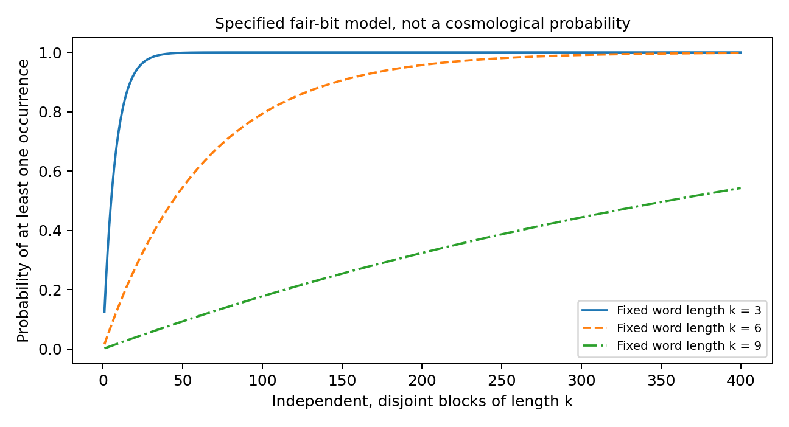

**Figure 1. A conditional probability in the constructed model. Longer specified words need more independent opportunities to appear. The curves are not estimates that our universe contains a particular world, person, heaven or hell.**

### 5.1.1 Correlated patterns: the stationary-ergodic extension

**Proposition A1 (standard ergodic corollary).** Let $\mu$ be a shift-invariant, ergodic probability measure on $\mathcal A^{\mathbb Z}$ for a finite alphabet $\mathcal A$. For a finite word $w$ let $[w]$ be its cylinder at a fixed origin. For $\mu$-almost every sequence, every word with $\mu([w])>0$ occurs infinitely often with asymptotic frequency $\mu([w])$, and no zero-probability word occurs at any position.

**Proof.** Apply Birkhoff's pointwise ergodic theorem to the bounded indicator of each cylinder. Ergodicity makes the invariant conditional expectation equal to $\mu([w])$. There are countably many finite words, so intersect their probability-one convergence events. For each zero-probability cylinder, stationarity makes its translate at every integer position have probability zero. The countable union of those translates and words is null. $\square$

This is a direct corollary of a known theorem, not a new probability law [14, Theorem 6.2.1]. It extends the independent-bit construction to many correlated processes. The admissible physical class must be specified independently; defining admissible to mean positive measure establishes coverage relative to a measure, not that every physically possible state has positive measure.

Garriga and Vilenkin's *Many worlds in one* (2001) provides directly relevant cosmological prior art: under their inflationary and finite coarse-grained-history premises, they argue for repeated histories across infinitely many regions [15]. Their finite-history argument and the symbolic ergodic theorem are related but not identical. Infinite regions plus finitely many labels alone guarantees repetition of some labels, not occurrence of all labels. The realization law and support must do additional work. The cited cosmological argument does not make the present physical premises observationally established.

### 5.1.2 Ergodicity is sufficient, not necessary

Without ergodicity, Birkhoff still gives a limit $\mathbb E[1_{[w]}\mid\mathcal I]$, where $\mathcal I$ is the invariant sigma-algebra. In an ergodic decomposition $\mu=\int\mu_\xi\,d\lambda(\xi)$ on this standard symbolic space, typical frequencies are those of the realized component. Every globally supported finite word occurs in almost every realization precisely when, for each such word, $\mu_\xi([w])>0$ for $\lambda$-almost every component. This assertion uses the componentwise ergodic theorem and countability; it is a coverage criterion, not a claim that the frequencies equal their mixture averages.

Three examples show the distinctions. A stationary golden-mean Markov chain forbidding adjacent ones has 13 admissible length-five words, not all 32. Its ergodic realizations cover those 13 and exclude the other 19. A half-and-half mixture of the all-zero and all-one sequences is stationary but nonergodic: its length-three support has two words, of which one realization contains only one. The relevant failure is one of two supported words, not one of eight supported words. Conversely, a mixture of independent Bernoulli processes with parameters one quarter and three quarters is nonergodic but each component has full finite-word support. Almost every realization still contains every finite binary word infinitely often, with component-dependent frequencies. Nonergodicity alone is therefore not an obstruction to finite-pattern plenitude.

The new finite simulations illustrate the golden-mean support and a finite sample's coverage. They do not test an infinite almost-sure theorem by exhaustive observation. Extension to a random field on $\mathbb Z^d$ requires a specified measure-preserving shift action and the appropriate multiparameter averaging theorem; it is not a free generalization to arbitrary continuous physical worlds.

### 5.2 What the construction does not show

The construction supplies its integer index, independent bits and probability measure. It does not derive geometry, time, energy, a quantum measurement rule, sentience or a causal process of world creation. A bit pattern is not automatically an experiencing world. A physical implementation would need a mapping from the code to lawful systems, including the resources and subject structure required for experience.

Every finite word is also much less than every possible infinite world. There are uncountably many infinite binary configurations, while one sequence contains only countably many positions at which to begin a suffix. The finite-word proposition cannot be promoted to realization of every infinite sequence. Nor does probability one mean that the exceptional all-zero sequence is logically impossible. The sample-space semantics remain intact.

A deterministic enumeration can also concatenate every finite word. That provides another existence construction but places the plenitude directly in its rule. Neither route makes the realization principle free. The positive result is coherence under explicit premises; the actual-world question remains open.

### 5.3 A finite-window comparison

Take a second model: a ring containing L independent fair bits. Compare it with the infinite independent chain through an experiment that samples r distinct sites, with r<L and without identifying wraparound or revisiting one physical site under two labels. In both models every observed r-bit assignment has probability $2^{-r}$. Unobserved sites simply marginalize out.

**Proposition B.** For this specified finite observation design, the finite-ring and infinite-chain models have identical likelihoods for every possible outcome.

This does not prove that infinity is forever untestable. It shows that a particular experiment cannot distinguish these particular models. A larger domain, repeated-site identification or other structural assumptions can change their predictions. The lesson is practical: evidence supports the feature a comparison actually identifies, not the largest ontology compatible with it.

### 5.4 Can this count as a substrate model?

It can be called a minimal generative or configuration model if that term is defined. One may treat the entire configuration as a single object with many substructures. That still leaves open whether the object is physically fundamental or merely a mathematical representation. The same distribution can be described using many variables; notation does not settle monism.

The construction is therefore best used as a constructive consistency test for a restricted AIU component. It shows that certain objections based solely on infinity or local finiteness are too strong. It does not supply the empirical bridge for AIU-M, AIU-C or maximal plenitude.

## 6. Infinity, necessity and the Absolute

Cantor's hierarchy and philosophical Absolute should not be collapsed into one physical magnitude. The fact that a set's power set has larger cardinality does not show that physical reality instantiates all such sizes. A physically infinite model can be represented by an ordinary set. It does not need to be the largest possible mathematical object. Historical discussions of the Absolute illuminate terminology, not the truth of a modern cosmology [16].

There are several ways to preserve the intended depth without claiming an invalid theorem. One is unrestricted ontological dependence: every actual form depends on the same ground. Another is unbounded actual extent or capacity under a specified physical model. A third is inexhaustibility of finite descriptions. These may be related in a developed theory, but none is equivalent by definition to the other two.

A ground that is not located inside effective spacetime need not have infinite spatial volume in the ordinary sense. Its relevant infinity might concern histories, relational extent or accessible alternatives under enlarged domains. It might instead be finite while supporting emergent spacetime. The empirical implications depend on the exact representation. Thus the statement that infinity can occur at any point needs disambiguation: global infinity is not an event that happens at one coordinate.

Literal unlimited retrievable information in a bounded finite-resource region encounters distinct physical questions. Entropy bounds have conditions involving energy, size, entropy definition or light-sheets [17; 18]. A maximum bound can constrain an admissible distinguishable codebook. Finite entropy of a single state alone does not imply finite support. Neither statement establishes the global size or experiential nature of the ground.

A proper-class ontology creates additional modelling work but need not ban all local predictions. A local experiment can have a set-sized sample space and ordinary observation probabilities even when a philosophical account refuses a completed set of everything. The consistency and interpretation of the larger ontology remain separate problems. Declaring that the totality exceeds formal capture does not itself yield a prediction.

### 6.1 Actual infinity and potentialist alternatives

The author's target includes an actually unbounded reality, not only a process whose finite descriptions can always be extended. Potentialism and indefinite extensibility are useful alternatives to examine; Linnebo and Shapiro (2019) provide a relevant philosophical treatment [19]. They must not silently replace the target or be declared mandatory merely because they ease formal modelling. Actual infinite set models, extensible-stage models and class-theoretic descriptions can encode different commitments. Selecting between them requires explicit philosophical or physical reasons. None is a largest cardinal, and none proves its own physical realization.

### 6.2 Cosmology constrains specified continuations

The DESI DR2 Results IV analysis, version 3, Section VI.4.3, Eq. 36 reports $10^3\Omega_K=2.1\pm1.1$ for DESI BAO plus Lyman-alpha full-shape plus CMB, in a curved Lambda-CDM analysis [20]. This is a model- and data-combination-dependent curvature constraint, not a direct measurement of total volume. It does not choose infinity over all finite alternatives. A compact flat torus illustrates why local flatness alone is insufficient.

Conversely, failure to settle finiteness against every possible continuation does not make all finite-versus-infinite comparisons nondiscriminating. Specified models can predict different topology signatures, correlation structure or curvature distributions. Their likelihoods and priors must be stated. The finite-ring theorem concerns one restricted observation design, not a universal ban on evidence about global structure. Complete positive-constant-curvature spatial manifolds can be finite quotients as well as simply connected spheres; simple connectedness is not required for every finite-volume inference. Other bearers of unboundedness, including time or generative capacity, remain distinct.

## 7. Probability without manufactured precision

### 7.1 What would an AIU probability mean?

A probability for AIU must be conditional on a hypothesis space, background information, priors, auxiliary models and an observation rule. None is supplied by the word infinite. The appropriate comparison is between sufficiently specified rivals, including their uncertainty about laws and parameters.

$$
\text{Posterior odds}(H_1:H_0)=\text{Prior odds}(H_1:H_0)\,\frac{\Pr(E\mid H_1)}{\Pr(E\mid H_0)}.
$$

When both rivals exactly reproduce the same observation distribution, that evidence gives a Bayes factor of one. When either likelihood is unspecified, no numerical Bayes factor has been earned. It is a mistake to treat compatibility as probability one, and an equal mistake to treat lack of a calculated likelihood as probability zero.

The conjunction has its own constraints. Under any common probability model,

$$
\Pr(H_{\mathrm{AIU}}\mid E)\le\min_{J\in\{M,U,P,C,C^{\text{*}}\}}\Pr(J\mid E),\qquad H_{\mathrm{AIU}}=M\wedge U\wedge P\wedge C\wedge C^{\text{*}}.
$$

Here P inside the event denotes the plenitude proposition; the operator $\Pr$ denotes probability. The chain rule expands the conjunction using conditional probabilities, not an assumed product of five independent confidence levels. This matters because a person can have a strong argument for a common basis while having much less evidence for all possible worlds or one universal subject.

### 7.2 A sensitivity illustration, not a verdict

Suppose, solely for illustration, that a specified model comparison had Bayes factor ten. A prior probability of 0.01 would become about 0.0917; a prior of 0.1 would become about 0.5263; a prior of 0.5 would become about 0.9091. These are arithmetic consequences of the assumptions, not three estimates of AIU's truth.

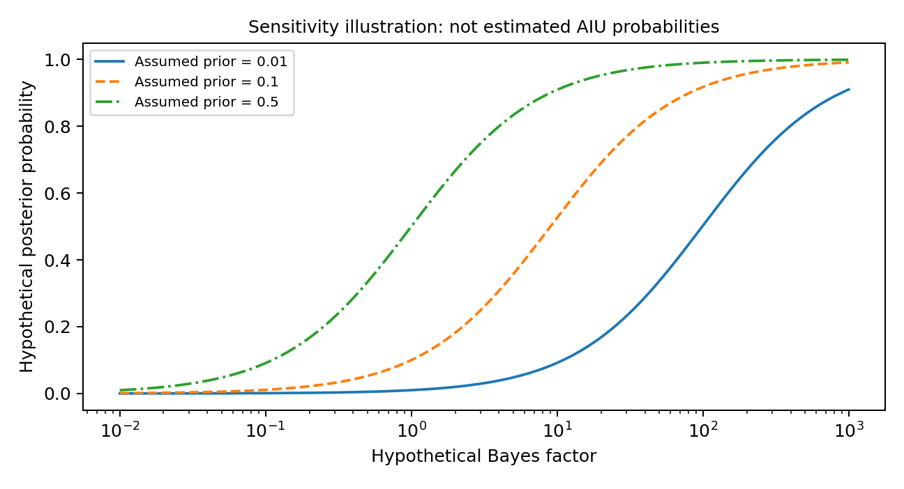

**Figure 2. Conditional Bayesian sensitivity. No prior or Bayes factor on this figure was estimated for AIU. The point is that even a stated evidence ratio does not uniquely determine a posterior without the other assumptions.**

An explicit non-numerical conclusion can be more rigorous than a precise invented percentage. One can identify a model as coherent, an argument as invalid, an empirical claim as constrained, or a comparison as presently nondiscriminating without pretending to possess a calibrated probability of ultimate reality.

### 7.3 Dependent patterns do not multiply into certainty

For evidence $E_1,\ldots,E_n$, a valid likelihood factorization is $\Pr(E_1\mid H)\Pr(E_2\mid E_1,H)\cdots$. Replacing all conditional terms with $\Pr(E_i\mid H)$ assumes conditional independence. Similar contemplative reports may share biology and traditions; papers may reuse a dataset; AI systems may reuse text or reasoning; different arguments may rely on one interpretive premise. Their apparent number can greatly exceed their independent information.

This does not make convergence worthless. It changes the research question from how many favourable examples can be listed to how much new constraint each example supplies. A genuinely surprising out-of-sample prediction under a well-specified alternative can matter more than hundreds of repetitions of a familiar description.

## 8. A pattern-and-indicator ledger

Table 4 shows how the programme should treat its principal indicators. The entries are analytical distinctions, not numerical weights and not a vote on AIU.

**Table 4. Indicators, competing explanations and discriminating work**

| Indicator | Why it motivates AIU | Strong alternative explanation | Next discriminating task |
| --- | --- | --- | --- |
| Successful unifications in physics | Common underlying organization can replace apparent plurality | Shared mathematical representation with multiple primitives | Compare complete models and independently recovered phenomena |
| Entangled joint states | The whole has structure not fixed by independent marginals | Composite quantum systems without substance monism | State which ontology adds a distinctive prediction or explanatory constraint |
| Local records in effective physics | Differentiated forms can share common dynamics | Ordinary decoherence with supplied geometry and preparation | Test an independently motivated pre-geometric implementation |
| Boundaryless or near-flat cosmological possibilities | Finite observational horizons do not bound total reality | Compact finite geometry or other global continuations | Compare topology and model-conditioned predictions, not curvature alone |
| Convergent unity reports | Ordinary self-boundaries may not exhaust experience | Shared cognitive mechanisms and interpretive learning | Measurement invariance, negative cases and content-specific reliability |
| Low-structure states yielding organization | A common ground can have many forms | Supplied laws, perturbations and resource gradients | Identify exactly which input does the explanatory work |
| Neural dependence of human experience | Could be a constraint on how local perspectives appear | Physical realization models with explicit neural mechanisms | Compare subject and intervention predictions, not generic labels |
| Mathematical infinite constructions | Some forms of unbounded richness are coherent | Formal existence without physical realization | Supply physical correspondence and an observation measure |

The ledger avoids two extremes. It does not classify every compatible pattern as confirmation. It also does not insist that philosophical explanation can have value only after a laboratory experiment. A reasoned metaphysical comparison can be substantive, provided its premises, explanatory criteria and alternatives are made explicit.

## 9. The major rival accounts and their strongest challenges

These are reconstructed positions, not statements issued by external scholars in a completed panel. Real advocates may reject some formulations; that is one reason to seek domain-qualified review rather than treat the table as a settled debate.

### 9.1 Finite common-ground realism

This rival accepts one ground but denies that unity requires infinity. A finite quantum or relational model can contain many differentiated patterns and complex experiences if the relevant realization theory permits them. Its strongest objection is that AIU has not shown why adding U explains any particular observation better. The AIU reply must identify a feature that finite alternatives cannot reproduce, or explain why an unbounded account is substantially more constrained and economical. Merely saying a finite ground would need an outside repeats the boundary error.

### 9.2 Plural physical realism

This rival treats some plurality of physical components as fundamental while allowing their states and interactions to be deeply relational. It need not imagine completely isolated little objects. Its objection is that a single ground may add a metaphysical label without reducing physical assumptions. AIU's best reply is to show a genuine dependence relation or unification that removes otherwise independent postulates. A global mathematical description alone is insufficient.

### 9.3 Structural or process realism

Ontic structural realism gives relational structure explanatory priority. Process ontology instead emphasizes events or becoming, and need not reduce to a timeless structure. Both can reject a further substance behind relations, but they offer different resources for explaining persistence and change. Both can agree with much of the substrate research while rejecting the image of one underlying stuff. Their shared question is what the word substrate contributes beyond the relational structure. AIU can answer by defining the ground as that structure, but doing so relinquishes any additional material-goo claim. A conscious-ground extension would still require its own argument.

### 9.4 Neutral and dual-aspect monism

Neutral monism offers a basis not initially classified as either ordinary mentality or ordinary matter. Dual-aspect monism treats mental and physical descriptions as irreducible aspects of a common reality. These positions need not have identical commitments about their ground. They can make unity plausible while leaving C*'s universal-subject claim open. Their advantage is avoiding an immediate inference from structural physics to consciousness. Their challenge is to specify the relation between the base and its aspects without simply renaming the explanatory gap. AIU-C must show why experiential fundamentality explains more than these less committal alternatives.

### 9.5 Panpsychist and cosmopsychist accounts

Panpsychist accounts begin with experiential or proto-experiential features at a basic level; cosmopsychist accounts begin with a fundamental whole. The former faces a combination problem, the latter a differentiation or decomposition problem. Naming one ground does not decide which grain is a subject. A useful comparison asks how private viewpoints, split or altered access, and non-biological realizations are individuated. The existence of these problems does not logically disprove experiential fundamentals, but it prevents treating them as a completed explanation [10].

### 9.6 Idealist and physical-realization accounts

An idealist model takes experience or mentality as fundamental and must recover the lawfulness of shared observations. A physical-realization model must explain how the organization of a physical system realizes experience. Either can be made so flexible that every result is accommodated. The productive test is between constrained versions: which systems are subjects, how interventions alter experience, and what predictions differ before the data are collected? Generic labels are not complete statistical models.

### 9.7 Methodological empiricism

This position suspends the ultimate ontological choice while studying the shared observable structure. Its strongest objection is that many AIU proposals have no unique empirical consequence. AIU's strongest reply is that science also depends on conceptual interpretation, and foundational questions can motivate new models before new predictions are available. Both points stand. The consequence should be appropriate classification and targeted development, not either metaphysical certainty or a prohibition on metaphysical research.

## 10. Consciousness, individuation and the proposed dream

A literal cosmic-dream account owes more than a metaphor. It must specify what is experiencing, how differentiated viewpoints arise, why their access is limited, and how intersubjectively stable observations emerge. A schematic map e_j = B_j(s) from ground state s to perspective j may organize the question, but the function B_j contains the central explanatory burden. Writing it does not explain phenomenality.

The claim can be separated into experiential character of the ground, unity of its subjectivity, and the relation between local subjects and that subject. These need not rise or fall together. A neutral common ground with local experience is not identical to one cosmic mind. A common conscious ground with irreducibly private perspectives still needs a rule for their numerical identity and continuity.

Physical constraints remain relevant where a conscious-ground theory makes physical commitments. IIT, for example, uses specified causal and partition conditions rather than a generic measure of unity [21]. A conclusion internal to that theory is not a theory-independent disproof of consciousness beyond its model. Conversely, a claimed cosmic subject cannot simply ignore causal-model assumptions while invoking IIT as evidence in its favour.

The paper does not infer that a copy of a person's physical pattern is the same continuing person. It also does not infer infinite pleasure or pain from an infinite number of finite episodes. Actual realization, recurrence, valence magnitude and personal identity are distinct obligations. Heavens and hells can remain names for proposed experiential possibilities, but their actual infinite realization is not established by the word infinity.

### 10.1 Affirmative AIU variants, not one ambiguous claim

**Table 5. Main variants kept active for reasoned comparison**

| Variant | Positive commitment | Distinctive burden |
| --- | --- | --- |
| AIU-R: relational ground | Every actual entity depends on one generative relational basis; effective forms need not be primitive | Show a nontrivial dependence account rather than merely collecting everything into one set |
| AIU-U: unbounded ground | AIU-R plus no finite bound on a specified global extent, history depth or distinguishable capacity | Name the bearer and compare actual finite alternatives; local continuum mathematics alone is insufficient |
| AIU-C: experiential ground | In the author's nested variant, AIU-U plus intrinsically experiential reality | Explain the experiential-physical relation; experiential fundamentality alone does not logically imply U |
| AIU-C*: cosmic-subject extension | AIU-C plus one unified subject with genuine local perspectives | Supply phenomenal unity, private access and individuation rules; common substance does not supply co-consciousness |

Plenitude is an additional P parameter of any variant, not a hidden consequence of the letters AIU. P-finite says every finite pattern in a stated admissible class is realised. P-history says every admissible complete history is realised. P-modal says every logically coherent reality is actual. These have different measures, cardinality issues and observation burdens. The author's preferred strongest vision remains AIU-C* with a strong P commitment; the weaker variants are comparison points, not a covert redefinition of that vision.

### 10.2 Subject maps and observational equivalence

A candidate model must specify at least a ground-state or history space S, laws D, an observation kernel O, a subject assignment Sigma(s), and a mapping B_j from the relevant ground history to the contents accessible to perspective j. O is a rule for public experimental outcomes; B_j is a proposed experiential bridge, not an equation that solves consciousness simply by naming it. A cosmic-subject model must explain why local subjects do not share unrestricted memory or access. A local-subject model must explain what binds each subject. These are rival explanatory burdens, not an automatic victory for either account.

There is a precise identification limit. Suppose two complete models, after integrating over their declared auxiliary parameters, assign the same probability to every event in a specified observation family. Then that family gives likelihood ratio one wherever the common probability is nonzero. No amount of repetition of those same kinds of observations separates the models. The conclusion is local to that family and model pair. It does not prove all ontological questions meaningless or every future observation uninformative.

Conversely, absence of a numerical likelihood is not likelihood ratio one. An unfinished cosmic-subject proposal may have no specified prediction at all. The constructive next step is to constrain B_j or O enough that an alternative would expect a different outcome, or to argue a demonstrable reduction in independent explanatory assumptions. A small p-value in a quantum-record calculation supplies neither bridge by itself.

### 10.2.1 Candidate subject accounts and the objections they must answer

A subject account may begin with explicit philosophical commitments rather than a numerical function. Table 6 distinguishes the authors' proposals and the scope of the source material used, including a publisher abstract where the full chapter was unavailable. Distinct proposals must not be collapsed into one supposedly established solution.

**Table 6. Primary-source subject accounts and their open burdens**

| Approach | Claim in the primary source | Critical question and checked scope |
| --- | --- | --- |
| Kastrup, dissociation-based idealism | Living organisms are dissociated centres within cosmic consciousness; his association-graph analogy models restricted experiential access | Does lost associative access suffice for distinct subjects? Sections 8 and 9 propose the account; Section 12 addresses brain-experience correlations. This is philosophical extrapolation, not experimental confirmation of cosmic dissociation [22] |
| Albahari, perennial idealism | The ground is aperspectival, not an enlarged perspectival cosmic observer. Dispositional subjects bounded by imagery account for manifestation | What constrains those dispositions and their correspondence to observations? Abstract and Sections 3 to 5 inspected. An aperspectival ground is not automatically the one-subject C* hypothesis [23] |
| Nagasawa and Wager, priority cosmopsychism | The cosmos is fundamental and phenomenally propertied; local parts depend on the whole | Whole-first dependence does not alone individuate private subjects. Publisher chapter abstract and pages 113-129 verified; full chapter argument not assessed here [24] |
| Miller, decombination critique | Structural phenomenal unity and disunity create a problem distinct from qualitative heterogeneity | His criticism targets transferring one proposed solution, not every possible conscious-ground theory. Published article, Sections 2 and 3, inspected; 2021, pages 112-125 [25] |

Kastrup provides more than a label: his Section 9 proposes associations among phenomenal contents and dissociation between parts of that network. Yet ordinary dissociation does not, without another argument, establish a cosmic implementation. Albahari deliberately avoids treating the universal ground as another bounded perspective. These are different ontological commitments, not interchangeable evidence for C*. Both remain candidates to assess, not validated subject-selection algorithms.

Miller distinguishes qualitative variety within experience from the unity and boundaries that individuate subjects. This challenges the automatic transfer of Schaffer's response to heterogeneity into a solution of decombination. It does not establish that priority monism itself is true, nor does it rule out every alternative individuation principle. The priority-monism argument in Section 3.3 therefore remains motivation for M, not proof of C*.

The next comparative step is to state which subject relations and observation rules each proposal actually constrains, and distinguish those from new rules introduced by this programme. A named rival may assign different probabilities to ordinary intervention or access outcomes even when both accounts permit them. No clinical intervention or diagnosis is proposed here, and neural results are not converted into metaphysical verdicts by analogy alone.

### 10.2.2 Worked comparison: a common ground with or without a cosmic subject

Consider a deliberately minimal operational system with two binary registers A and B. Initially they are independent fair bits. An intervention sets A to a chosen value a. One later update leaves A unchanged and, when a communication link is enabled, sets B equal to A with probability $1-\eta$, where $0<\eta<1/2$. When the link is disabled, B retains its initially independent bit. Reports read the corresponding registers without additional noise. This is an identification-limit illustration with equal observable laws imposed by construction, not a neural model, a fitted theory of consciousness or a discovery that published subject accounts are observationally equivalent.

The shared observation rule is therefore
$$\Pr(R_B=a\mid\operatorname{do}(A=a),\mathrm{link}=1)=1-\eta,$$
$$\Pr(R_B=a\mid\operatorname{do}(A=a),\mathrm{link}=0)=1/2.$$
At $\eta=0.1$, these are 0.9 and 0.5. The same law specifies the entire joint report distribution. Repeating the experiment, varying a, or disabling the link cannot discriminate accounts that retain exactly this law.

**Cosmic-subject account.** The physical process is a restricted expression of a common experiential ground. In addition to local perspectives with contents A and B, the account posits a unified ground-level subject. Local accessible content is restricted to the corresponding register and whatever the stated communication rule supplies. Ground-level co-consciousness is a further postulate; it is not defined as communication bandwidth.

**Nearby rival.** The same common ground and operational process support the same local perspectives, but there is no additional cosmic subject. The rival can share the proposed physical continuation, including a separately stipulated unbounded completion. Thus the comparison holds the infinity and physical-law commitments fixed and varies the cosmic-subject commitment, rather than confusing several changes in ontology.

Under these stipulations both accounts agree on every event in the declared report/intervention family, so the Bayes factor is one wherever their common event probability is nonzero. Their subject assignments differ, even though no readout here observes that difference. This is an exact identification limit for these constructed accounts, not evidence that actual subject accounts are equivalent in every possible experiment. Neither account derives phenomenal experience from a bit label; both still owe an independently defensible experiential bridge.

The strongest objection to the cosmic-subject account is explanatory surplus: the additional subject has not reduced any operational or local-subject assumption in this construction. The strongest reply is that a cosmic unity principle might independently constrain which local perspectives can exist and thereby reduce the full theory's unexplained assumptions. That reply becomes an argument only when the constraint is supplied. The common observation rule cannot by itself favour either ontology, and counting one fundamental entity as simpler is insufficient if extra bridge rules are required. A useful discriminator would be an independently motivated modification that makes the models assign different probabilities or excludes different subject configurations before the relevant observations are inspected. This example is the present paper's schematic comparison, not a formalization claimed by Kastrup, Albahari, Nagasawa, Wager or Miller.

### 10.3 What the preparation results do, and do not, imply for formlessness

Conditional Haar typicality is a statement about a specified invariant distribution on finite quantum states. It is not a statement that reality without a preferred macroscopic form cannot produce form. A globally covariant ensemble can contain preparation and coupling resources that are aligned within each individual draw. Conditioning on those resources matters. Likewise, an energy-constrained ensemble need not behave like a full-Hilbert-space Haar ensemble.

The stronger scientific descendant of the original image is therefore not creation from an absence of every constraint. It is generation of new effective form from a basis lacking that particular effective form, under explicit relations, history and selection rules. AIU can make this a positive explanatory ambition. It must then say what is supplied and show what is recovered, rather than call supplied laws evidence of unlimited generativity.

## 11. Empirical routes that could matter

### 11.1 Physical structure and records

A physical research route asks whether independently defined locality and informative records favour compatible subsystem structures. The mathematical safeguards and finite quantum examples developed in the separate methods paper *Frame-Aligned Records* do not yet recover an unknown spacetime metric. Its original source-off pilot has a negative mean change relative to frozen evolution. A later paired factorial extension has positive contrasts between Hamiltonian orientations at fixed injection. These are different counterfactuals, not a reversal of one result. Neither reconstructs a metric or establishes a common infinite ground; both concern supplied finite dynamics and access. A finite propagation bound does not by itself identify the mechanism behind the scalar readability contrast.

The correspondence burden includes controlled recovery of the target regime. A few-body decomposition is not enough. Graphs, symmetries, effective distances, propagation, matter content and measurement rules must be classified as supplied inputs or recovered outputs. Existing emergent-spacetime approaches provide concrete problems and examples, not transferred confirmation of AIU [26; 27].

### 11.2 Phenomenology and common structure

A useful first question is whether defined experiential dimensions survive comparison across adequately sampled groups after translation, expectations and interpretive vocabulary are addressed. A reanalysis can begin with a known dataset only after its codebook, permissions and group sizes are inspected. This release did not analyse participant data. A new study requires ethics review, informed consent and safeguards for distress; it need not instruct anyone to induce altered states.

Experiential description should be separated from metaphysical interpretation. Blind coding of open accounts can complement predeclared scales, while negative and ambiguous cases remain eligible. Episode properties, repeatable capacity, enduring trait change and a tradition's attribution of enlightenment are not one variable. A recovered common factor establishes a measurement result within its population, not universal identical experience. Generic AIU and neurocognitive labels do not by themselves specify the probability of measurement invariance, so their likelihood ratio cannot simply be assigned a value near one. A discriminating comparison requires completed observation models; both models may assign positive probability to an outcome and still be distinguishable.

### 11.3 Content-specific correspondence

For an experience to support a claim about a referent beyond the experience, there must be a defensible correspondence. Ordinary perception earns such warrant through prediction, calibration, cross-checks and action. An AIU interpretation needs an analogous account appropriate to its content. A feeling of unlimitedness does not by itself encode infinitely many independently checkable facts.

Unusual information access is not the sole possible test, and no such ability follows from monism alone. Ordinary evidence about subject boundaries and intervention effects may be more tractable. A proposed anomaly would first need rigorous controls and comparison with multiple explanations; it would not uniquely identify AIU by defeating one ordinary account.

### 11.4 Observation selection and measure

A plenitude theory must explain why this kind of observation is expected, not only why it exists somewhere. Observer-weighting pathologies can make a proposed cosmology epistemically unstable under stated assumptions [28]. Their significance is that realization and observation measures do substantive work. A claim that every possible world exists still needs an account of why our records are orderly and reliable.

This task should be approached as model construction, not as a demand for a universal probability measure before any local science is permitted. Specific domains and comparisons can be predictive. Their success does not automatically validate the unrestricted metaphysical extension.

## 12. Union, compassion and the independence of ethical protection

The author's conception links union with care and the possibility of flourishing. That can be a coherent ethical orientation without being a physics theorem. The descriptive fact that two beings share a ground does not establish a particular duty unless normative premises are added. Conversely, their protection need not wait for agreement about ultimate ontology.

Boundaries also have more than one moral role. A boundary can exclude or harm; it can protect an organism, preserve agency, allow consent and support cooperation. Fear and greed cannot be reduced to all forms of separation without a causal account and evidence. The aspiration to reduce alienation should therefore be distinguished from erasing functional differentiation.

A strong AIU ethics can say that no being's experience should be dismissed merely because it is described as an expression of a larger whole. It must not convert cosmic unity into permission to sacrifice vulnerable individuals. People who reject AIU remain fully eligible for protection and participation. This follows from the ethical commitments being proposed, not from a measurement of the substrate.

Ethical protection should therefore remain robust across the compared ontologies. A philosophical preference for unity may guide personal interpretation, but it must not become a prerequisite for rights, participation or consideration of suffering. Nor should a numerical ranking be invented when the evidence and normative assumptions do not identify one.

## 13. What would change the assessment?

Table 7 keeps the research vulnerable to evidence without pretending one experiment can adjudicate the entire conjunction.

**Table 7. Update rules for the principal commitments**

| Claim | Confidence could increase through | Confidence could decrease through |
| --- | --- | --- |
| M: one ground | A constrained common-basis model with superior independent recovery or a stronger grounding argument | A competing account that explains the same target with fewer arbitrary bridges; internal inconsistency |
| U: unboundedness | Comparative support for a specified unbounded continuation against named finite alternatives | Evidence incompatible with that continuation, such as a relevant compact topology under its assumptions |
| G: effective emergence | Controlled approximation and successful predictions of the target regime | Persistent failure in the declared model class or proof that the target was supplied as input |
| P: realization richness | A realization theorem whose physical premises are independently supported | Conserved constraints, inaccessible sectors or a measure contradicting the claimed coverage |
| C: conscious ground | A constrained individuation rule with discriminating successful predictions or a stronger philosophical account | Failed predictions, inability to recover observed dependencies, or uncontrolled ad hoc repairs |
| Phenomenological relevance | Replicated, well-specified convergence and validated correspondence | Sampling/translation explanations, failed generalization, or stronger rival predictions |

Evidence against a model is not necessarily evidence against every member of its broad family. But that fact must not become immunity by perpetual retreat. After a predeclared class repeatedly fails, the programme should record that loss, narrow its claim and justify the next class independently. Calling every successful theory AIU after the fact would erase the thesis's distinct content.

Likewise, successful mathematical repairs do not move the ontological posterior by themselves. They improve the instrument used to investigate one possible mechanism. A correct map is not evidence that the destination exists; it is what makes a genuine search possible.

## 14. A focused agenda

Two tasks have the greatest direct relevance. A physical model must identify its primitives, recover specified observations and compete with alternatives on a held-out target. A subject account must explain private perspectives and shared observations, then state either a genuine empirical discriminator or an explicit philosophical criterion of preference. The worked comparison in Section 10.2.2 shows how identical operational predictions leave a precise ontological disagreement rather than a fictitious probability verdict.

Further development should close one of these obligations with a proof, counterexample, model comparison or observation. Repetition of compatible examples is not a substitute. Conceptual criticism remains useful when it identifies a genuinely different constraint or exposes a hidden premise; its value is not measured by the number of approving reviewers.

## 15. Conclusion: the strongest defensible affirmative position

The affirmative AIU position can be stated without false certainty: differentiated existence may depend on one generative ground; unbounded and experiential versions are serious possibilities; mathematics can clarify their consistency and implications; and patterns in physical organization and experience can motivate focused investigation. The preferred strong conjunction remains explicit rather than silently replaced by generic interdependence.

Its current limitation is not that inquiry is prohibited by an old unsolved problem. It is that the physical, probabilistic and experiential bridges have not yet been supplied at the strength the full claim requires. That is a research agenda with identifiable burdens, not a licence to announce proof or a reason to terminate the investigation.

A successful programme may confirm a constrained AIU account, reject part of it, or reveal a better structure not captured by the initial metaphor. Its standard is whether the resulting account explains and predicts more accurately while carrying fewer unsupported assumptions. That is how commitment to the possibility of an infinite union can remain commitment to truth rather than commitment to a predetermined answer.


## Declarations

This is a philosophical hypothesis assessment, not an empirical consciousness study. No human-participant data were collected or reanalysed. Claude and ChatGPT assisted criticism, calculations, source retrieval, drafting and production; no AI system is an author, and their agreement is not independent evidence. The author retains responsibility for the arguments and final approval. Funding, competing interests and final correspondence metadata require author confirmation before submission. Related quantum calculations belong to the separate methods paper and supplement, not independent confirmations of this ontology.

## References

[1] Spinoza, B. (1677). Ethics, Part I, Definition 6 and Propositions 14, 15 and 33. R. H. M. Elwes translation. https://www.gutenberg.org/files/3800/3800-h/3800-h.htm

[2] Lovejoy, A. O. (1936). The Great Chain of Being: A Study of the History of an Idea. Harvard University Press. Modern reprint publisher record: https://www.routledge.com/The-Great-Chain-of-Being-A-Study-of-the-History-of-an-Idea/Lovejoy/p/book/9781412810265

[3] Lewis, D. (1986). On the Plurality of Worlds. Blackwell. Publisher reprint description: https://www.wiley-vch.de/en/areas-interest/humanities-social-sciences/on-the-plurality-of-worlds-978-0-631-22426-6

[4] Nozick, R. (1981). Philosophical Explanations. Harvard University Press. Bibliographic lead only in this edition; the relevant original chapter was not retrieved.

[5] Tegmark, M. (2008). The Mathematical Universe. Foundations of Physics 38, 101-150. https://doi.org/10.1007/s10701-007-9186-9 ; arXiv:0704.0646.

[6] Shani, I. (2015). Cosmopsychism: A Holistic Approach to the Metaphysics of Experience. Philosophical Papers 44(3), 389-437. https://doi.org/10.1080/05568641.2015.1106709

[7] Goff, P. (2017). A Conscious Universe. In Consciousness and Fundamental Reality, Chapter 9, 220-255. Oxford University Press. https://doi.org/10.1093/oso/9780190677015.003.0009

[8] Schaffer, J. (2010). Monism: The priority of the whole. The Philosophical Review, 119(1), 31-76. https://www.jonathanschaffer.org/monism.pdf

[9] Horodecki, R., et al. (2009). Quantum entanglement. Reviews of Modern Physics, 81, 865-942. https://arxiv.org/abs/quant-ph/0702225

[10] Chalmers, D. J. (2016). The combination problem for panpsychism. In Panpsychism: Contemporary Perspectives, pp. 179-214. Oxford University Press. https://consc.net/papers/combination.pdf

[11] Gamma, A., & Metzinger, T. (2021). The Minimal Phenomenal Experience questionnaire. PLOS ONE, 16(7), e0253694. https://journals.plos.org/plosone/article?id=10.1371/journal.pone.0253694

[12] Lindahl, J. R., et al. (2017). The varieties of contemplative experience. PLOS ONE, 12(5), e0176239. https://journals.plos.org/plosone/article?id=10.1371/journal.pone.0176239

[13] Springel, V., et al. (2005). Simulations of the formation, evolution and clustering of galaxies and quasars. Nature, 435, 629-636. https://arxiv.org/abs/astro-ph/0504097

[14] Durrett, R. (2019). Probability: Theory and Examples, 5th ed. Cambridge University Press. https://sites.math.duke.edu/~rtd/PTE/PTE5_011119.pdf

[15] Garriga, J., and Vilenkin, A. (2001). Many worlds in one. Physical Review D 64, 043511. https://arxiv.org/html/gr-qc/0102010v2

[16] Welch, P., & Horsten, L. (2016). Reflecting on absolute infinity. The Journal of Philosophy, 113(2), 89-111. https://research-information.bris.ac.uk/ws/portalfiles/portal/56264140/AbsInfFIN_revised_October_2015.pdf

[17] Bousso, R. (2002). The holographic principle. Reviews of Modern Physics, 74, 825-874. https://arxiv.org/abs/hep-th/0203101

[18] Casini, H. (2008). Relative entropy and the Bekenstein bound. Classical and Quantum Gravity, 25, 205021. https://arxiv.org/abs/0804.2182

[19] Linnebo, O., and Shapiro, S. (2019). Actual and Potential Infinity. Nous 53(1), 160-191. https://doi.org/10.1111/nous.12208

[20] DESI Collaboration (2026). DESI DR2 Results IV: Alcock-Paczynski Measurements from the Lyman Alpha Forest and Cosmological Constraints. arXiv:2607.27410v3, Section VI.4.3, Eq. 36. https://arxiv.org/html/2607.27410v3

[21] Albantakis, L., et al. (2023). Integrated information theory (IIT) 4.0. PLOS Computational Biology, 19(10), e1011465. https://journals.plos.org/ploscompbiol/article?id=10.1371/journal.pcbi.1011465

[22] Kastrup, B. (2018). The Universe in Consciousness. Journal of Consciousness Studies 25(5-6), 125-155. https://www.imprint.co.uk/wp-content/uploads/2019/03/Kastrup_Open_Access.pdf

[23] Albahari, M. (2019). Perennial Idealism: A Mystical Solution to the Mind-Body Problem. Philosophers' Imprint 19(44), 1-37. https://quod.lib.umich.edu/p/phimp/3521354.0019.044/1

[24] Nagasawa, Y., and Wager, K. (2016). Panpsychism and Priority Cosmopsychism. In G. Bruntrup and L. Jaskolla (eds.), Panpsychism: Contemporary Perspectives, 113-129. Oxford University Press. https://doi.org/10.1093/acprof:oso/9780199359943.003.0005

[25] Miller, G. (2021). The Decombination Problem for Cosmopsychism is not the Heterogeneity Problem for Priority Monism. Journal of Consciousness Studies 28(3-4), 112-125. https://philpapers.org/archive/MILTDP-5.pdf

[26] Surya, S. (2019). The causal set approach to quantum gravity. Living Reviews in Relativity, 22, 5. https://arxiv.org/abs/1903.11544

[27] Van Raamsdonk, M. (2010). Building up spacetime with quantum entanglement. General Relativity and Gravitation, 42, 2323-2329. https://arxiv.org/abs/1005.3035

[28] Carroll, S. M. (2017). Why Boltzmann brains are bad. arXiv:1702.00850. https://arxiv.org/abs/1702.00850

---

# Source: editorial/REVIEW_DECISIONS.md

# Selective adjudication for release v1.8

## Accepted

The factorial extension is a useful missing comparison. Its four/six/eight-qubit numerical results reproduce. The 60,000-unit source-off reimplementation also reproduces and strengthens the negative original mean for the same restricted target. The new per-unit outputs improve reproducibility beyond supplied aggregate JSON.

Correct the pilot's broad interpretation, but not its original numbers. State the two counterfactuals algebraically. Report post hoc status, paired units, finite-family uncertainty and the limits of the supplied frame and circuit architecture.

Repair actual rendering defects through direct mathematical PDF typesetting. Preserve correct native Word mathematics and normalize explicit delimiters/operators for interoperable rendering. A failed extracted-text projection is not itself proof of bad source bytes.

Add standard historical and contemporary philosophical interlocutors where primary evidence is available, with scope-specific descriptions. Keep actual infinity distinct from potentialism, and M distinct from C*. Qualify the selected meditator sample near the first positive use of the study. Keep the worked equal-likelihood construction explicitly illustrative.

## Accepted with qualification

The new factorial result supports a Hamiltonian-orientation intervention within a specified finite family. It does not show that locality alone was altered. A third independently sampled frame is a comparator, not a guaranteed causally neutral control. A local propagation bound cannot by itself establish the sign of this time-averaged trace-distance comparison.

A regression on the initial gap can describe the data, but z contains that gap algebraically. A slope near minus one half is not on its own an identified relaxation mechanism, and a nonzero intercept is not automatically frame recovery.

The stationary-ergodic finite-word statement is a sufficient conditional result, not a proof of physical plenitude; nonergodic full-support components remain possible. Historical monism, modal plurality and cosmic-consciousness accounts have different commitments and are not one cumulative confirmation.

The new variance-sensitive bound improves precision without a normality assumption. It still assumes iid model units, a disclosed finite target family and faithful evaluation. Its post hoc selection must remain visible. No claim of original historical priority is made for empirical Bernstein bounds.

## Rejected or already resolved

Miller 112-115: rejected. The published first page says 112-125 and volume 28, issues 3-4. Search-engine metadata do not override that primary record.

Replace 18 pi-cubed by 9 pi-cubed: rejected. Substitution of real sphere dimension and Lipschitz constant in Popescu-Short-Winter gives the manuscript's 18 pi-cubed denominator. A slightly tighter circuit count is optional and not consequential; it was not changed.

The factorial control reverses the original answer: rejected literally. E[z_CL] and E[z_aL-z_aC] are different estimands; a negative original and positive factorial mean can coexist. The missing factor blocks an isolated locality interpretation, not the original descriptive contrast.

Missing accents or powers in a text projection: check the bytes before acting. Canonical sources retain accents. Fragile prose superscripts are rewritten as TeX expressions for predictable transport; no false assertion that all prior Markdown bytes were corrupt is made.

The exact prior protocol's old version header is not a falsified execution record. A reader edition now explains its lineage; the pre-execution source remains unchanged.

## Scope of this adjudication

All current supplied feedback and scripts were inspected. Numerical re-execution is documented separately from philosophical-source retrieval and visual production checks. These are same-project checks, not external peer review. The complete new source texts and diffs preserve which changes were made. Unresolved funding, rights and correspondence statements are author decisions, not facts to fabricate.

---

# Source: sources/SOURCE_CHECKS_v1_8.json

```json
[
  {
    "source": "Miller 2021",
    "url": "https://philpapers.org/archive/MILTDP-5.pdf",
    "scope": "PRIMARY_PASSAGE",
    "notes": "Published first-page header: JCS 28, Nos. 3-4, pp. 112-125. Corrects secondary 112-115. PDF screenshot service failed; text header retrieved."
  },
  {
    "source": "Popescu, Short and Winter 2006",
    "url": "https://arxiv.org/pdf/quant-ph/0511225",
    "scope": "PRIMARY_EQUATION",
    "notes": "Lemma 3 and Eqs. 20-22: real sphere dimension and Lipschitz substitution yield 18 pi^3."
  },
  {
    "source": "Maurer and Pontil 2009",
    "url": "https://arxiv.org/pdf/0907.3740",
    "scope": "PRIMARY_EQUATION",
    "notes": "Theorem 4 and sample variance definition read in parsed text and successful page screenshot; rescaling and union bound supplied in SI."
  },
  {
    "source": "DESI DR2 IV v3",
    "url": "https://arxiv.org/html/2607.27410v3",
    "scope": "PRIMARY_EQUATION",
    "notes": "Section VI.4.3 Eq.36: 1000 Omega_K=2.1+/-1.1 for BAO+Ly-alpha full shape+CMB in curved Lambda-CDM. Not Eq.35 BAO+Ly-alpha-only."
  },
  {
    "source": "Gamma and Metzinger 2021",
    "url": "https://journals.plos.org/plosone/article?id=10.1371/journal.pone.0253694",
    "scope": "PRIMARY_PASSAGE",
    "notes": "1403 usable selected-meditator responses and tentative 12-factor solution; sampling limits retained."
  },
  {
    "source": "Lieb and Robinson 1972",
    "url": "https://collaborate.princeton.edu/en/publications/the-finite-group-velocity-of-quantum-spin-systems/",
    "scope": "PRIMARY_ABSTRACT",
    "notes": "Primary institutional bibliographic/abstract record; no derivation of a sign for the present statistic is attributed."
  },
  {
    "source": "Spinoza Ethics",
    "url": "https://www.gutenberg.org/files/3800/3800-h/3800-h.htm",
    "scope": "PRIMARY_PASSAGE",
    "notes": "Part I Def.6, Props.14,15,33 inspected in public-domain primary text."
  },
  {
    "source": "Lovejoy 1936",
    "url": "https://www.routledge.com/The-Great-Chain-of-Being-A-Study-of-the-History-of-an-Idea/Lovejoy/p/book/9781412810265",
    "scope": "PUBLISHER_DESCRIPTION",
    "notes": "Publisher reprint description/contents and library metadata; not full original-book verification; no coinage priority claim."
  },
  {
    "source": "Lewis 1986",
    "url": "https://www.wiley-vch.de/en/areas-interest/humanities-social-sciences/on-the-plurality-of-worlds-978-0-631-22426-6",
    "scope": "PUBLISHER_DESCRIPTION",
    "notes": "Publisher confirms modal-realist thesis and philosophical utility. Sample chapter access failed; detailed argument not represented as re-read."
  },
  {
    "source": "Nozick 1981",
    "url": "https://ndlsearch.ndl.go.jp/en/books/R100000002-I000006288650",
    "scope": "BIBLIOGRAPHIC_ONLY",
    "notes": "Book metadata checked; relevant original chapter not retrieved. AI-generated abstract encountered and deliberately not used."
  },
  {
    "source": "Tegmark 2008",
    "url": "https://arxiv.org/pdf/0704.0646",
    "scope": "PRIMARY_PASSAGE",
    "notes": "MUH and mathematical democracy/Level IV passages inspected; neither consciousness nor all imaginable structures inferred."
  },
  {
    "source": "Shani 2015",
    "url": "https://www.tandfonline.com/doi/abs/10.1080/05568641.2015.1106709",
    "scope": "PRIMARY_ABSTRACT",
    "notes": "Publisher abstract and bibliographic record; not full article proof audit."
  },
  {
    "source": "Goff 2017 chapter 9",
    "url": "https://academic.oup.com/book/3834/chapter-abstract/145323999",
    "scope": "PRIMARY_ABSTRACT",
    "notes": "Publisher abstract and pages 220-255 checked; its proposed argument is not adopted as proof."
  }
]
```

---

# Source: data/factorial_analysis/analysis.json

```json
{
  "alpha": 0.05,
  "family_size": 6,
  "log_term": 6.173786103901937,
  "source": "Maurer and Pontil (2009), Theorem 4, rescaling plus union over two tails and six targets",
  "scope": "post hoc finite-family sampling analysis; not original ID1 primary; numerical roundoff not formally enclosed",
  "effects": [
    {
      "qubits": 4,
      "units": 20000,
      "injection": "injL",
      "mean": 0.005752264248069765,
      "variance": 0.0009934775199159967,
      "positive": 11320,
      "normal_lo": 0.005315426564226596,
      "normal_hi": 0.006189101931912935,
      "hoeffding_simultaneous_lo": -0.017658500206219188,
      "hoeffding_simultaneous_hi": 0.02916302870235872,
      "bernstein_simultaneous_lo": 0.003528474346647271,
      "bernstein_simultaneous_hi": 0.007976054149492259,
      "cancellation_max_error": 1.6653345369377348e-16,
      "min_unit": -0.14534402849215222,
      "max_unit": 0.15518589956648549
    },
    {
      "qubits": 4,
      "units": 20000,
      "injection": "injC",
      "mean": 0.011074479816549172,
      "variance": 0.0011221967901892053,
      "positive": 12503,
      "normal_lo": 0.010610204510874249,
      "normal_hi": 0.011538755122224095,
      "hoeffding_simultaneous_lo": -0.012336284637739782,
      "hoeffding_simultaneous_hi": 0.03448524427083813,
      "bernstein_simultaneous_lo": 0.00880149942136454,
      "bernstein_simultaneous_hi": 0.013347460211733804,
      "cancellation_max_error": 1.5265566588595902e-16,
      "min_unit": -0.13306133587474148,
      "max_unit": 0.19761296794014271
    },
    {
      "qubits": 6,
      "units": 20000,
      "injection": "injL",
      "mean": 0.010513608542473397,
      "variance": 0.0003566563968326464,
      "positive": 14227,
      "normal_lo": 0.010251870962627448,
      "normal_hi": 0.010775346122319346,
      "hoeffding_simultaneous_lo": -0.012897155911815558,
      "hoeffding_simultaneous_hi": 0.03392437299676235,
      "bernstein_simultaneous_lo": 0.008603740183750238,
      "bernstein_simultaneous_hi": 0.012423476901196556,
      "cancellation_max_error": 9.367506770274758e-17,
      "min_unit": -0.07561394644807636,
      "max_unit": 0.1001001763031576
    },
    {
      "qubits": 6,
      "units": 20000,
      "injection": "injC",
      "mean": 0.012635116497361048,
      "variance": 0.0004096280410258554,
      "positive": 14708,
      "normal_lo": 0.012354614529239171,
      "normal_hi": 0.012915618465482925,
      "hoeffding_simultaneous_lo": -0.010775647956927906,
      "hoeffding_simultaneous_hi": 0.036045880951650004,
      "bernstein_simultaneous_lo": 0.010691607120837682,
      "bernstein_simultaneous_hi": 0.014578625873884414,
      "cancellation_max_error": 1.0755285551056204e-16,
      "min_unit": -0.07750858403409046,
      "max_unit": 0.09962804639805113
    },
    {
      "qubits": 8,
      "units": 1000,
      "injection": "injL",
      "mean": 0.010362682190778237,
      "variance": 0.0001935391586006881,
      "positive": 775,
      "normal_lo": 0.009500417711815777,
      "normal_hi": 0.011224946669740696,
      "hoeffding_simultaneous_lo": -0.0943334392592735,
      "hoeffding_simultaneous_hi": 0.11505880364082997,
      "bernstein_simultaneous_lo": -0.02002303745129353,
      "bernstein_simultaneous_hi": 0.04074840183285001,
      "cancellation_max_error": 6.591949208711867e-17,
      "min_unit": -0.02849647900674696,
      "max_unit": 0.06642117978145284
    },
    {
      "qubits": 8,
      "units": 1000,
      "injection": "injC",
      "mean": 0.01213688313573906,
      "variance": 0.00022251479099060577,
      "positive": 790,
      "normal_lo": 0.011212322255607572,
      "normal_hi": 0.013061444015870548,
      "hoeffding_simultaneous_lo": -0.09255923831431268,
      "hoeffding_simultaneous_hi": 0.1168330045857908,
      "bernstein_simultaneous_lo": -0.018360522233029412,
      "bernstein_simultaneous_hi": 0.04263428850450753,
      "cancellation_max_error": 4.85722573273506e-17,
      "min_unit": -0.03214185200376831,
      "max_unit": 0.057607896128611384
    }
  ],
  "design_decomposition": [
    {
      "qubits": 4,
      "average_rotation_contrast": 0.008413372032309468,
      "interaction_difference": -0.005322215568479406,
      "injection_contrast_dynL": 0.03933491339598679,
      "injection_contrast_dynC": 0.0446571289644662,
      "warning": "Finite-design contrasts; not a unique causal decomposition into injection and locality mechanisms."
    },
    {
      "qubits": 6,
      "average_rotation_contrast": 0.011574362519917223,
      "interaction_difference": -0.0021215079548876515,
      "injection_contrast_dynL": 0.028032441320429702,
      "injection_contrast_dynC": 0.03015394927531736,
      "warning": "Finite-design contrasts; not a unique causal decomposition into injection and locality mechanisms."
    },
    {
      "qubits": 8,
      "average_rotation_contrast": 0.01124978266325865,
      "interaction_difference": -0.0017742009449608226,
      "injection_contrast_dynL": 0.01907392139196614,
      "injection_contrast_dynC": 0.020848122336926966,
      "warning": "Finite-design contrasts; not a unique causal decomposition into injection and locality mechanisms."
    }
  ]
}
```

---

# Source: specialist_review/REVIEW_REQUEST.md

# Prepared specialist brief, not sent

Please review the attached *Frame-Aligned Records* v0.5, its Supplementary Information v1.2 and the source-off/factorial results log v1.2 as a methods contribution, not a proposed proof of ontology.

1. Are any projection, typicality, adaptive-family, persistence or interval arguments incorrect under their stated assumptions?
2. Does the combination of access-aware equivalence, distinct counterfactuals and unresolved-count inference add useful methodology relative to existing work?
3. Does the paired Hamiltonian-orientation comparison isolate a scientifically interesting intervention, given its changes to preparation-dynamics relations and the shallow-circuit architecture?
4. Would multi-injection held-out structure identification answer a better physical question than another supplied-frame contest?

The original source-off mean is negative; the later intervention contrast is positive. The manuscripts explicitly distinguish their targets. Code, raw original trajectories and per-unit factorial results accompany the archive. All model-assisted replays and source checks are labelled; no external replication is claimed.

For the philosophical manuscript, please separately assess whether the explicit M/U/G/P/C/C* commitments and worked identification-limit comparison sharpen the debate, and which additional subject/observation constraint would change the explanatory comparison.

---

# Code: code/replay_reviewer.py

```python
"""Replay supplied reviewer implementations, preserving per-unit observables.
Same-code reproduction, not external replication or preregistration.
"""
from pathlib import Path
import argparse, json, sys, time, hashlib, platform
import numpy as np

def save_rows(path, rows):
    if 'native' in rows[0]:
        keys=[a+'.'+k for a in ('native','rotated') for k in rows[0][a]]
        vals=[[r[a][k] for a in ('native','rotated') for k in rows[0][a]] for r in rows]
    else:
        keys=[]
        for k,v in rows[0].items():
            keys.extend([f'{k}.{j}' for j in range(len(v))] if isinstance(v,list) else [k])
        vals=[]
        for r in rows:
            row=[]
            for v in r.values(): row.extend(v if isinstance(v,list) else [v])
            vals.append(row)
    np.savez_compressed(path,columns=np.array(keys),values=np.array(vals,dtype=float))

def compare(a,b,path='root',errors=None):
    errors=[] if errors is None else errors
    if isinstance(a,dict) and isinstance(b,dict):
        if set(a)!=set(b): errors.append(path+': keys differ')
        for k in set(a)&set(b): compare(a[k],b[k],path+'.'+k,errors)
    elif isinstance(a,list) and isinstance(b,list):
        if len(a)!=len(b): errors.append(path+': lengths differ')
        for i,(x,y) in enumerate(zip(a,b)):compare(x,y,path+f'[{i}]',errors)
    elif isinstance(a,(int,float)) and isinstance(b,(int,float)):
        if not np.isclose(a,b,rtol=1e-8,atol=1e-10): errors.append(f'{path}: {a} != {b}')
    elif a!=b: errors.append(path+': value differs')
    return errors

def main():
    p=argparse.ArgumentParser();p.add_argument('--root',type=Path,required=True);p.add_argument('--out',type=Path,required=True);p.add_argument('--task',choices=['factorial','reimplementation','neutral','all'],default='all');args=p.parse_args()
    if args.out.exists() and any(args.out.iterdir()):raise SystemExit('Output must be empty.')
    args.out.mkdir(parents=True,exist_ok=True)
    source=args.root/'feedback/current';sys.path.insert(0,str(source))
    import reimpl_id1 as r
    import factorial_id1 as f
    started=time.time(); comparisons=[]
    def dump(name,out):
        (args.out/name).write_text(json.dumps(out,indent=2)+'\n')
        exp=json.loads((source/name).read_text()); errs=compare(out,exp)
        comparisons.append({'file':name,'match':not errs,'errors':errs,'rtol':1e-8,'atol':1e-10})
        print(name, 'MATCH' if not errs else errs[:5], 'elapsed',round(time.time()-started,1),flush=True)
        (args.out/'comparisons.json').write_text(json.dumps(comparisons,indent=2))
    if args.task in ('all','factorial'):
        out={}
        for n,N in ((6,20000),(4,20000),(8,1000)):
            rows=f.run(n,N,4242+n);save_rows(args.out/f'factorial_n{n}.npz',rows);s={}
            for k in ('injL_dynL','injC_dynL','injL_dynC','injC_dynC'):
                z=np.array([row[k] for row in rows]);se=z.std(ddof=1)/np.sqrt(len(z))
                s[k]=dict(mean=float(z.mean()),ci95=[float(z.mean()-1.96*se),float(z.mean()+1.96*se)],aL=[float(np.mean([row[k+'_aL'][j] for row in rows])) for j in (0,1)],aC=[float(np.mean([row[k+'_aC'][j] for row in rows])) for j in (0,1)])
            for inj in ('injL','injC'):
                e=np.array([row[f'{inj}_dynL']-row[f'{inj}_dynC'] for row in rows]);se=e.std(ddof=1)/np.sqrt(len(e))
                s[f'locality_effect_{inj}']=dict(mean=float(e.mean()),ci95=[float(e.mean()-1.96*se),float(e.mean()+1.96*se)],frac_positive=float((e>0).mean()))
            out[f'n{n}_N{N}']=s;print('factorial',n,N,round(time.time()-started,1),flush=True)
        dump('factorial_results.json',out)
    if args.task in ('all','reimplementation'):
        out={}
        for n in (4,6):
            reps=[]
            for k in range(5):
                rows=r.run(n,96,7000+100*n+k);save_rows(args.out/f'reimpl_n{n}_rep{k}.npz',rows)
                reps.append({a:r.summ(rows,a) for a in ('native','rotated')})
            out[f'n{n}_96unit_replicates']=reps
        for n,N,seed in ((6,60000,9606),(8,2000,9808)):
            rows=r.run(n,N,seed);save_rows(args.out/f'reimpl_n{n}_N{N}.npz',rows)
            out[f'n{n}_{N}']={a:r.summ(rows,a) for a in ('native','rotated')}
            print('reimpl',n,N,round(time.time()-started,1),flush=True)
        dump('reimpl_id1_results.json',out)
    if args.task in ('all','neutral'):
        n,N=6,6000;rng=np.random.default_rng(777);rows=[]
        for _ in range(N):
            H=r.H_S(n,rng);UC=r.U_C(n,rng);W=r.U_C(n,rng);E,V=np.linalg.eigh(H);row={}
            for inj,Vinj in (('injL',np.eye(2**n)),('injC',UC)):
                for dyn,Vd in (('dynL',V),('dynC',UC@V),('dynW',W@V)):
                    row[f'{inj}_{dyn}']=float(f.z_arm(E,Vd,n,Vinj,UC)[0])
            rows.append(row)
        save_rows(args.out/'neutral_n6.npz',rows);out={}
        for k in rows[0]:
            x=np.array([row[k] for row in rows]);out[k]=[float(x.mean()),float(1.96*x.std(ddof=1)/np.sqrt(N))]
        for inj in ('injL','injC'):
            for a,b in (('dynL','dynW'),('dynW','dynC')):
                e=np.array([row[f'{inj}_{a}']-row[f'{inj}_{b}'] for row in rows]);out[f'{inj}: {a} minus {b}']=[float(e.mean()),float(1.96*e.std(ddof=1)/np.sqrt(N)),float((e>0).mean())]
        dump('factorial_neutral.json',out)
    receipt={'task':args.task,'python':platform.python_version(),'numpy':np.__version__,'elapsed_seconds':time.time()-started,'comparisons':comparisons,'wrapper_sha256':hashlib.sha256(Path(__file__).read_bytes()).hexdigest(),'scope':'same supplied implementations, preserved per-unit observables; no external replication'}
    (args.out/'REPLAY_RECEIPT.json').write_text(json.dumps(receipt,indent=2)+'\n')
    if any(not c['match'] for c in comparisons):raise SystemExit(1)
if __name__=='__main__':main()
```

---

# Code: code/analyze_factorial.py

```python
"""Secondary analysis of the supplied factorial extension.
All reported sampling intervals condition on the declared iid law and faithful
numerical evaluation. No external preregistration or mechanistic identification.
"""
from pathlib import Path
import argparse,json,csv,math
import numpy as np

def load(path):
    with np.load(path,allow_pickle=False) as a:return {str(k):a['values'][:,i] for i,k in enumerate(a['columns'])}

def main():
    p=argparse.ArgumentParser();p.add_argument('--root',type=Path,required=True);p.add_argument('--out',type=Path,required=True);a=p.parse_args()
    if a.out.exists() and any(a.out.iterdir()):raise SystemExit('Output must be empty')
    a.out.mkdir(parents=True,exist_ok=True)
    rows=[];cells=[];decomp=[];alpha=.05;K=6;L=math.log(4*K/alpha)
    for n in (4,6,8):
        d=load(a.root/f'data/reviewer_replay/factorial_n{n}.npz');N=len(d['injL_dynL'])
        for inj in ('injL','injC'):
            e=d[inj+'_dynL']-d[inj+'_dynC'];s2=float(e.var(ddof=1));mu=float(e.mean())
            # Same initial gap cancels exactly; hence e is in [-1,1], not [-2,2].
            direct=.5*((d[inj+'_dynL_aL.1']-d[inj+'_dynL_aC.1'])-(d[inj+'_dynC_aL.1']-d[inj+'_dynC_aC.1']))
            rad=math.sqrt(2*s2*L/N)+14*L/(3*(N-1))
            h=math.sqrt(2*math.log(2*K/alpha)/N)
            rows.append(dict(qubits=n,units=N,injection=inj,mean=mu,variance=s2,positive=int((e>0).sum()),normal_lo=mu-1.96*math.sqrt(s2/N),normal_hi=mu+1.96*math.sqrt(s2/N),hoeffding_simultaneous_lo=max(-1,mu-h),hoeffding_simultaneous_hi=min(1,mu+h),bernstein_simultaneous_lo=max(-1,mu-rad),bernstein_simultaneous_hi=min(1,mu+rad),cancellation_max_error=float(abs(e-direct).max()),min_unit=float(e.min()),max_unit=float(e.max())))
        for inj in ('injL','injC'):
            for dyn in ('dynL','dynC'):
                key=inj+'_'+dyn;v=d[key]
                cells.append(dict(qubits=n,units=N,injection=inj,dynamics=dyn,mean=float(v.mean()),se=float(v.std(ddof=1)/np.sqrt(N)),aL_initial=float(d[key+'_aL.0'].mean()),aC_initial=float(d[key+'_aC.0'].mean()),aL_post=float(d[key+'_aL.1'].mean()),aC_post=float(d[key+'_aC.1'].mean())))
        eL=d['injL_dynL']-d['injL_dynC'];eC=d['injC_dynL']-d['injC_dynC']
        decomp.append(dict(qubits=n,average_rotation_contrast=float(((eL+eC)/2).mean()),interaction_difference=float((eL-eC).mean()),injection_contrast_dynL=float((d['injL_dynL']-d['injC_dynL']).mean()),injection_contrast_dynC=float((d['injL_dynC']-d['injC_dynC']).mean()),warning='Finite-design contrasts; not a unique causal decomposition into injection and locality mechanisms.'))
    for name,data in [('factorial_intervals.csv',rows),('factorial_cells.csv',cells)]:
        with (a.out/name).open('w',newline='') as f:w=csv.DictWriter(f,fieldnames=list(data[0]));w.writeheader();w.writerows(data)
    report=dict(alpha=alpha,family_size=K,log_term=L,source='Maurer and Pontil (2009), Theorem 4, rescaling plus union over two tails and six targets',scope='post hoc finite-family sampling analysis; not original ID1 primary; numerical roundoff not formally enclosed',effects=rows,design_decomposition=decomp)
    (a.out/'analysis.json').write_text(json.dumps(report,indent=2)+'\n')
    print(json.dumps(report,indent=2))
if __name__=='__main__':main()
```

---

# Code: code/validate_factorial.py

```python
"""Small independent propagation check using exponential action and density matrices.
Input generators are shared with reviewer code; propagation and reduction are not.
"""
from pathlib import Path
import json,sys,argparse
import numpy as np
from scipy.sparse.linalg import expm_multiply

def reduce_one(rho,n,j):
    r=rho.reshape([2]*2*n);rest=[k for k in range(n) if k!=j]
    r=r.transpose([j]+rest+[n+j]+[n+k for k in rest]).reshape(2,2**(n-1),2,2**(n-1))
    return np.einsum('arbr->ab',r)

def independent_z(H,Vinj,U,n):
    v=np.zeros(2**n,complex);v[0]=1;w=np.zeros_like(v);w[2**(n-1)]=1
    psi=[Vinj@(v+s*1j*w)/np.sqrt(2) for s in (-1,1)]
    traj=[expm_multiply(-1j*H,q,start=0,stop=2.5,num=51,endpoint=True,traceA=-1j*np.trace(H)) for q in psi]
    a=[]
    for D in (np.eye(2**n),U):
        vals=[]
        for t in range(51):
            r=[np.outer(D.conj().T@b[t],(D.conj().T@b[t]).conj()) for b in traj]
            vals.append(np.mean([.5*np.sum(np.abs(np.linalg.eigvalsh(reduce_one(r[0]-r[1],n,j)))) for j in range(n)]))
        a.append(np.array(vals))
    g=a[0]-a[1];return .5*(g[1:].mean()-g[0])

def main():
    p=argparse.ArgumentParser();p.add_argument('--root',type=Path,required=True);p.add_argument('--out',type=Path);args=p.parse_args();sys.path.insert(0,str(args.root/'feedback/current'))
    import reimpl_id1 as r, factorial_id1 as f
    checks=[]
    def check(label,value,limit=1e-10):checks.append(dict(label=label,residual=float(value),limit=limit,passed=bool(value<=limit)))
    for n in (4,6):
        for seed in (171,299):
            rng=np.random.default_rng(seed+n);H=r.H_S(n,rng);U=r.U_C(n,rng);E,V=np.linalg.eigh(H);zs={}
            for inj,A in [('L',np.eye(2**n)),('C',U)]:
                for dyn,Hd,Vd in [('L',H,V),('C',U@H@U.conj().T,U@V)]:
                    z0=f.z_arm(E,Vd,n,A,U)[0];z1=independent_z(Hd,A,U,n);zs[inj+dyn]=z1
                    check(f'n{n} seed{seed} {inj}{dyn} independent solver',abs(z0-z1))
            for inj in ('L','C'):check(f'n{n} seed{seed} {inj} contrast range',max(0,abs(zs[inj+'L']-zs[inj+'C'])-1))
            # Swapping orientation requires U inverse, not merely relabelling the original circuit law.
            zinv=f.z_arm(E,V,n,np.eye(2**n),U.conj().T)[0]
            check(f'n{n} seed{seed} inverse-frame identity',abs(zs['CC']+zinv))
    # Deterministic statistical identities checked separately from main analysis.
    for values in [np.array([-1.,0.,1.]),np.array([.1,.2,.4,.8])]:
        N=len(values);pair=sum((values[i]-values[j])**2 for i in range(N) for j in range(i+1,N))/(N*(N-1));check('pairwise variance equals sample variance',abs(pair-values.var(ddof=1)))
        log=np.log(24/.05);x=(values+1)/2
        scaled=2*(np.sqrt(2*x.var(ddof=1)*log/N)+7*log/(3*(N-1)))
        direct=np.sqrt(2*values.var(ddof=1)*log/N)+14*log/(3*(N-1));check('Bernstein affine rescaling',abs(scaled-direct))
    out={'checks':checks,'passed':sum(c['passed'] for c in checks),'failed':sum(not c['passed'] for c in checks),'scope':'selected inputs; different propagator and full-density reduction; not independent research team'}
    (args.out or args.root/'verification/factorial_independent_checks.json').write_text(json.dumps(out,indent=2)+'\n');print(json.dumps(out,indent=2));assert out['failed']==0
if __name__=='__main__':main()
```

---

# Code: feedback/current/factorial_id1.py

```python
"""2x2 factorial control for the P01-ID1 readability contrast: injection frame x dynamics-locality frame.
Claude, 26 September 2026. Uses reimpl_id1 conventions. Paired: all four arms share H_S and U_C per unit."""
import json, time, numpy as np
from reimpl_id1 import H_S, U_C, bloch, TS

def z_arm(E, V, n, Vinj, UC):
    base = np.zeros(2 ** n, complex); base[0] = 1
    flip = np.zeros(2 ** n, complex); flip[2 ** (n - 1)] = 1
    d = {}
    for frame, D in (('L', np.eye(2 ** n)), ('C', UC)):
        r = []
        for s in (-1, 1):
            psi0 = Vinj @ ((base + s * 1j * flip) / np.sqrt(2))
            c = V.conj().T @ psi0
            Psi = np.vstack([psi0[None, :], (V @ (np.exp(-1j * np.outer(E, TS)) * c[:, None])).T])
            r.append(bloch(Psi @ D.conj(), n))
        d[frame] = 0.5 * np.linalg.norm(r[0] - r[1], axis=2)
    aL = d['L'].mean(1); aC = d['C'].mean(1)
    return 0.5 * ((aL[1:] - aC[1:]).mean() - (aL[0] - aC[0])), aL, aC

def run(n, N, seed):
    rng = np.random.default_rng(seed)
    rows = []
    for _ in range(N):
        H = H_S(n, rng); UC = U_C(n, rng)
        EL, VL = np.linalg.eigh(H)           # local in L
        EC, VC = EL, UC @ VL                  # U_C H U_C^dagger: same spectrum, rotated eigenvectors (local in C)
        row = {}
        for inj, Vinj in (('injL', np.eye(2 ** n)), ('injC', UC)):
            for dyn, (E, V) in (('dynL', (EL, VL)), ('dynC', (EC, VC))):
                z, aL, aC = z_arm(E, V, n, Vinj, UC)
                row[f'{inj}_{dyn}'] = float(z)
                row[f'{inj}_{dyn}_aL'] = [float(aL[0]), float(aL[1:].mean())]
                row[f'{inj}_{dyn}_aC'] = [float(aC[0]), float(aC[1:].mean())]
        rows.append(row)
    return rows

if __name__ == '__main__':
    t0 = time.time()
    out = {}
    for n, N in ((6, 20000), (4, 20000), (8, 1000)):
        rows = run(n, N, 4242 + n)
        s = {}
        for k in ('injL_dynL', 'injC_dynL', 'injL_dynC', 'injC_dynC'):
            z = np.array([r[k] for r in rows]); se = z.std(ddof=1) / np.sqrt(len(z))
            s[k] = dict(mean=float(z.mean()), ci95=[float(z.mean() - 1.96 * se), float(z.mean() + 1.96 * se)],
                        aL=[float(np.mean([r[k + '_aL'][i] for r in rows])) for i in (0, 1)],
                        aC=[float(np.mean([r[k + '_aC'][i] for r in rows])) for i in (0, 1)])
        for inj in ('injL', 'injC'):
            eff = np.array([r[f'{inj}_dynL'] - r[f'{inj}_dynC'] for r in rows]); se = eff.std(ddof=1) / np.sqrt(len(eff))
            h = np.sqrt(2 * np.log(40) / len(eff)) * 2  # locality-effect variable ranges over [-2, 2]
            s[f'locality_effect_{inj}'] = dict(mean=float(eff.mean()), ci95=[float(eff.mean() - 1.96 * se), float(eff.mean() + 1.96 * se)],
                                              frac_positive=float((eff > 0).mean()))
        out[f'n{n}_N{N}'] = s
        print(f'n={n} N={N} done {time.time()-t0:.0f}s'); print(json.dumps(s, indent=1))
    json.dump(out, open('factorial_results.json', 'w'), indent=1)
```

---

# Code: feedback/current/reimpl_id1.py

```python
"""Independent reimplementation of the P01-ID1 source-off pilot from the P01 v1.2 protocol text.

Claude, 26 September 2026. Not GPT's code. Own seeds. Conventions inferred where the text is silent:
open chain; U_C = L2 @ L1 (L1 pairs (0,1),(2,3),...; L2 pairs (1,2),(3,4),...); site 0 leftmost.
Usage: python3 reimpl_id1.py
"""
import json, sys, time
import numpy as np

X = np.array([[0, 1], [1, 0]], complex); Y = np.array([[0, -1j], [1j, 0]]); Z = np.diag([1., -1.]).astype(complex)
I2 = np.eye(2)

def op(ops, n):
    """ops: dict site->2x2; returns full operator, site 0 leftmost."""
    out = np.array([[1.]], complex)
    for k in range(n):
        out = np.kron(out, ops.get(k, I2))
    return out

_cache = {}
def paulis(n):
    if n not in _cache:
        P = {'X': X, 'Y': Y, 'Z': Z}
        bonds = {(j, a): op({j: P[a], j + 1: P[a]}, n) for j in range(n - 1) for a in 'XYZ'}
        fields = {(j, a): op({j: P[a]}, n) for j in range(n) for a in 'XYZ'}
        _cache[n] = (bonds, fields)
    return _cache[n]

def haar(k, rng):
    A = (rng.normal(size=(k, k)) + 1j * rng.normal(size=(k, k))) / np.sqrt(2)
    Q, R = np.linalg.qr(A)
    return Q * (np.diag(R) / abs(np.diag(R)))

def two_site(g, a, n):
    return np.kron(np.kron(np.eye(2 ** a), g), np.eye(2 ** (n - a - 2)))

def U_C(n, rng):
    L1 = np.eye(2 ** n, dtype=complex)
    for a in range(0, n - 1, 2):
        L1 = two_site(haar(4, rng), a, n) @ L1
    L2 = np.eye(2 ** n, dtype=complex)
    for a in range(1, n - 1, 2):
        L2 = two_site(haar(4, rng), a, n) @ L2
    return L2 @ L1

def H_S(n, rng):
    bonds, fields = paulis(n)
    H = np.zeros((2 ** n, 2 ** n), complex)
    for key, M in bonds.items():
        H += rng.normal(0, np.sqrt(1 / 3)) * M
    for key, M in fields.items():
        H += rng.normal(0, 0.35) * M
    return H

def bloch(Phi, n):
    """Phi: (T, 2^n) states. Returns (T, n, 3) Bloch vectors."""
    T = Phi.shape[0]
    out = np.empty((T, n, 3))
    for j in range(n):
        R = Phi.reshape(T, 2 ** j, 2, 2 ** (n - j - 1))
        a, b = R[:, :, 0, :], R[:, :, 1, :]
        ab = np.einsum('tik,tik->t', a.conj(), b)
        out[:, j, 0] = 2 * ab.real
        out[:, j, 1] = 2 * ab.imag
        out[:, j, 2] = np.einsum('tik,tik->t', a.conj(), a).real - np.einsum('tik,tik->t', b.conj(), b).real
    return out

TS = 0.05 * np.arange(1, 51)

def unit(n, rng):
    H = H_S(n, rng); UC = U_C(n, rng)
    E, V = np.linalg.eigh(H)
    base = np.zeros(2 ** n, complex); base[0] = 1
    flip = np.zeros(2 ** n, complex); flip[2 ** (n - 1)] = 1
    res = {}
    for arm, Vinj in (('native', np.eye(2 ** n)), ('rotated', UC)):
        d = {}
        for frame, D in (('L', np.eye(2 ** n)), ('C', UC)):
            r = []
            for s in (-1, +1):
                psi0 = Vinj @ ((base + s * 1j * flip) / np.sqrt(2))
                c = V.conj().T @ psi0
                Psi = np.vstack([psi0[None, :], (V @ (np.exp(-1j * np.outer(E, TS)) * c[:, None])).T])
                r.append(bloch(Psi @ D.conj(), n))  # rows: (D^dagger psi)^T = psi^T D^*
            d[frame] = 0.5 * np.linalg.norm(r[0] - r[1], axis=2)  # (51, n): t=0 then 50 checkpoints
        aL = d['L'].mean(1); aC = d['C'].mean(1)
        z = 0.5 * ((aL[1:] - aC[1:]).mean() - (aL[0] - aC[0]))
        eligL = int((d['L'][0] < 2e-4).sum()); eligC = int((d['C'][0] < 2e-4).sum())
        transL = int(((d['L'][0] < 2e-4) & (d['L'][1:].max(0) >= 0.8)).sum())
        transC = int(((d['C'][0] < 2e-4) & (d['C'][1:].max(0) >= 0.8)).sum())
        res[arm] = dict(z=float(z), aL0=float(aL[0]), aC0=float(aC[0]), aLpost=float(aL[1:].mean()),
                        aCpost=float(aC[1:].mean()), eligL=eligL, eligC=eligC, transL=transL, transC=transC)
    return res

def run(n, N, seed):
    rng = np.random.default_rng(seed)
    return [unit(n, rng) for _ in range(N)]

def summ(rows, arm):
    z = np.array([r[arm]['z'] for r in rows]); N = len(z)
    h = np.sqrt(2 * np.log(40) / N)
    se = z.std(ddof=1) / np.sqrt(N)
    keys = ['aL0', 'aC0', 'aLpost', 'aCpost']
    return dict(N=N, mean=float(z.mean()), sd=float(z.std(ddof=1)), clt95=[float(z.mean() - 1.96 * se), float(z.mean() + 1.96 * se)],
                hoeffding95=[float(z.mean() - h), float(z.mean() + h)], pos=int((z > 0).sum()), neg=int((z < 0).sum()),
                **{k: float(np.mean([r[arm][k] for r in rows])) for k in keys},
                eligL_per_unit=sorted(set(r[arm]['eligL'] for r in rows)), eligC_per_unit=sorted(set(r[arm]['eligC'] for r in rows)),
                transient_L=int(sum(r[arm]['transL'] for r in rows)), transient_C=int(sum(r[arm]['transC'] for r in rows)))

if __name__ == '__main__':
    out = {}
    t0 = time.time()
    for n in (4, 6):
        reps = []
        for k in range(5):
            rows = run(n, 96, 7000 + 100 * n + k)
            reps.append({arm: summ(rows, arm) for arm in ('native', 'rotated')})
        out[f'n{n}_96unit_replicates'] = reps
    print('96-unit replicates done', round(time.time() - t0, 1), 's'); sys.stdout.flush()
    big = run(6, 60000, 9606)
    out['n6_60000'] = {arm: summ(big, arm) for arm in ('native', 'rotated')}
    print('n=6 60000 done', round(time.time() - t0, 1), 's'); sys.stdout.flush()
    b8 = run(8, 2000, 9808)
    out['n8_2000'] = {arm: summ(b8, arm) for arm in ('native', 'rotated')}
    print('n=8 done', round(time.time() - t0, 1), 's')
    json.dump(out, open('reimpl_id1_results.json', 'w'), indent=1)
    def line(tag, s):
        print(f"{tag:28s} N={s['N']:6d} mean={s['mean']:+.6f} sd={s['sd']:.4f} CLT95=[{s['clt95'][0]:+.5f},{s['clt95'][1]:+.5f}] "
              f"Hoeff95=[{s['hoeffding95'][0]:+.4f},{s['hoeffding95'][1]:+.4f}] +/-={s['pos']}/{s['neg']} "
              f"aL0={s['aL0']:.4f} aC0={s['aC0']:.4f} aLpost={s['aLpost']:.4f} aCpost={s['aCpost']:.4f} "
              f"elig/unit L={s['eligL_per_unit']} C={s['eligC_per_unit']} transL={s['transient_L']} transC={s['transient_C']}")
    for n in (4, 6):
        for k, rep in enumerate(out[f'n{n}_96unit_replicates']):
            for arm in ('native', 'rotated'):
                line(f'n{n} 96u rep{k} {arm}', rep[arm])
    for arm in ('native', 'rotated'):
        line(f'n6 60000 {arm}', out['n6_60000'][arm])
    for arm in ('native', 'rotated'):
        line(f'n8 2000 {arm}', out['n8_2000'][arm])
```

---

# Code: feedback/current/factorial_neutral.py

```python
"""Add a neutral comparator: internal dynamics local in an independent third brickwork frame W (W H_S W^dagger).
Claude, 26 September 2026. Exploratory, post hoc."""
import json, numpy as np
from reimpl_id1 import H_S, U_C
from factorial_id1 import z_arm
n, N = 6, 6000
rng = np.random.default_rng(777)
acc = {k: [] for k in ('injL_dynL', 'injL_dynC', 'injL_dynW', 'injC_dynL', 'injC_dynC', 'injC_dynW')}
for _ in range(N):
    H = H_S(n, rng); UC = U_C(n, rng); W = U_C(n, rng)
    E, VL = np.linalg.eigh(H)
    for inj, Vinj in (('injL', np.eye(2 ** n)), ('injC', UC)):
        for dyn, V in (('dynL', VL), ('dynC', UC @ VL), ('dynW', W @ VL)):
            acc[f'{inj}_{dyn}'].append(z_arm(E, V, n, Vinj, UC)[0])
out = {}
for k, v in acc.items():
    v = np.array(v); se = v.std(ddof=1) / np.sqrt(N); out[k] = [float(v.mean()), float(1.96 * se)]
for inj in ('injL', 'injC'):
    for a, b in (('dynL', 'dynW'), ('dynW', 'dynC')):
        e = np.array(acc[f'{inj}_{a}']) - np.array(acc[f'{inj}_{b}'])
        out[f'{inj}: {a} minus {b}'] = [float(e.mean()), float(1.96 * e.std(ddof=1) / np.sqrt(N)), float((e > 0).mean())]
json.dump(out, open('factorial_neutral.json', 'w'), indent=1)
for k, v in out.items(): print(k, [round(x, 5) for x in v])
```

---

# Source: editorial/FINALIZATION_NOTES.md

# Finalization decisions: v1.8, current versions retained

26 September 2026. This is a limited corrective build, not a new study or a new numbered manuscript. The original v1.8 active files are preserved under `historical/v1_8_before_finalization`. The source diff and before/after hashes distinguish the builds despite unchanged version labels, as requested by the author.

## Changes made

| Finding | Decision and exact boundary |
| --- | --- |
| Coupling operator and alternate frame both called C | Rename the coupling operator to K_C (upright subscript C in equations) in the methods paper and supplement. Frame labels D_C, U_C and H_C are retained. Historical code variables and raw outputs are unchanged. |
| Transport formula missing its encoding at first use | Name the vacuum-versus-excitation code beside sin-squared time in the results log. The protocol control row states both that formula and the phase-code absolute-sine formula. The original experimental source encoding, data and timing remain unchanged. |
| Review-stage implementation could be mistaken for independent scientific replication | Say separately written review-stage implementation in the methods paper and disclose the inferred boundary, layer-order and tensor-order conventions. No new independence claim is made. |
| Residual shorthand and version friction | Replace the remaining paper-as-C reference with its title and add one supplement version crosswalk. Frozen calculation identifiers do not designate competing current manuscripts. |
| AIU bibliography not in first-use order | Reorder identifiers and entries together; preserve each source and its scope. The explicit old-to-new mapping is supplied, including the qualified Durrett theorem citation. |
| Two subscript symbols misrender in the DOCX inspection environment | Replace the sign-probability subscript plus with pos, and the conjunction label H_* with H_AIU. These are equivalent labels, not changed hypotheses, tests or probabilities. |
| Cover abbreviation and font issue | Spell out Open Relational Substrate Hypothesis and Absolute Infinite Union. Regenerate the one-page contents guide with embedded fonts, verified page ranges and safe line wrapping. Font embedding is not represented as PDF/A certification. |

## Suggestions not adopted as scientific corrections

Miller's published first-page header says *Journal of Consciousness Studies* 28, No. 3-4 (2021), pp. 112-25. The request to replace 112-125 with 112-115 is rejected. Multiple secondary listings do not override the article's own pagination.

The original canonical UTF-8 sources already contain Brandão, Rényi, Zanghì, naïve and their mathematical expressions. Their loss in an external text-extraction view was not treated as corruption of the files. Native Word equations were inspected in rendered pages, not judged from blank text extraction alone. The two actual subscript-rendering defects found during that inspection were repaired as described above.

The concentration denominator 18 pi cubed and the conservative circuit-cover bound are unchanged. The versioned DESI Eq. 36 value and its data combination were checked again; no cosmological inference was expanded. All the original negative and positive numerical findings remain as different estimands, not a reversal.

The factual author declarations remain pending. No funding statement, conflict declaration, contact address, ORCID, public licence, repository DOI, human peer review or publication is invented. A persistent deposit may be needed by a chosen venue; this build is not a deposit.

## Scope of the Core 15 observations

The feedback also discusses an Aligners Sheet v5.9 workbook guard and an older operational prompt. Those are not active documents in this five-document research release. They have not been audited or repaired here, and this archive must not be described as certifying those separate MathGov assets. Their mention does not justify modifying an unseen workbook or replacing the current papers' normative framing.

## Preserved evidence and readiness

All baseline files under `data/`, `figures/`, the existing numerical `code/`, the original pre-execution record and historical input folders retain their bytes. The new collection-build helper concerns document production only. A fresh original-pilot replay, both available numerical check suites and the factorial-summary reanalysis were run at the documented scope. The large review-stage population runs are not claimed as newly rerun in this finalization.

The five documents are complete for specialist circulation. They are not certified journal submissions, proof of AIU, proof of recovered spacetime, or externally replicated physical discoveries. No new scientific argument or experiment was added merely to prolong the revision sequence.

---

# Source: editorial/AIU_REFERENCE_CROSSWALK.json

```json
{
  "reason": "Sequential first-citation order; reference contents and supported claims unchanged.",
  "old_to_final": {
    "22": 1,
    "23": 2,
    "24": 3,
    "25": 4,
    "26": 5,
    "27": 6,
    "28": 7,
    "1": 8,
    "2": 9,
    "3": 10,
    "4": 11,
    "5": 12,
    "6": 13,
    "7": 14,
    "8": 15,
    "9": 16,
    "10": 17,
    "11": 18,
    "12": 19,
    "13": 20,
    "14": 21,
    "15": 22,
    "16": 23,
    "17": 24,
    "18": 25,
    "19": 26,
    "20": 27,
    "21": 28
  }
}
```

---

# Source: sources/FINALIZATION_SOURCE_CHECKS.json

```json
{
  "date": "2026-09-26",
  "scope": "Targeted source verification, not a new complete literature audit.",
  "checks": [
    {
      "source": "Miller (2021), published article",
      "url": "https://philpapers.org/archive/MILTDP-5.pdf",
      "scope": "Primary parsed first-page journal header; PDF is 14 pages. Fresh screenshot request failed, so no new visual source check is claimed.",
      "finding": "28, No. 3-4, 2021, pp. 112-25. Keep 112-125.",
      "action": "No bibliographic change except first-citation renumbering."
    },
    {
      "source": "Popescu, Short and Winter, quant-ph/0511225",
      "url": "https://arxiv.org/pdf/quant-ph/0511225",
      "scope": "Primary parsed Lemma 3 and equations 20-22. Screenshot attempt failed.",
      "finding": "With real sphere dimension 2d-1 and Lipschitz constant 2, the inherited denominator 18*pi^3 is retained.",
      "action": "No mathematical change."
    },
    {
      "source": "DESI DR2 Results IV, version 3",
      "url": "https://arxiv.org/html/2607.27410v3",
      "scope": "Primary HTML Section VI.4.3, equation 36 and data-combination context.",
      "finding": "10^3 Omega_K = 2.1 +/- 1.1 for DESI BAO plus Lyman-alpha full-shape plus CMB in curved Lambda-CDM.",
      "action": "Retain model-conditioned wording."
    },
    {
      "source": "Adil et al., Search for classical subsystems in quantum worlds",
      "url": "https://journals.aps.org/prd/abstract/10.1103/vj4x-96fk",
      "scope": "Official publisher indexed bibliographic record, not a fresh complete theorem audit.",
      "finding": "Physical Review D 113, 103535; published 26 May 2026.",
      "action": "Retain bibliographic entry."
    }
  ]
}
```

---

# Source: verification/RELEASE_VERIFICATION.md

# Release verification: v1.8 finalized build

26 September 2026. Portfolio and manuscript version labels are unchanged. The finalized build is distinguished by its content manifest and the finalization change record. This report states the checks performed in this finalization, separately from inherited execution claims.

## Preservation and change scope

The input v1.8 ZIP passed its original 338-file manifest before editing. The five original MD/DOCX/PDF pairs, collected PDF and prior release records are preserved under `historical/v1_8_before_finalization`. Before/after source hashes and a unified text diff are in `editorial/`.

All 39 baseline data files, 26 figure files, 15 existing code files, 135 historical files and 22 feedback files remain byte-identical. All three original pre-execution hash entries are unchanged. The added collection-build helper changes document production only. No numerical result, sample, source pulse, threshold, pre-outcome specification or statistical conclusion was changed.

## Fresh executable checks

| Check | Result | Scope |
| --- | --- | --- |
| Original source-off pilot replay in empty directory | 7/7 numerical/configuration files byte-identical | Environment report differs as expected; not a numerical mismatch |
| Separate pilot implementation | 36 passed; 0 failed | Selected trajectory and analytic controls, not external replication |
| Separate factorial implementation | 32 passed; 0 failed | Selected trajectories and paired calculations, not a new full population run |
| Factorial analysis replay | 3/3 outputs byte-identical | Reanalysis of delivered per-unit outcomes |
| Original pre-execution hashes | 3/3 unchanged | Integrity, not an independent timestamp or preregistration |

The full 60,000-unit reimplementation and all large factorial population runs were not rerun again during this limited finalization. Their original v1.8 outputs, code, input seeds and recorded replay checks remain unchanged and available. This distinction prevents inherited evidence from being advertised as another new experiment.

## Reader and production checks

| Check | Result |
| --- | --- |
| Canonical sources matching their build records | 5/5 |
| Ordered converted content blocks matching delivered Word files | 1169 |
| Markdown math objects / native Word equations | 811/811 |
| Referenced Word styles undefined | 0 |
| Tables with explicit borders | 26/26 |
| Embedded figures in the five readers | 12 |
| Current Markdown figure paths resolved | 12/12 |
| Genuine OOXML ZIP signatures and readable Word contents | 5/5 |
| Collected PDF page images visually inspected | 66/66 |
| DOCX-render page images visually inspected | 67/67 |
| Fonts listed by pdffonts in the collected PDF | All embedded |

Raw UTF-8 inspection confirms Brandão, Rényi, Zanghì, naïve and TeX probability/Greek notation. No new encoding loss was found. Two actual DOCX-render subscript issues were corrected with equivalent labels, then rechecked. The cover spells out both programme names and gives page ranges derived from the five actual PDFs. The reference ordering in AIU was changed with an explicit identifier crosswalk, not by changing the cited sources.

Delivered PDFs are generated through XeLaTeX from canonical Markdown. DOCX uses editable Office mathematics. LibreOffice was used only to inspect Word rendering; no Microsoft Word application test is claimed. Equation counts and ordered block checks are not a proof of mathematical semantic identity. Visual inspection found no unresolved clipping, missing inline equations or duplicated contribution item on the reviewed pages. Small inherited TeX table-width warnings below 0.13 point are documented in build reports; they were not visible as clipping. No PDF/A, PDF/UA or formal floating-point certification is claimed.

## Archive verification

`MANIFEST_SHA256.json` and `SHA256SUMS.txt` describe this finalized build. The finalized ZIP is tested, extracted into a fresh directory and checked by `code/verify_archive.py` and `code/verify_release.py`; the external delivery receipt records the final archive hash, byte size and exact file/check counts. A manifest does not hash itself; the two manifest files are explicitly excluded from its content inventory.

## Readiness boundary

Complete for technical and philosophical specialist review at the documents' declared scope. Submission declarations, any public persistent deposit, licence selection, venue-specific checks and independent human criticism are not supplied by these checks. No email, deposit or submission was made. Separate Core 15 and Aligners Sheet findings were not audited or changed in this portfolio finalization.
